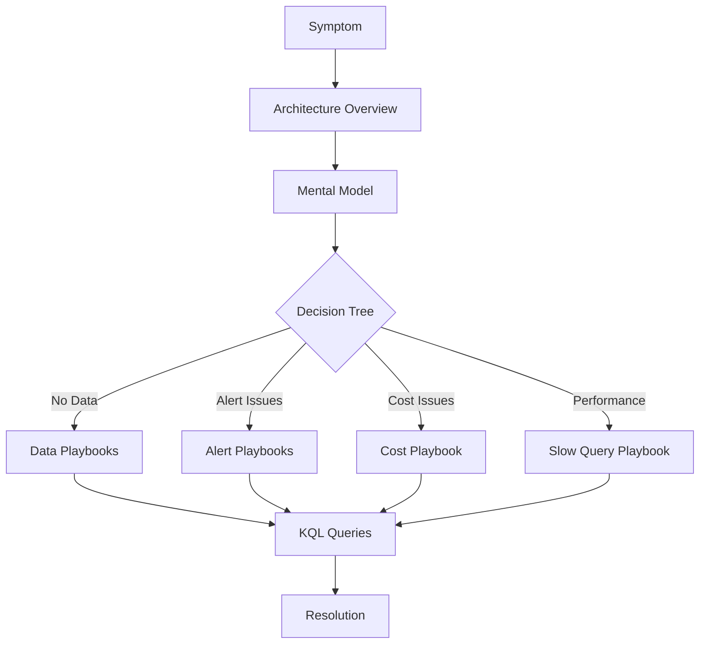

# Troubleshooting

Diagnosis and resolution for common Azure Monitor issues.

## Start Here

Use these entry pages in order when you need fast routing before opening a detailed playbook.

| Need | Go To |
|---|---|
| Understand where Azure Monitor can fail end to end | [Architecture Overview](architecture-overview.md) |
| Use a symptom → hypothesis → validation workflow | [Mental Model](mental-model.md) |
| Route from symptom to the right playbook quickly | [Decision Tree](decision-tree.md) |
| Know which evidence sources to collect first | [Evidence Map](evidence-map.md) |

## Quick Navigation

| Symptom | Go To |
|---------|-------|
| Data not appearing in workspace | [No Data in Workspace](playbooks/no-data-in-workspace.md) |
| Application Insights not showing telemetry | [Missing Application Telemetry](playbooks/missing-application-telemetry.md) |
| Alert rule not firing | [Alert Not Firing](playbooks/alert-not-firing.md) |
| Too many alerts | [Alert Storm](playbooks/alert-storm.md) |
| Unexpected cost spike | [High Ingestion Cost](playbooks/high-ingestion-cost.md) |
| KQL queries timing out | [Slow Query Performance](playbooks/slow-query-performance.md) |
| Agent not sending data | [Agent Not Reporting](playbooks/agent-not-reporting.md) |

## In This Section

| Page | Description |
|------|-------------|
| [Architecture Overview](architecture-overview.md) | Azure Monitor troubleshooting map: sources, routing, stores, and consumers |
| [Mental Model](mental-model.md) | Symptom → hypothesis → validation framework for investigations |
| [Decision Tree](decision-tree.md) | Symptom-based routing to playbooks |
| [Evidence Map](evidence-map.md) | What data sources to check for each symptom |
| [Playbooks](playbooks/index.md) | Step-by-step troubleshooting guides (9 playbooks) |
| [KQL Query Packs](kql/index.md) | Ready-to-use diagnostic queries (14 pages) |

## Suggested Flow

1. Read [Architecture Overview](architecture-overview.md) to identify the likely failure domain.
2. Use [Mental Model](mental-model.md) to list competing hypotheses before making changes.
3. Route with the [Decision Tree](decision-tree.md).
4. Open the targeted playbook and collect KQL and CLI evidence.

## See Also

- [Operations](../operations/index.md)
- [Reference](../reference/index.md)

## Sources

- [Troubleshoot Azure Monitor](https://learn.microsoft.com/en-us/azure/azure-monitor/troubleshoot)
- [Troubleshoot Log Analytics](https://learn.microsoft.com/en-us/azure/azure-monitor/logs/troubleshoot)
