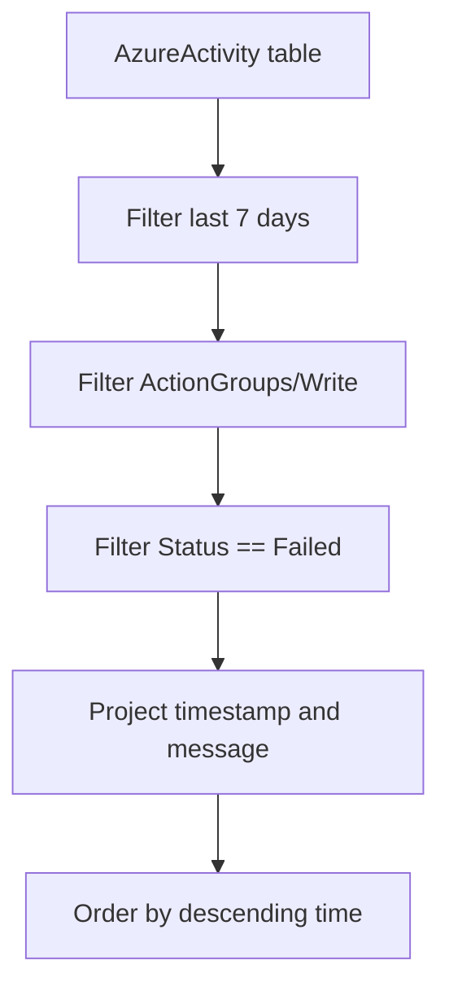

---
content_sources:
  diagrams:
    - id: data-flow
      type: flowchart
      source: mslearn-adapted
      based_on:
        - https://learn.microsoft.com/en-us/azure/azure-monitor/alerts/action-groups
        - https://learn.microsoft.com/en-us/azure/azure-monitor/alerts/alerts-troubleshoot
---

# Action Group Failures (Configuration Write Failures)

When action group configuration changes fail (create, update, or delete), the failure is logged in the `AzureActivity` table. Tracking these failures helps ensure that action groups remain correctly configured so alerts can reach the intended responders.

## Scenario
You suspect that recent action group configuration changes failed, and you want to identify which changes were rejected and why—e.g., invalid receiver addresses, insufficient permissions, or ARM validation errors.

## KQL Query
```kusto
AzureActivity
| where TimeGenerated > ago(7d)
| where OperationNameValue == "Microsoft.Insights/ActionGroups/Write"
| where ActivityStatusValue == "Failed"
| project 
    TimeGenerated, 
    ResourceGroup, 
    OperationNameValue, 
    ActivityStatusValue, 
    Properties_d.statusMessage
| order by TimeGenerated desc
```

## Data Flow
<!-- diagram-id: data-flow -->


## Sample Output
| TimeGenerated | ResourceGroup | OperationNameValue | ActivityStatusValue | Properties_d.statusMessage |
| :--- | :--- | :--- | :--- | :--- |
| 2024-03-24 10:15 | prod-rg | Microsoft.Insights/ActionGroups/Write | Failed | The request content was invalid: receiver email address format is not valid. |
| 2024-03-24 09:30 | dev-rg | Microsoft.Insights/ActionGroups/Write | Failed | Authorization failed. Caller does not have permissions to perform action. |
| 2024-03-24 08:00 | stg-rg | Microsoft.Insights/ActionGroups/Write | Failed | Webhook URI validation failed: HTTP 404 Not Found. |

## How to Read This
Examine the `Properties_d.statusMessage` for the root cause. Authorization failures indicate RBAC misconfiguration. Invalid receiver errors mean the action group has malformed email or phone values. Webhook URI validation failures suggest the endpoint is unreachable during ARM validation.

!!! warning "Runtime delivery is not logged here"
    This query covers **configuration-time** failures (ARM write operations). Runtime notification delivery failures (e.g., email bounce, SMS quota, webhook timeout at fire time) are **not** recorded in `AzureActivity`. To diagnose runtime delivery, check the **Azure Portal → Alerts → Action groups → (select group) → Notification Status** and the alert instance's action status.

## Limitations
*   `AzureActivity` log retention must be enabled and the log must be sent to the Log Analytics workspace.
*   Status messages vary depending on the receiver type and ARM validation stage.
*   This query only surfaces management-plane write failures—not runtime delivery outcomes.

## Common Variations

### All action group operations (success and failure)
```kusto
AzureActivity
| where TimeGenerated > ago(7d)
| where OperationNameValue has "ActionGroups"
| summarize Count = count() by ActivityStatusValue, OperationNameValue
| order by Count desc
```

### Failure trend over time
```kusto
AzureActivity
| where TimeGenerated > ago(7d)
| where OperationNameValue == "Microsoft.Insights/ActionGroups/Write"
| where ActivityStatusValue == "Failed"
| summarize FailureCount = count() by bin(TimeGenerated, 1d)
| render timechart
```

## Interpretation Guide

| Pattern | Indicates | Action |
|---|---|---|
| Authorization failures dominate | RBAC or policy blocking changes | Verify Monitoring Contributor role for the caller |
| Validation failures after deployment | IaC template has invalid receiver values | Review Bicep/ARM parameters for the action group |
| Failures cluster after a specific time | Recent policy or RBAC change | Correlate with `AzureActivity` policy assignment events |

## Related Playbook

For the full alert investigation workflow, see [Alert Not Firing](../../playbooks/alert-not-firing.md).

## See Also
*   [Alert Firing History](alert-firing-history.md)
*   [Activity Logs Overview](../../../platform/how-azure-monitor-works.md)

## Sources
*   [MS Learn: AzureActivity table reference](https://learn.microsoft.com/azure/azure-monitor/reference/tables/azureactivity)
*   [MS Learn: Troubleshooting Azure Monitor alerts](https://learn.microsoft.com/azure/azure-monitor/alerts/alerts-troubleshoot)
*   [MS Learn: Action groups](https://learn.microsoft.com/azure/azure-monitor/alerts/action-groups)
