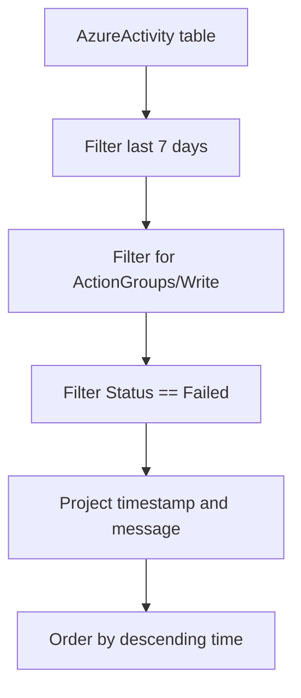

# Action Group Failures (Failed Notifications)

When an alert fires but the notification is not sent, it is logged in the `AzureActivity` table as a failure. Troubleshooting these failures is essential for ensuring that critical issues are communicated to the correct responders.

## Scenario
You suspect that email or SMS notifications are not being sent for critical alerts and want to identify the specific error message associated with the failure.

## KQL Query
```kusto
AzureActivity
| where TimeGenerated > ago(7d)
| where OperationNameValue == "Microsoft.Insights/ActionGroups/Write"
| where ActivityStatusValue == "Failed"
| project 
    TimeGenerated, 
    ResourceGroup, 
    OperationNameValue, 
    ActivityStatusValue, 
    Properties_d.statusMessage
| order by TimeGenerated desc
```

## Data Flow


## Sample Output
| TimeGenerated | ResourceGroup | OperationNameValue | ActivityStatusValue | Properties_d.statusMessage |
| :--- | :--- | :--- | :--- | :--- |
| 2024-03-24 10:15 | prod-rg | Microsoft.Insights/ActionGroups/Write | Failed | SMS notification failed: rate limit exceeded. |
| 2024-03-24 09:30 | dev-rg | Microsoft.Insights/ActionGroups/Write | Failed | Email delivery failed: SMTP server unreachable. |
| 2024-03-24 08:00 | stg-rg | Microsoft.Insights/ActionGroups/Write | Failed | Webhook failed: HTTP 404 Not Found. |

## How to Read This
Examine the `Properties_d.statusMessage` for the root cause. "Rate limit exceeded" for SMS is common if many alerts fire simultaneously. Webhook failures often point to an endpoint being down or misconfigured URL in the action group.

## Limitations
*   `AzureActivity` log retention must be enabled and the log must be sent to the Log Analytics workspace.
*   Status messages can vary depending on the provider (Email, SMS, Webhook, Logic App).
*   Only management-plane failures are logged here; transient downstream provider issues may not always appear.

## See Also
*   [Alert Firing History](alert-firing-history.md)
*   [Activity Logs Overview](../../../platform/how-azure-monitor-works.md)

## Sources
*   [MS Learn: AzureActivity table reference](https://learn.microsoft.com/azure/azure-monitor/reference/tables/azureactivity)
*   [MS Learn: Troubleshooting Azure Monitor alerts](https://learn.microsoft.com/azure/azure-monitor/alerts/alerts-troubleshoot)
