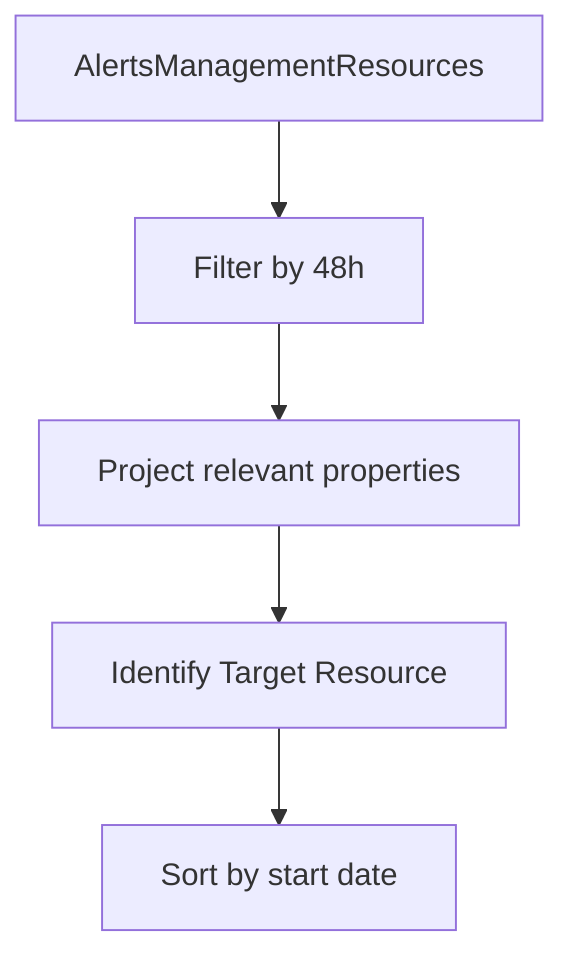

---
content_sources:
  diagrams:
    - id: data-flow
      type: flowchart
      source: mslearn-adapted
      based_on:
        - https://learn.microsoft.com/en-us/azure/azure-monitor/alerts/alerts-overview
        - https://learn.microsoft.com/en-us/azure/azure-monitor/alerts/alerts-troubleshoot
---

# Alert Firing History (Timeline Analysis)

Analyzing the history of fired alerts is critical for identifying recurring infrastructure issues and potential "alert fatigue" where too many non-critical alerts are generated.

## Scenario
You want to review a timeline of alerts fired in the last 48 hours to identify patterns of system instability or correlate alerts with recent deployments.

## KQL Query
```kusto
AlertsManagementResources
| where properties.essentials.startDateTime > ago(48h)
| project 
    TimeGenerated = properties.essentials.startDateTime, 
    AlertName = name, 
    Severity = properties.essentials.severity, 
    MonitorCondition = properties.essentials.monitorCondition, 
    TargetResource = properties.essentials.targetResourceName
| order by TimeGenerated desc
```

## Data Flow
<!-- diagram-id: data-flow -->


## Sample Output
| TimeGenerated | AlertName | Severity | MonitorCondition | TargetResource |
| :--- | :--- | :--- | :--- | :--- |
| 2024-03-24 12:00 | High CPU Usage | Sev1 | Fired | vm-prod-web-01 |
| 2024-03-24 11:45 | SQL Latency Spike | Sev2 | Resolved | main-sql-db |
| 2024-03-24 11:30 | Memory Pressure | Sev3 | Fired | app-service-plan-01 |

## How to Read This
A cluster of alerts at the same time for different resources often points to a shared infrastructure failure. If the `MonitorCondition` remains `Fired`, the issue is ongoing. Pay close attention to `Sev1` (Critical) alerts that correlate with a specific `TargetResource`.

## Limitations
*   `AlertsManagementResources` only contains alerts managed by Azure Monitor. 
*   Data retention for alert history may vary depending on your subscription settings.
*   This query requires the "Resource Graph" to be queried via KQL if using the portal's Logs interface in some contexts.

## See Also
*   [Action Group Failures](action-group-failures.md)
*   [Resource Health Status](../log-analytics/resource-health.md)

## Sources
*   [MS Learn: AlertsManagementResources schema](https://learn.microsoft.com/azure/azure-monitor/reference/tables/alertsmanagementresources)
*   [MS Learn: Manage alerts in Azure](https://learn.microsoft.com/azure/azure-monitor/alerts/alerts-manage-instances)
