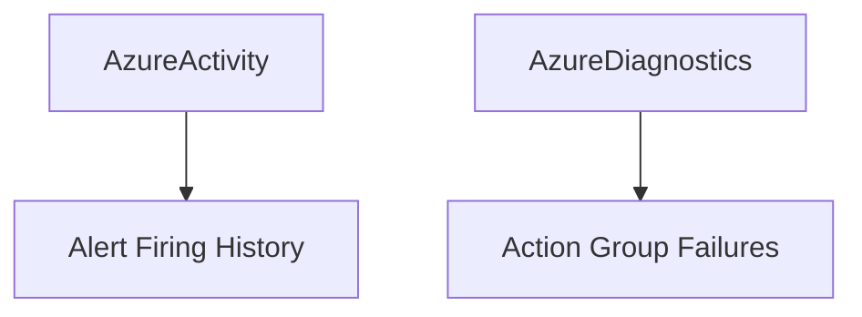

---
content_sources:
  diagrams:
    - id: alert-investigation-queries
      type: flowchart
      source: self-generated
      based_on:
        - https://learn.microsoft.com/en-us/azure/azure-monitor/alerts/alerts-overview
        - https://learn.microsoft.com/en-us/azure/azure-monitor/alerts/alerts-troubleshoot
---

# Alert Investigation Queries

KQL queries for alert evaluation and troubleshooting.

<!-- diagram-id: alert-investigation-queries -->

## Queries

| Query | Description |
|-------|-------------|
| [Alert Firing History](alert-firing-history.md) | Alert timeline, resolution patterns, frequency analysis |
| [Action Group Failures](action-group-failures.md) | Failed notifications, webhook errors, email delivery |

## See Also

- [Platform: Alerts Architecture](../../../platform/alerts-architecture.md)
- [Operations: Alert Rule Management](../../../operations/alert-rule-management.md)

## Sources

- [Manage your alert instances](https://learn.microsoft.com/azure/azure-monitor/alerts/alerts-manage-alert-instances)
- [Troubleshoot Azure Monitor alerts](https://learn.microsoft.com/azure/azure-monitor/alerts/alerts-troubleshoot)
