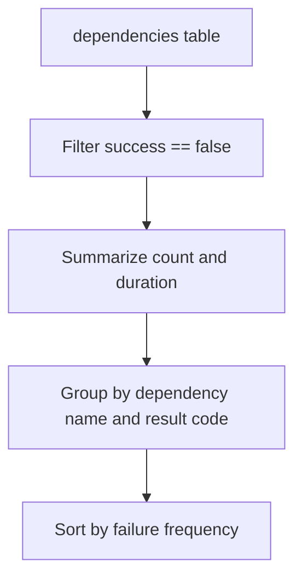

---
content_sources:
  diagrams:
    - id: data-flow
      type: flowchart
      source: mslearn-adapted
      based_on:
        - https://learn.microsoft.com/en-us/azure/azure-monitor/app/app-insights-overview
        - https://learn.microsoft.com/en-us/azure/azure-monitor/app/distributed-trace-data
---

# Dependency Failures (Outbound Calls)

Analyze failing outbound calls from your application to external dependencies like SQL databases, HTTP APIs, or Azure storage. Identifying dependency issues is crucial for troubleshooting systemic application failures.

## Scenario
You want to see which external services are currently failing most frequently and identify the specific error codes they return.

## KQL Query
```kusto
dependencies
| where timestamp > ago(24h)
| where success == false
| summarize 
    FailureCount = count(), 
    AvgDuration = avg(duration), 
    DistinctTargetCount = dcount(target) 
    by name, type, resultCode
| order by FailureCount desc
```

## Data Flow
<!-- diagram-id: data-flow -->


## Sample Output
| name | type | resultCode | FailureCount | AvgDuration |
| :--- | :--- | :--- | :--- | :--- |
| SQL: main-db | SQL | 4060 | 850 | 15.2 |
| GET /v1/inventory | HTTP | 503 | 240 | 3200.0 |
| BlobStorage.Put | Azure blob | 403 | 45 | 12.1 |

## How to Read This
Large failure counts for a specific `resultCode` often point to infrastructure issues or misconfiguration. For example, a `4060` result code in SQL suggests a database login failure, while an `HTTP 503` indicates the downstream service is overloaded or unavailable.

## Limitations
*   Only dependencies explicitly tracked by the SDK or Auto-Instrumentation are included.
*   The `target` field may be truncated or sanitized depending on your telemetry configuration.

## See Also
*   [App Insights Exceptions](exception-trends.md)
*   [Performance Percentiles](request-performance.md)

## Sources
*   [MS Learn: Application Insights dependencies schema](https://learn.microsoft.com/azure/azure-monitor/reference/tables/dependencies)
*   [MS Learn: Troubleshooting dependencies](https://learn.microsoft.com/azure/azure-monitor/app/asp-net-dependencies)
