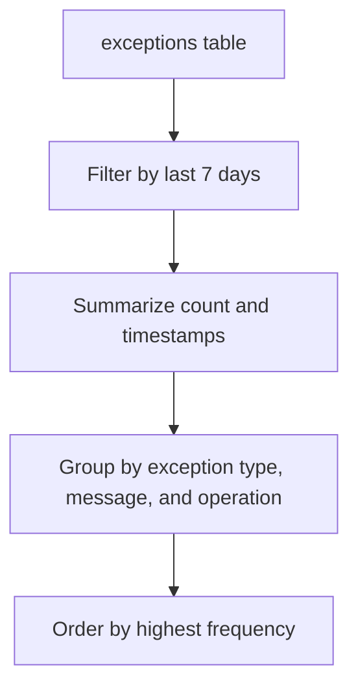

# Exception Trends (Volume by Type)

Exceptions are unplanned events that interrupt your application's flow. Monitoring the type and volume of exceptions provides insight into software bugs, misconfigurations, or external system failures.

## Scenario
You need to identify the most common exception types and see if they are increasing over time. This helps prioritize bug fixing and identifies new issues after a deployment.

## KQL Query
```kusto
exceptions
| where timestamp > ago(7d)
| summarize 
    ExceptionCount = count(), 
    LastOccurrence = max(timestamp), 
    FirstOccurrence = min(timestamp) 
    by type, outerMessage, operation_Name
| order by ExceptionCount desc
```

## Data Flow


## Sample Output
| type | outerMessage | operation_Name | ExceptionCount | LastOccurrence |
| :--- | :--- | :--- | :--- | :--- |
| System.NullReferenceException | Object reference not set to an instance of an object. | GET /api/Profile | 450 | 2024-03-24 10:30 |
| System.Data.SqlClient.SqlException | Timeout expired. | POST /api/Order | 120 | 2024-03-24 10:45 |
| Microsoft.Azure.Cosmos.CosmosException | Request rate is large. | GET /api/Search | 85 | 2024-03-24 11:00 |

## How to Read This
A high volume of `System.NullReferenceException` usually points to code logic errors that require developer intervention. In contrast, `SqlException` timeouts or `CosmosException` rate limits often indicate infrastructure bottlenecking or the need for better scaling strategies.

## Limitations
*   Only exceptions caught and logged by the Application Insights SDK are captured.
*   The `outerMessage` may be truncated if it exceeds the maximum allowed length.
*   Sensitive information within exception messages may be masked based on your workspace settings.

## See Also
*   [Dependency Failures](dependency-failures.md)
*   [Performance Trends](request-performance.md)

## Sources
*   [MS Learn: Application Insights exceptions schema](https://learn.microsoft.com/azure/azure-monitor/reference/tables/exceptions)
*   [MS Learn: Diagnostic search in Application Insights](https://learn.microsoft.com/azure/azure-monitor/app/diagnostic-search)
