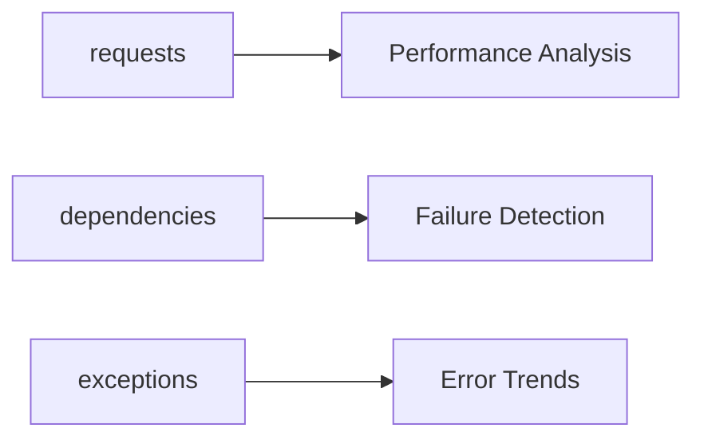

---
content_sources:
  diagrams:
    - id: application-insights-queries
      type: flowchart
      source: self-generated
      based_on:
        - https://learn.microsoft.com/en-us/azure/azure-monitor/app/app-insights-overview
        - https://learn.microsoft.com/en-us/azure/azure-monitor/logs/log-query-overview
---

# Application Insights Queries

KQL queries for Application Insights telemetry analysis.

<!-- diagram-id: application-insights-queries -->

## Queries

| Query | Description |
|-------|-------------|
| [Request Performance](request-performance.md) | P50/P95/P99 latency by endpoint, slow request investigation |
| [Dependency Failures](dependency-failures.md) | Failing outbound calls, latency impact |
| [Exception Trends](exception-trends.md) | Exception volume by type, new exception detection |

## See Also

- [Platform: Application Insights](../../../platform/application-insights.md)
- [Log Analytics Queries](../log-analytics/index.md)

## Sources

- [Application Insights log-based metrics](https://learn.microsoft.com/azure/azure-monitor/essentials/app-insights-metrics)
- [Diagnose exceptions in web apps with Application Insights](https://learn.microsoft.com/azure/azure-monitor/app/asp-net-exceptions)
