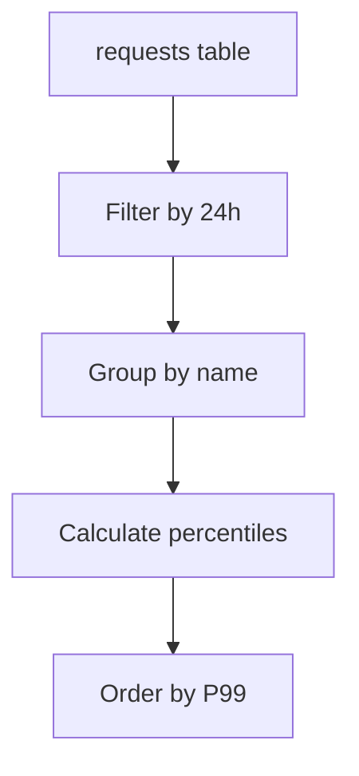

---
content_sources:
  diagrams:
    - id: data-flow
      type: flowchart
      source: mslearn-adapted
      based_on:
        - https://learn.microsoft.com/en-us/azure/azure-monitor/app/app-insights-overview
        - https://learn.microsoft.com/en-us/azure/azure-monitor/essentials/metrics-getting-started
        - https://learn.microsoft.com/en-us/azure/azure-monitor/logs/log-query-overview
---

# Request Performance (P50, P95, P99)

This query analyzes the latency of incoming requests to your application, providing a breakdown of median and tail latency. Monitoring percentiles helps identify performance issues that affect only a small portion of users but may indicate significant underlying problems.

## Scenario
You need to identify endpoints experiencing high latency and understand the difference between typical performance and worst-case scenarios for your users.

## KQL Query
```kusto
requests
| where timestamp > ago(24h)
| summarize 
    AvgDuration = avg(duration), 
    P50 = percentile(duration, 50), 
    P95 = percentile(duration, 95), 
    P99 = percentile(duration, 99), 
    Count = count() 
    by name
| order by P99 desc
```

## Data Flow
<!-- diagram-id: data-flow -->


## Sample Output
| name | AvgDuration | P50 | P95 | P99 | Count |
| :--- | :--- | :--- | :--- | :--- | :--- |
| GET /api/Search | 450.2 | 320.0 | 1200.0 | 3500.0 | 1500 |
| POST /api/Checkout | 120.5 | 110.0 | 250.0 | 800.0 | 450 |
| GET /home/index | 45.3 | 40.0 | 95.0 | 150.0 | 12000 |

## How to Read This
Focus on the gap between P50 and P99. A large disparity (e.g., P50 is 300ms but P99 is 3.5s) suggests that while most users have a good experience, some encounter significant delays, often due to resource contention or cold starts.

## Limitations
*   Percentiles require a sufficient volume of data to be statistically significant. 
*   `duration` in Application Insights is measured in milliseconds.
*   This query does not account for client-side latency (network transit).

## See Also
*   [Application Insights Overview](../../../platform/how-azure-monitor-works.md)
*   [Analyzing Request Failures](dependency-failures.md)

## Sources
*   [MS Learn: summarize operator](https://learn.microsoft.com/azure/data-explorer/kusto/query/summarizeoperator)
*   [MS Learn: Application Insights requests schema](https://learn.microsoft.com/azure/azure-monitor/reference/tables/requests)
