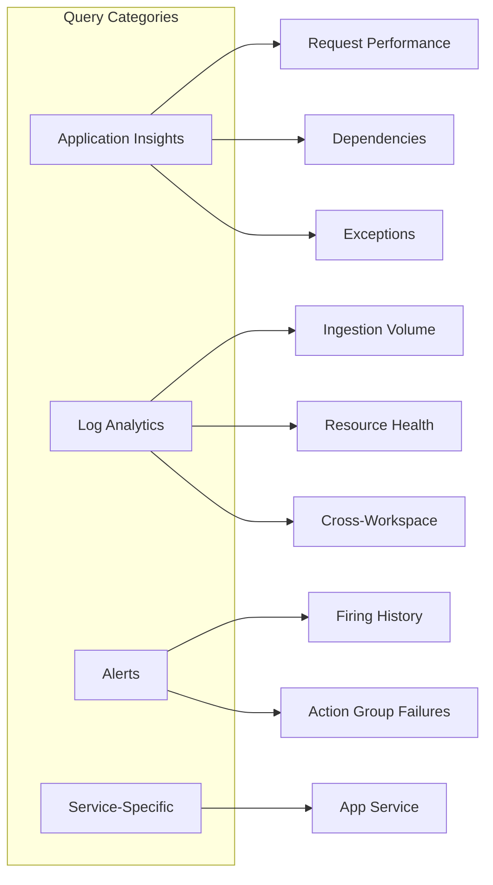

---
content_sources:
  diagrams:
    - id: kql-query-packs
      type: flowchart
      source: self-generated
      based_on:
        - https://learn.microsoft.com/en-us/azure/azure-monitor/logs/log-query-overview
        - https://learn.microsoft.com/en-us/azure/azure-monitor/logs/query-best-practices
        - https://learn.microsoft.com/en-us/azure/azure-monitor/logs/query-optimization
---

# KQL Query Packs

Ready-to-use KQL queries for Azure Monitor diagnostics.

<!-- diagram-id: kql-query-packs -->

## Query Categories

| Category | Description | Pages |
|----------|-------------|-------|
| [Application Insights](app-insights/index.md) | Request, dependency, exception queries | 3 |
| [Log Analytics](log-analytics/index.md) | Ingestion, resource health, cross-workspace | 3 |
| [Alerts](alerts/index.md) | Alert evaluation, firing history | 2 |
| [Service-Specific](service-specific/index.md) | Per-service diagnostic queries | 1 |

## See Also

- [Reference: KQL Quick Reference](../../reference/kql-quick-reference.md)
- [Playbooks](../playbooks/index.md)

## Sources

- [Log queries in Azure Monitor](https://learn.microsoft.com/azure/azure-monitor/logs/log-query-overview)
- [KQL quick reference](https://learn.microsoft.com/azure/data-explorer/kusto/query/kql-quick-reference)
