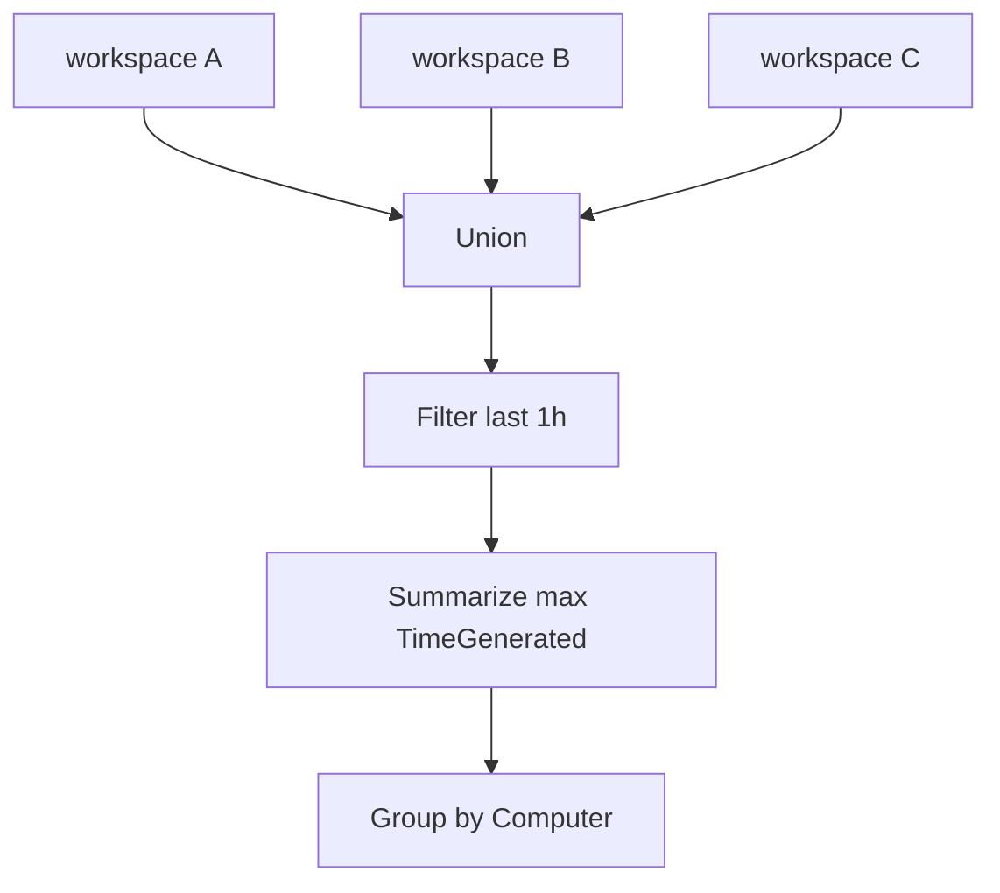

---
content_sources:
  diagrams:
    - id: data-flow
      type: flowchart
      source: mslearn-adapted
      based_on:
        - https://learn.microsoft.com/en-us/azure/azure-monitor/logs/log-analytics-overview
        - https://learn.microsoft.com/en-us/azure/azure-monitor/logs/log-analytics-workspace-overview
        - https://learn.microsoft.com/en-us/azure/azure-monitor/logs/log-query-overview
---

# Cross-Workspace Query Patterns

The `workspace()` function allows you to query data across multiple Log Analytics workspaces within your tenant. This is essential for organizations with distributed logging architectures or centralized security auditing.

## Scenario
You need to correlate heartbeat data from virtual machines that report to different workspaces, such as a Production and a Staging workspace.

## KQL Query
```kusto
union 
    workspace("Production-Workspace-ID").Heartbeat,
    workspace("Staging-Workspace-ID").Heartbeat,
    workspace("Dev-Workspace-ID").Heartbeat
| where TimeGenerated > ago(1h)
| summarize 
    LastContact = max(TimeGenerated) 
    by Computer, _ResourceId
| order by LastContact desc
```

## Data Flow
<!-- diagram-id: data-flow -->


## Sample Output
| Computer | _ResourceId | LastContact |
| :--- | :--- | :--- |
| web-prod-01 | /subscriptions/.../web-prod-01 | 2024-03-24 11:20 |
| srv-stage-02 | /subscriptions/.../srv-stage-02 | 2024-03-24 11:18 |
| vm-dev-05 | /subscriptions/.../vm-dev-05 | 2024-03-24 11:15 |

## How to Read This
The `union` operator combines rows from multiple sources. Ensure that the workspaces are in the same Microsoft Entra tenant and that you have read permissions for all specified workspaces. If a workspace is inaccessible, the query may fail or return partial results.

## Limitations
*   Performance may degrade when querying across many workspaces (max 100 recommended).
*   Latency is higher than single-workspace queries due to cross-region or cross-workspace overhead.
*   Workspaces must be specified by their Workspace ID or Resource ID; names are not supported.

## Common Variations

### Add source workspace label
```kusto
union withsource = SourceWorkspace
    workspace("Production-Workspace-ID").Heartbeat,
    workspace("Staging-Workspace-ID").Heartbeat
| where TimeGenerated > ago(1h)
| summarize LastContact = max(TimeGenerated) by SourceWorkspace, Computer
| order by LastContact desc
```

### Compare ingestion by workspace
```kusto
union withsource = SourceWorkspace
    workspace("Production-Workspace-ID").Usage,
    workspace("Staging-Workspace-ID").Usage
| where TimeGenerated > ago(7d)
| summarize TotalGB = sum(Quantity) / 1024 by SourceWorkspace, DataType
| order by TotalGB desc
```

## Interpretation Guide

| Pattern | Indicates | Action |
|---|---|---|
| One workspace consistently lags others | Workspace-specific ingest or query issue | Narrow investigation to that workspace settings and region |
| Results are duplicated across sources | Overlapping collection scope | Check DCRs, diagnostic settings, and workspace design |
| Query slow only after adding more workspaces | Query fan-out cost | Reduce scope, time range, or pre-aggregate |

## Related Playbook

For the full investigation workflow, see [Slow Query Performance](../../playbooks/slow-query-performance.md).

## See Also
*   [Resource Health Checks](resource-health.md)
*   [Ingestion Volume Analysis](ingestion-volume.md)

## Sources
*   [MS Learn: Cross-workspace queries](https://learn.microsoft.com/azure/azure-monitor/logs/cross-workspace-query)
*   [MS Learn: union operator](https://learn.microsoft.com/azure/data-explorer/kusto/query/unionoperator)
