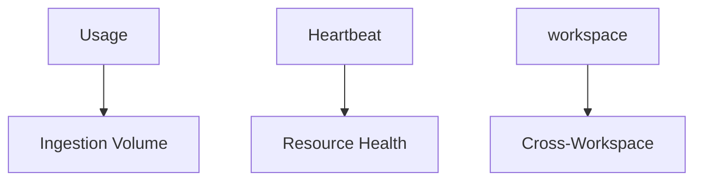

---
content_sources:
  diagrams:
    - id: log-analytics-queries
      type: flowchart
      source: self-generated
      based_on:
        - https://learn.microsoft.com/en-us/azure/azure-monitor/logs/log-analytics-overview
        - https://learn.microsoft.com/en-us/azure/azure-monitor/logs/log-analytics-workspace-overview
        - https://learn.microsoft.com/en-us/azure/azure-monitor/logs/log-query-overview
---

# Log Analytics Queries

KQL queries for Log Analytics workspace analysis.

<!-- diagram-id: log-analytics-queries -->

## Queries

| Query | Description |
|-------|-------------|
| [Ingestion Volume](ingestion-volume.md) | Data volume by table, source, resource; cost attribution |
| [Resource Health](resource-health.md) | Heartbeat checks, agent status, data freshness |
| [Cross-Workspace](cross-workspace.md) | workspace() function patterns, union across workspaces |

## See Also

- [Platform: Log Analytics Workspace](../../../platform/log-analytics-workspace.md)
- [Application Insights Queries](../app-insights/index.md)

## Sources

- [Analyze usage in Log Analytics workspace](https://learn.microsoft.com/azure/azure-monitor/logs/analyze-usage)
- [Cross-resource query Azure Monitor](https://learn.microsoft.com/azure/azure-monitor/logs/cross-workspace-query)
