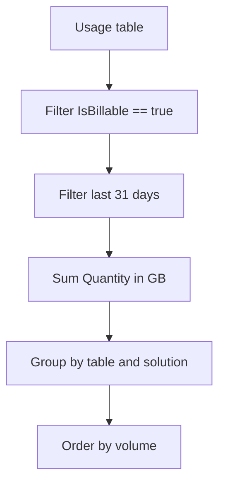

# Ingestion Volume (Data Volume by Table)

Analyze the volume of data being ingested into your Log Analytics workspace. Monitoring ingestion volume is critical for cost management and identifying unexpected spikes in logging that could lead to budget overruns.

## Scenario
You need to identify which tables in your workspace are consuming the most data over the last 31 days to optimize logging costs.

## KQL Query
```kusto
Usage
| where IsBillable == true
| where TimeGenerated > ago(31d)
| summarize 
    TotalGB = sum(Quantity) / 1024 
    by DataType, Solution, Unit
| order by TotalGB desc
```

## Data Flow


## Sample Output
| DataType | Solution | Unit | TotalGB |
| :--- | :--- | :--- | :--- |
| AppRequests | LogManagement | GBytes | 120.5 |
| ContainerLogV2 | ContainerInsights | GBytes | 85.2 |
| Syslog | LogManagement | GBytes | 45.1 |
| Heartbeat | LogManagement | GBytes | 5.3 |

## How to Read This
Focus on the top 3 tables. If `AppRequests` or `ContainerLogV2` are high, review the logging level in your application or cluster. High `Syslog` volume may indicate an noisy agent on a virtual machine.

## Limitations
*   The `Usage` table provides data volume based on billing granularity, which may differ slightly from raw telemetry size.
*   Data is typically aggregated hourly, so it's not suitable for real-time traffic monitoring.
*   This query only includes billable data; free data tiers or specific tables might not appear if filtered by `IsBillable == true`.

## See Also
*   [Resource Health Status](resource-health.md)
*   [Cross-Workspace Queries](cross-workspace.md)

## Sources
*   [MS Learn: Usage table reference](https://learn.microsoft.com/azure/azure-monitor/reference/tables/usage)
*   [MS Learn: Cost and usage in Azure Monitor](https://learn.microsoft.com/azure/azure-monitor/logs/manage-cost-storage)
