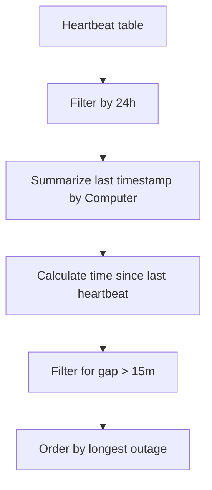

---
content_sources:
  diagrams:
    - id: data-flow
      type: flowchart
      source: mslearn-adapted
      based_on:
        - https://learn.microsoft.com/en-us/azure/azure-monitor/logs/log-analytics-workspace-overview
        - https://learn.microsoft.com/en-us/azure/azure-monitor/logs/troubleshoot
        - https://learn.microsoft.com/en-us/azure/azure-monitor/logs/log-query-overview
---

# Resource Health (Heartbeat Checks)

Monitor the heartbeat signal of virtual machines and on-premises servers that have the Log Analytics agent or Azure Monitor agent installed. Frequent heartbeats indicate that the agent is healthy and communicating with the platform.

## Scenario
You want to quickly see which virtual machines haven't reported a heartbeat in the last 15 minutes, which might indicate the VM is down or the agent has stopped functioning.

## KQL Query
```kusto
Heartbeat
| where TimeGenerated > ago(24h)
| summarize 
    LastHeartbeat = max(TimeGenerated) 
    by Computer, OSType, ComputerEnvironment
| extend 
    TimeSinceLastHeartbeat = now() - LastHeartbeat
| where TimeSinceLastHeartbeat > 15m
| order by TimeSinceLastHeartbeat desc
```

## Data Flow
<!-- diagram-id: data-flow -->


## Sample Output
| Computer | OSType | ComputerEnvironment | LastHeartbeat | TimeSinceLastHeartbeat |
| :--- | :--- | :--- | :--- | :--- |
| vm-prod-db-01 | Linux | Azure | 2024-03-24 09:15 | 01:30:00.000 |
| vm-dev-web-02 | Windows | Azure | 2024-03-24 10:40 | 00:25:15.000 |
| onprem-srv-05 | Linux | Non-Azure | 2024-03-24 10:55 | 00:18:45.000 |

## How to Read This
Focus on the `TimeSinceLastHeartbeat`. Large gaps for Azure virtual machines should be cross-referenced with the Resource Health dashboard in the portal. For on-premises servers, check for network connectivity or local agent status.

## Limitations
*   Heartbeat frequency depends on the agent configuration (typically every 1 minute).
*   Lack of a heartbeat doesn't always mean the VM is down; it could be a transient networking issue.
*   This query assumes that the agents have successfully reported at least one heartbeat in the last 24 hours.

## See Also
*   [Ingestion Volume Analysis](ingestion-volume.md)
*   [Cross-Workspace Query Patterns](cross-workspace.md)

## Sources
*   [MS Learn: Heartbeat table reference](https://learn.microsoft.com/azure/azure-monitor/reference/tables/heartbeat)
*   [MS Learn: Monitor VM health](https://learn.microsoft.com/azure/azure-monitor/vm/monitor-virtual-machines)
