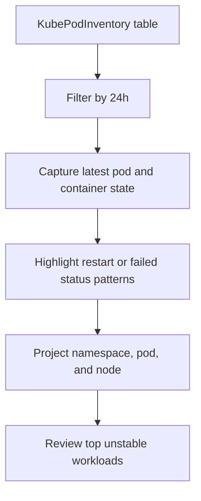

---
content_sources:
  diagrams:
    - id: data-flow
      type: flowchart
      source: mslearn-adapted
      based_on:
        - https://learn.microsoft.com/en-us/azure/azure-monitor/containers/container-insights-overview
        - https://learn.microsoft.com/en-us/azure/aks/monitor-aks
---

# AKS Container Insights Diagnostics

Analyze Container Insights inventory and log data for Azure Kubernetes Service to identify unstable pods, repeated container restarts, and node-level warning signals before they become cluster-wide incidents.

## Scenario
You need to find pods with repeated restarts or failed states in the last 24 hours and correlate them with the node that is hosting the workload.

## KQL Query
```kusto
KubePodInventory
| where TimeGenerated > ago(24h)
| summarize
    RestartCount = max(ContainerRestartCount),
    arg_max(TimeGenerated, PodStatus, ContainerStatus, Computer)
    by ClusterName, Namespace, PodName, ContainerName
| where RestartCount > 0 or PodStatus in ("Failed", "Pending", "Unknown") or ContainerStatus != "running"
| project
    ClusterName,
    Namespace,
    PodName,
    ContainerName,
    PodStatus,
    ContainerStatus,
    RestartCount,
    Node = Computer,
    LastSeen = TimeGenerated
| order by RestartCount desc, LastSeen desc
| take 15
```

## Data Flow
<!-- diagram-id: data-flow -->


## Sample Output
| ClusterName | Namespace | PodName | ContainerName | PodStatus | ContainerStatus | RestartCount | Node | LastSeen |
|-------------|-----------|---------|---------------|-----------|-----------------|--------------|------|----------|
| aks-prod-01 | payments | api-7c9d8b6f6f-jx2lm | api | Running | waiting | 9 | aks-nodepool1-38291-vmss000003 | 2026-04-13 09:42:00Z |
| aks-prod-01 | ingress | nginx-ingress-5fd6d8b9d8-kt4rq | controller | Failed | terminated | 4 | aks-nodepool1-38291-vmss000001 | 2026-04-13 09:39:00Z |

## How to Read This
High `RestartCount` values usually indicate crash loops, image pull retries, or readiness probe failures. If several affected pods map to the same `Node`, investigate node pressure, kubelet health, or underlying infrastructure conditions before focusing only on the application container.

## Limitations
*   Container Insights must be enabled and sending `KubePodInventory` data to the workspace.
*   This query shows the latest observed state, so short-lived transient failures can be missed if they recover quickly.
*   Node condition details may require correlation with `KubeNodeInventory`, `InsightsMetrics`, or Kubernetes events outside this query pack.

## See Also
*   [AKS Monitoring Guide](../../../service-guides/aks/index.md)
*   [AKS Container Insights Issues Playbook](../../playbooks/aks-container-insights-issues.md)

## Sources
*   [MS Learn: Container insights overview](https://learn.microsoft.com/en-us/azure/azure-monitor/containers/container-insights-overview)
*   [MS Learn: Monitor Azure Kubernetes Service (AKS)](https://learn.microsoft.com/en-us/azure/aks/monitor-aks)
