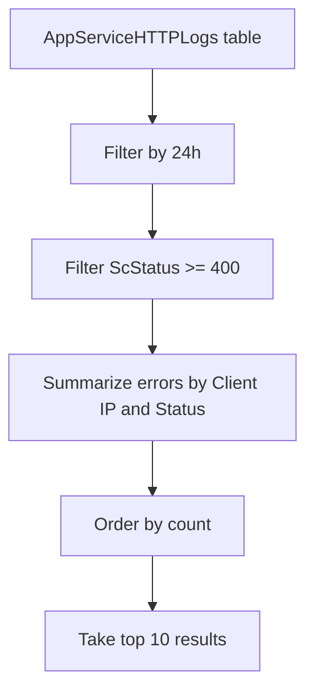

---
content_sources:
  diagrams:
    - id: data-flow
      type: flowchart
      source: mslearn-adapted
      based_on:
        - https://learn.microsoft.com/en-us/azure/app-service/monitor-app-service
        - https://learn.microsoft.com/en-us/azure/app-service/troubleshoot-diagnostic-logs
---

# App Service Diagnostics (HTTP Log Analysis)

Analyze HTTP logs for Azure App Service to identify errors, slow requests, or unusual traffic patterns. This table provides raw details about each incoming request at the infrastructure level.

## Scenario
You need to identify the top client IP addresses and paths that are causing 4xx or 5xx errors on your App Service in the last 24 hours.

## KQL Query
```kusto
AppServiceHTTPLogs
| where TimeGenerated > ago(24h)
| where ScStatus >= 400
| summarize 
    ErrorCount = count(), 
    AvgTimeTaken = avg(TimeTaken) 
    by CIp, ScStatus, CsMethod, CsUriStem
| order by ErrorCount desc
| take 10
```

## Data Flow
<!-- diagram-id: data-flow -->


## Sample Output
| CIp | ScStatus | CsMethod | CsUriStem | ErrorCount | AvgTimeTaken |
|-----|----------|----------|-----------|------------|--------------|
| 203.0.113.45 | 500 | GET | /api/error | 20 | 109 |
| 198.51.100.12 | 404 | GET | /nonexistent | 15 | 25 |

## How to Read This
A high volume of `404` errors for a specific `CsUriStem` from a single `CIp` often indicates a bot or automated scanner. `500` or `503` errors with high `AvgTimeTaken` usually point to application performance issues or downstream dependency timeouts.

## Limitations
*   HTTP logs must be explicitly enabled in the App Service diagnostic settings.
*   The `CIp` field may be obfuscated or represent a load balancer if not configured correctly.
*   Only incoming requests to the App Service are captured; outbound calls are in the `AppDependencies` or `dependencies` tables.

## See Also
*   [Performance Percentiles](../app-insights/request-performance.md)
*   [App Service Monitoring Guide](../../../service-guides/app-service/index.md)

## Sources
*   [MS Learn: AppServiceHTTPLogs table reference](https://learn.microsoft.com/azure/azure-monitor/reference/tables/appservicehttplogs)
*   [MS Learn: Monitor Azure App Service](https://learn.microsoft.com/azure/app-service/troubleshoot-diagnostic-logs)
