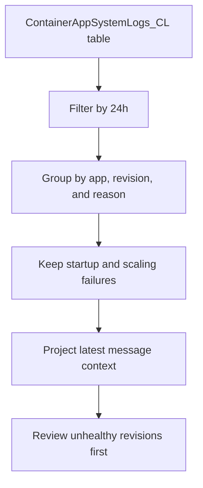

---
content_sources:
  diagrams:
    - id: data-flow
      type: flowchart
      source: mslearn-adapted
      based_on:
        - https://learn.microsoft.com/en-us/azure/container-apps/log-monitoring
        - https://learn.microsoft.com/en-us/azure/container-apps/observability
---

# Container Apps Diagnostics (Revision and Startup Analysis)

Analyze Azure Container Apps platform and console logs to identify unhealthy revisions, startup failures, and scaling activity that explains why a deployment is not serving traffic as expected.

## Scenario
You need to identify revisions with repeated startup or scale events in the last 24 hours and determine whether the issue is caused by the app container or the managed environment.

## KQL Query
```kusto
ContainerAppSystemLogs_CL
| where TimeGenerated > ago(24h)
| summarize
    EventCount = count(),
    LastSeen = max(TimeGenerated),
    arg_max(TimeGenerated, Log_s)
    by ContainerAppName_s, RevisionName_s, Reason_s
| where Reason_s in ("RevisionProvisioningError", "ContainerCreateFailure", "HealthCheckFailed", "ScaleRuleTriggered", "DaprSidecarUnhealthy")
| project
    ContainerApp = ContainerAppName_s,
    Revision = RevisionName_s,
    Reason = Reason_s,
    EventCount,
    LastSeen,
    LatestMessage = Log_s
| order by EventCount desc, LastSeen desc
| take 15
```

## Data Flow
<!-- diagram-id: data-flow -->


## Sample Output
| ContainerApp | Revision | Reason | EventCount | LastSeen | LatestMessage |
|--------------|----------|--------|------------|----------|---------------|
| aca-orders | aca-orders--green | HealthCheckFailed | 11 | 2026-04-13 09:36:00Z | Readiness probe failed on port 8080 after revision activation |
| aca-orders | aca-orders--green | ScaleRuleTriggered | 7 | 2026-04-13 09:35:00Z | HTTP scale rule increased replica count from 2 to 5 |

## How to Read This
`HealthCheckFailed` or `ContainerCreateFailure` usually indicates the revision never became healthy enough to receive stable traffic. `ScaleRuleTriggered` by itself is not a failure, but when it appears alongside startup errors it often means traffic is increasing while new replicas fail to initialize fast enough.

## Limitations
*   Azure Container Apps diagnostic logs must be routed to Log Analytics before these tables appear.
*   Table names and columns can vary slightly by ingestion mode or workspace schema evolution.
*   Console-level application errors often require a companion query against `ContainerAppConsoleLogs_CL` for full stack traces.

## See Also
*   [Container Apps Monitoring Guide](../../../service-guides/container-apps/index.md)
*   [Resource Health Query Pack](../log-analytics/resource-health.md)

## Sources
*   [MS Learn: Monitor logs in Azure Container Apps](https://learn.microsoft.com/en-us/azure/container-apps/log-monitoring)
*   [MS Learn: Observability in Azure Container Apps](https://learn.microsoft.com/en-us/azure/container-apps/observability)
