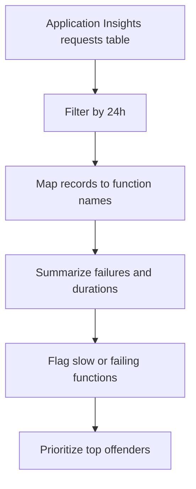

---
content_sources:
  diagrams:
    - id: data-flow
      type: flowchart
      source: mslearn-adapted
      based_on:
        - https://learn.microsoft.com/en-us/azure/azure-functions/monitor-functions
        - https://learn.microsoft.com/en-us/azure/azure-functions/analyze-telemetry-data
---

# Functions Diagnostics (Execution Failures and Timeouts)

Analyze Azure Functions telemetry in Application Insights to identify slow executions, timeout patterns, and the functions that are producing the highest failure rates in a recent incident window.

## Scenario
You need to identify which functions are failing or running longer than expected in the last 24 hours so that you can separate host saturation from function-specific code issues.

## KQL Query
```kusto
requests
| where timestamp > ago(24h)
| where cloud_RoleName has "func" or operation_Name has "Function"
| extend FunctionName = coalesce(operation_Name, name)
| summarize
    InvocationCount = count(),
    FailureCount = countif(success == false),
    AvgDurationMs = avg(duration / 1ms),
    P95DurationMs = percentile(duration / 1ms, 95)
    by FunctionName
| extend FailureRate = round(todouble(FailureCount) * 100.0 / InvocationCount, 2)
| where FailureCount > 0 or P95DurationMs > 10000
| order by FailureCount desc, P95DurationMs desc
| take 15
```

## Data Flow
<!-- diagram-id: data-flow -->


## Sample Output
| FunctionName | InvocationCount | FailureCount | AvgDurationMs | P95DurationMs | FailureRate |
|--------------|-----------------|--------------|---------------|---------------|-------------|
| ProcessOrders | 482 | 37 | 1840 | 15320 | 7.68 |
| CleanupTimer | 96 | 6 | 9230 | 61100 | 6.25 |

## How to Read This
High `FailureRate` with low duration often points to dependency or input validation errors, while high `P95DurationMs` suggests timeout pressure, cold start amplification, or downstream latency. When a timer or queue-triggered function is slow but not failing often, check backlog growth and host concurrency limits before focusing only on exceptions.

## Limitations
*   This query assumes Azure Functions telemetry is landing in Application Insights `requests` data.
*   Function naming can vary depending on trigger type, host version, and custom telemetry enrichment.
*   Timeout root cause analysis often requires joining with `traces`, `exceptions`, or dependency telemetry for full context.

## See Also
*   [Functions Monitoring Guide](../../../service-guides/functions/index.md)
*   [Dependency Failures](../app-insights/dependency-failures.md)

## Sources
*   [MS Learn: Monitor Azure Functions](https://learn.microsoft.com/en-us/azure/azure-functions/monitor-functions)
*   [MS Learn: Analyze Azure Functions telemetry in Application Insights](https://learn.microsoft.com/en-us/azure/azure-functions/analyze-telemetry-data)
