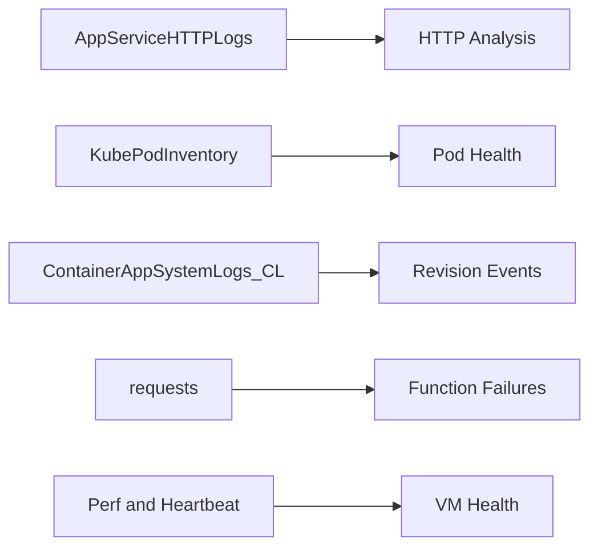

---
content_sources:
  diagrams:
    - id: service-specific-queries
      type: flowchart
      source: self-generated
      justification: "Synthesized from Microsoft Learn monitoring guides for App Service, AKS, Container Apps, Functions, and VMs"
      based_on:
        - https://learn.microsoft.com/en-us/azure/app-service/monitor-app-service
        - https://learn.microsoft.com/en-us/azure/aks/monitor-aks
        - https://learn.microsoft.com/en-us/azure/container-apps/log-monitoring
        - https://learn.microsoft.com/en-us/azure/azure-functions/monitor-functions
        - https://learn.microsoft.com/en-us/azure/azure-monitor/vm/monitor-virtual-machine
---

# Service-Specific Queries

KQL queries for specific Azure service diagnostics.

<!-- diagram-id: service-specific-queries -->

## Queries

| Query | Description |
|-------|-------------|
| [App Service Diagnostics](app-service-diagnostics.md) | HTTP log analysis, startup errors, platform log correlation |
| [AKS Container Insights Diagnostics](aks-diagnostics.md) | Pod status, container restart counts, and node correlation for unstable workloads |
| [Container Apps Diagnostics](container-apps-diagnostics.md) | Revision health, startup failures, and scaling event analysis |
| [Functions Diagnostics](functions-diagnostics.md) | Execution duration, failure rate, and timeout pattern analysis |
| [VM Diagnostics](vm-diagnostics.md) | CPU pressure, performance counter review, and heartbeat gap detection |

## See Also

- [Service Guides: App Service](../../../service-guides/app-service/index.md)
- [Service Guides: AKS](../../../service-guides/aks/index.md)
- [Service Guides: Container Apps](../../../service-guides/container-apps/index.md)
- [Service Guides: Functions](../../../service-guides/functions/index.md)
- [Service Guides: Virtual Machines](../../../service-guides/vm/index.md)
- [Reference: Diagnostic Tables](../../../reference/diagnostic-tables.md)

## Sources

- [Monitor App Service](https://learn.microsoft.com/azure/app-service/monitor-app-service)
- [Monitor Azure Kubernetes Service (AKS)](https://learn.microsoft.com/azure/aks/monitor-aks)
- [Monitor logs in Azure Container Apps](https://learn.microsoft.com/en-us/azure/container-apps/log-monitoring)
- [Monitor Azure Functions](https://learn.microsoft.com/en-us/azure/azure-functions/monitor-functions)
- [Monitor virtual machines with Azure Monitor](https://learn.microsoft.com/azure/azure-monitor/vm/monitor-virtual-machine)
- [Enable diagnostics logging for apps in Azure App Service](https://learn.microsoft.com/azure/app-service/troubleshoot-diagnostic-logs)
