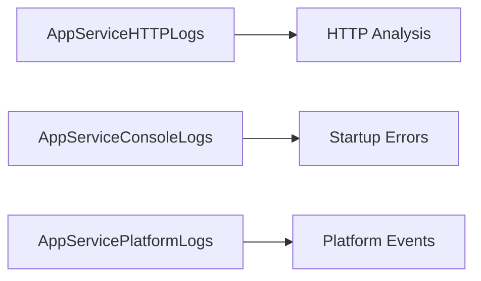

# Service-Specific Queries

KQL queries for specific Azure service diagnostics.

## Queries

| Query | Description |
|-------|-------------|
| [App Service Diagnostics](app-service-diagnostics.md) | HTTP log analysis, startup errors, platform log correlation |

## See Also

- [Service Guides: App Service](../../../service-guides/app-service/index.md)
- [Reference: Diagnostic Tables](../../../reference/diagnostic-tables.md)

## Sources

- [Monitor App Service](https://learn.microsoft.com/azure/app-service/monitor-app-service)
- [Enable diagnostics logging for apps in Azure App Service](https://learn.microsoft.com/azure/app-service/troubleshoot-diagnostic-logs)
