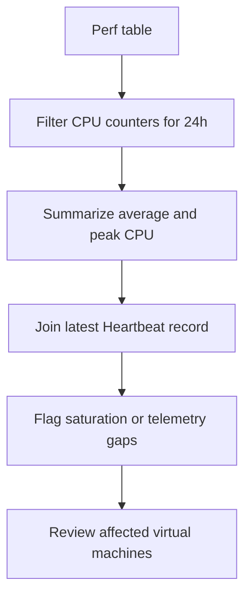

---
content_sources:
  diagrams:
    - id: data-flow
      type: flowchart
      source: mslearn-adapted
      based_on:
        - https://learn.microsoft.com/en-us/azure/azure-monitor/vm/vminsights-overview
        - https://learn.microsoft.com/en-us/azure/azure-monitor/vm/monitor-virtual-machine
---

# VM Diagnostics (Performance and Heartbeat Gaps)

Analyze VM Insights and performance counter data to identify virtual machines with sustained CPU pressure, memory stress, disk latency symptoms, or heartbeat gaps that suggest the agent or guest is unhealthy.

## Scenario
You need to find VMs that show high CPU utilization or missing heartbeats in the last 24 hours so that you can distinguish workload saturation from monitoring pipeline issues.

## KQL Query
```kusto
Perf
| where TimeGenerated > ago(24h)
| where ObjectName == "Processor" and CounterName == "% Processor Time" and InstanceName == "_Total"
| summarize
    AvgCpu = avg(CounterValue),
    PeakCpu = max(CounterValue),
    LastCpuSample = max(TimeGenerated)
    by Computer
| join kind=leftouter (
    Heartbeat
    | where TimeGenerated > ago(24h)
    | summarize LastHeartbeat = max(TimeGenerated) by Computer
) on Computer
| extend HeartbeatGapMinutes = datetime_diff('minute', now(), LastHeartbeat) * -1
| where AvgCpu > 70 or PeakCpu > 90 or HeartbeatGapMinutes > 15
| project Computer, AvgCpu = round(AvgCpu, 2), PeakCpu = round(PeakCpu, 2), LastCpuSample, LastHeartbeat, HeartbeatGapMinutes
| order by HeartbeatGapMinutes desc, PeakCpu desc
| take 15
```

## Data Flow
<!-- diagram-id: data-flow -->


## Sample Output
| Computer | AvgCpu | PeakCpu | LastCpuSample | LastHeartbeat | HeartbeatGapMinutes |
|----------|--------|---------|---------------|---------------|---------------------|
| vm-payroll-01 | 82.44 | 97.31 | 2026-04-13 09:40:00Z | 2026-04-13 09:41:00Z | 1 |
| vm-batch-03 | 28.17 | 66.92 | 2026-04-13 08:55:00Z | 2026-04-13 08:37:00Z | 64 |

## How to Read This
High `AvgCpu` and `PeakCpu` point to workload pressure, noisy neighbors, or undersized VM SKUs. A large `HeartbeatGapMinutes` value with normal CPU usually means the Azure Monitor Agent stopped reporting, the VM was rebooted, or network connectivity to the workspace was interrupted.

## Limitations
*   This query depends on performance counters and heartbeat data being collected by Azure Monitor Agent or legacy agents.
*   Memory and disk bottlenecks are not shown here and require additional `Perf` or `InsightsMetrics` queries.
*   Heartbeat gaps alone do not prove the VM is down because planned maintenance or scale actions can also interrupt reporting.

## See Also
*   [VM Monitoring Guide](../../../service-guides/vm/index.md)
*   [Agent Not Reporting Playbook](../../playbooks/agent-not-reporting.md)

## Sources
*   [MS Learn: VM insights overview](https://learn.microsoft.com/en-us/azure/azure-monitor/vm/vminsights-overview)
*   [MS Learn: Monitor virtual machines with Azure Monitor](https://learn.microsoft.com/en-us/azure/azure-monitor/vm/monitor-virtual-machine)
