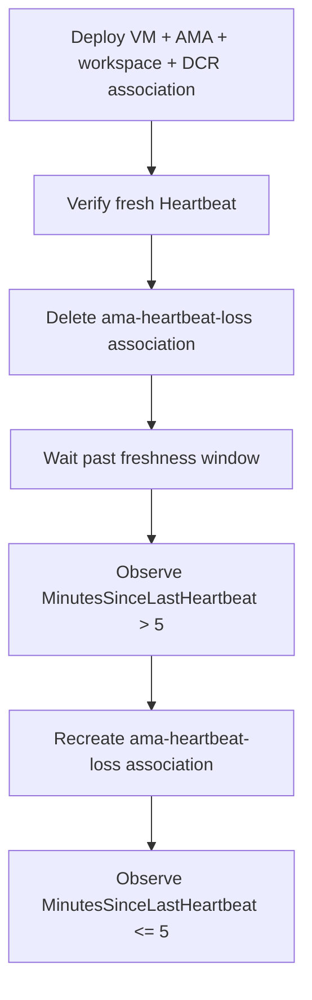

# AMA Heartbeat Loss

This lab guide documents the first troubleshooting lab for the repository: a minimal Linux VM with Azure Monitor Agent (AMA), a Log Analytics workspace, and a data collection rule (DCR) association named `ama-heartbeat-loss`. The failure is triggered by deleting that DCR association so the VM stays alive, the extension can still appear installed, and the `Heartbeat` table becomes stale until the association is restored.

## Lab Metadata

| Attribute | Value |
|---|---|
| Difficulty | Intermediate |
| Estimated Duration | 25-35 minutes for a live run |
| Azure Monitor Tier | Guest telemetry troubleshooting |
| Primary Services | Azure Monitor Agent, Log Analytics, Data Collection Rules, Azure Virtual Machines |
| Failure Trigger | Delete the DCR association named `ama-heartbeat-loss` from the VM |
| Success Condition | `MinutesSinceLastHeartbeat` rises above 5 during the break and returns to 5 or less after the fix |
| Substrate | `labs/ama-heartbeat-loss/` |
| Live Azure Required | Yes for evidence capture, but deferred in this documentation-only PR |

## 1) Background

The question behind this lab is: **what does AMA heartbeat loss look like when the VM and AMA extension still exist, but the guest signal path to the workspace is severed?**

The substrate in `labs/ama-heartbeat-loss/` deploys:

- A Linux VM named `vm-ama-heartbeat-loss`.
- The `AzureMonitorLinuxAgent` extension.
- A Log Analytics workspace named `law-ama-heartbeat-loss`.
- A Linux DCR named `dcr-ama-heartbeat-loss`.
- A DCR association on the VM named `ama-heartbeat-loss`.

That design isolates a common operational confusion: an operator may see a VM and AMA extension still present, but `Heartbeat` silently ages out because the association that routes guest telemetry was removed.

<!-- diagram-id: ama-heartbeat-loss-flow -->


## 2) Hypothesis

If the VM keeps running and the AMA extension remains installed, but the DCR association named `ama-heartbeat-loss` is deleted, then the workspace should stop receiving fresh guest signals from that VM and `Heartbeat` should become stale.

Prediction:

- **If** the association exists and onboarding has completed, **then** `MinutesSinceLastHeartbeat` should stay at 5 minutes or less.
- **If** the association is deleted and the VM waits past the freshness window, **then** `MinutesSinceLastHeartbeat` should become greater than 5.
- **If** the same association is recreated against the same DCR, **then** heartbeat freshness should recover and `MinutesSinceLastHeartbeat` should return to 5 minutes or less.

## 3) Runbook

This PR does not execute the lab. The runbook below is the documented live procedure grounded in the shipped substrate.

1. **Deploy the substrate and capture the emitted environment variables.**

    ```bash
    export RG="rg-ama-heartbeat-loss"
    export LOCATION="eastus"

    bash labs/ama-heartbeat-loss/scripts/deploy.sh
    ```

2. **Verify the healthy baseline before breaking anything.**

    ```bash
    bash labs/ama-heartbeat-loss/scripts/verify.sh
    ```

3. **Break the guest signal path by deleting the DCR association only.**

    ```bash
    bash labs/ama-heartbeat-loss/scripts/break.sh
    ```

4. **Wait past the freshness window, then verify the stale state.**

    ```bash
    sleep 360
    bash labs/ama-heartbeat-loss/scripts/verify.sh
    ```

5. **Recreate the DCR association and verify recovery.**

    ```bash
    bash labs/ama-heartbeat-loss/scripts/fix.sh
    sleep 180
    bash labs/ama-heartbeat-loss/scripts/verify.sh
    ```

The substrate scripts map directly to the intended investigation states:

- `deploy.sh` creates the workspace, VM, AMA extension, DCR, and association.
- `verify.sh` runs the corrected `Heartbeat` query against the workspace.
- `break.sh` deletes the association named `ama-heartbeat-loss`.
- `fix.sh` recreates that same association against the deployed DCR.

## 4) Experiment Log

This section is intentionally documentation-first. Real observations are deferred until a live Azure run generates evidence.

| Phase | Planned observation | Evidence status |
|---|---|---|
| Baseline after deployment | Fresh heartbeat from `vm-ama-heartbeat-loss` with `MinutesSinceLastHeartbeat <= 5` | Pending live capture |
| After `break.sh` and wait window | Heartbeat becomes stale with `MinutesSinceLastHeartbeat > 5` | Pending live capture |
| After `fix.sh` and recovery wait | Heartbeat becomes fresh again with `MinutesSinceLastHeartbeat <= 5` | Pending live capture |

??? note "Evidence notes"
    [Not Proven] This PR does not include live deployment, live KQL output, or screenshots.

    [Inferred] The substrate design should isolate DCR-association loss because the break step deletes only `ama-heartbeat-loss` and the fix step recreates only that association.

    [Observed] The substrate scripts and Bicep resources show a single VM, a single DCR, and a single association path for the experiment.

### Falsification

The hypothesis is falsified if a live run shows either of these outcomes:

- `MinutesSinceLastHeartbeat` never rises above 5 after deleting the association and waiting past the freshness window.
- `MinutesSinceLastHeartbeat` stays above 5 after recreating the association and waiting for recovery.

## 5) Verification Queries

Use the corrected substrate query below. Do **not** multiply by `-1`; the lab expects `MinutesSinceLastHeartbeat` to be a positive number that increases while AMA stays silent.

```kusto
Heartbeat
| where Computer == 'vm-ama-heartbeat-loss'
| summarize LastHeartbeat=max(TimeGenerated), MinutesSinceLastHeartbeat=datetime_diff('minute', now(), max(TimeGenerated))
```

| Verification point | Pass / fail rule | Live result |
|---|---|---|
| Baseline before break | Pass when `MinutesSinceLastHeartbeat <= 5` | Pending live capture |
| Broken state after deleting `ama-heartbeat-loss` and waiting | Fail state confirmed when `MinutesSinceLastHeartbeat > 5` | Pending live capture |
| Falsification after fix | Recovery confirmed when `MinutesSinceLastHeartbeat <= 5` | Pending live capture |

Interpretation:

- A value greater than 5 means the VM is no longer sending fresh heartbeat records to the workspace.
- A value of 5 or less after `fix.sh` is the falsification step that proves the association restore corrected the original theory.
- Record the real before/after values during the first live run; do not pre-fill them in documentation.

## 6) Portal Evidence

Target directory for future captures: `docs/assets/troubleshooting/ama-heartbeat-loss/`

Pending live capture only. Do not add markdown image references until the actual files exist and are visually verified.

Planned captures:

- `01-vm-extensions-healthy.png` — VM Extensions blade showing `AzureMonitorLinuxAgent` still present.
- `02-dcr-association-missing.png` — VM or DCR association view after `break.sh` removes `ama-heartbeat-loss`.
- `03-logs-heartbeat-stale.png` — Logs blade with the stale-heartbeat query result after the wait window.
- `04-dcr-association-restored.png` — Association restored after `fix.sh`.
- `05-logs-heartbeat-recovered.png` — Logs blade showing the recovered heartbeat state.

Portal evidence expectations:

- Capture the broken state before the fix.
- Capture the recovered state after the fix.
- Keep all screenshots marked as pending until real Portal images exist on disk.

## Clean Up

When the live lab is complete, remove the resource group.

```bash
bash labs/ama-heartbeat-loss/scripts/cleanup.sh
```

## Related Playbook

- [Agent Not Reporting](../playbooks/agent-not-reporting.md)
- Source path: `docs/troubleshooting/playbooks/agent-not-reporting.md`

## See Also

- [Troubleshooting Lab Guides](index.md)
- [Evidence Map](../evidence-map.md)
- [Virtual machine observability](../../service-guides/vm/observability.md)
- [Data collection rules](../../platform/data-collection-rules.md)

## Sources

- [Azure Monitor agent overview](https://learn.microsoft.com/en-us/azure/azure-monitor/agents/azure-monitor-agent-overview)
- [Troubleshoot the Azure Monitor agent on Azure virtual machines](https://learn.microsoft.com/en-us/azure/azure-monitor/agents/azure-monitor-agent-troubleshoot-linux-vm)
- [Data collection rules in Azure Monitor](https://learn.microsoft.com/en-us/azure/azure-monitor/data-collection/data-collection-rule-overview)
- [Heartbeat table reference](https://learn.microsoft.com/en-us/azure/azure-monitor/reference/tables/heartbeat)
- [Enable VM insights overview](https://learn.microsoft.com/en-us/azure/azure-monitor/vm/vminsights-enable-overview)
