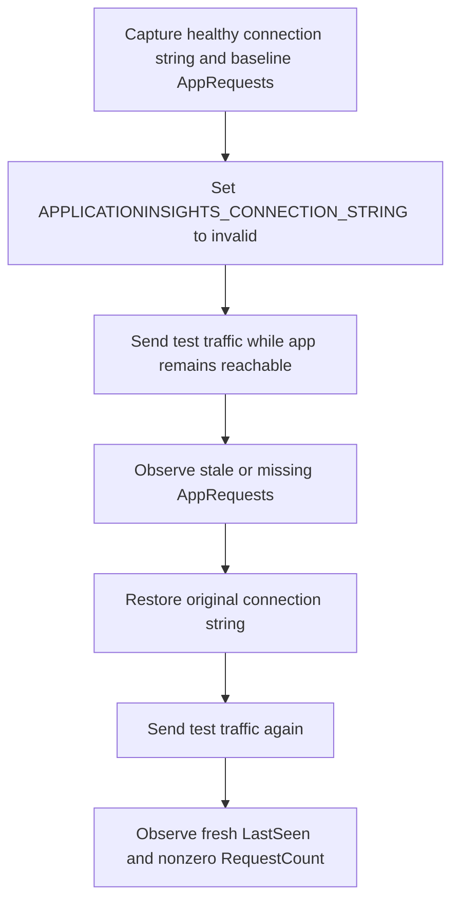

# Application Insights Telemetry Gap

This lab guide documents a Wave 5 Zero-Lab Readiness follow-on scenario for `missing-application-telemetry`: an App Service app is healthy enough to serve traffic, but `APPLICATIONINSIGHTS_CONNECTION_STRING` is deliberately set to `invalid`, causing Application Insights request telemetry to stop arriving in `AppRequests` until the original connection string is restored.

## Lab Metadata

| Attribute | Value |
|---|---|
| Difficulty | Intermediate |
| Estimated Duration | 20-30 minutes for a live run |
| Azure Monitor Tier | Application telemetry troubleshooting |
| Primary Services | Azure App Service, Application Insights, Log Analytics |
| Failure Trigger | Replace `APPLICATIONINSIGHTS_CONNECTION_STRING` with `invalid` |
| Success Condition | `AppRequests` becomes stale or empty during the break, then returns with fresh `LastSeen` and nonzero `RequestCount` after restore |
| Substrate | `labs/app-insights-telemetry-gap/` |
| Live Azure Required | Yes for evidence capture, but deferred in this documentation-only PR |

## 1) Background

The question behind this lab is: **what does an Application Insights telemetry gap look like when the web app still responds to requests, but the runtime no longer has a valid connection string for Application Insights ingestion?**

This scenario deliberately isolates configuration drift instead of traffic loss, regional outage, or sampling behavior:

- The application keeps serving requests.
- The break is a single app setting change on App Service.
- The verification target is `AppRequests`, not Live Metrics.
- The recovery step restores the original connection string value and checks for fresh telemetry.

That makes the lab a concrete companion to the paired playbook at `docs/troubleshooting/playbooks/missing-application-telemetry.md`, especially for operators who need to recognize the difference between **application unavailable** and **application running but telemetry disconnected**.

<!-- diagram-id: app-insights-telemetry-gap-flow -->


## 2) Hypothesis

If an App Service application keeps running but `APPLICATIONINSIGHTS_CONNECTION_STRING` is changed to an invalid value, then the app should stop sending fresh request telemetry to Application Insights and `AppRequests` should become stale or empty for that app role until the original connection string is restored.

Prediction:

- **If** the original connection string is present and the app is serving traffic, **then** the acceptance query should return a fresh `LastSeen` and a nonzero `RequestCount`.
- **If** the connection string is replaced with `invalid` and new requests are sent, **then** the acceptance query should show a stale `LastSeen`, no new rows, or `RequestCount` failing to increase.
- **If** the original connection string is restored and traffic resumes, **then** the acceptance query should again return a fresh `LastSeen` and a nonzero `RequestCount`.

## 3) Runbook

This PR does not execute the lab. The runbook below is the documented live procedure only.

1. **Capture the current Application Insights connection string from the App Service app settings.** Save the real value in a temporary shell variable for the later restore step.

    ```bash
    GOOD_CONNECTION_STRING=$(az webapp config appsettings list \
        --resource-group "$RG" \
        --name "$APP_NAME" \
        --query "[?name=='APPLICATIONINSIGHTS_CONNECTION_STRING'].value | [0]" \
        --output tsv)
    ```

    | Command | Purpose |
    | --- | --- |
    | `az webapp config appsettings list` | List application settings of the web app. |
    | `--resource-group` | Resource group that contains the web app. |
    | `--name` | Name of the App Service app. |
    | `--query` | Return only the current Application Insights connection string value. |
    | `--output` | Emit the saved setting as plain text for shell-variable assignment. |

2. **Verify the healthy baseline in Log Analytics before breaking anything.**

    ```bash
    az monitor log-analytics query \
        --workspace "$WORKSPACE_ID" \
        --analytics-query "AppRequests | where AppRoleName == '$APP_ROLE' and TimeGenerated > ago(30m) | summarize LastSeen=max(TimeGenerated), RequestCount=sum(ItemCount)" \
        --timespan "PT30M"
    ```

    | Command | Purpose |
    | --- | --- |
    | `az monitor log-analytics query` | Run the acceptance query against the workspace-based Application Insights data. |
    | `--workspace` | Log Analytics workspace ID for the query. |
    | `--analytics-query` | Kusto query that returns `LastSeen` and `RequestCount` for the target app role. |
    | `--timespan` | Constrain the query window to the most recent 30 minutes. |

3. **Break the telemetry path by replacing the connection string with an invalid value.**

    ```bash
    az webapp config appsettings set \
        --resource-group "$RG" \
        --name "$APP_NAME" \
        --settings APPLICATIONINSIGHTS_CONNECTION_STRING="invalid"
    ```

    | Command | Purpose |
    | --- | --- |
    | `az webapp config appsettings set` | Update application settings on the web app. |
    | `--resource-group` | Resource group that contains the web app. |
    | `--name` | Name of the App Service app. |
    | `--settings` | Replace `APPLICATIONINSIGHTS_CONNECTION_STRING` with the intentionally broken value. |

4. **Generate test traffic while the app remains otherwise healthy.**

    ```bash
    for _ in 1 2 3 4 5; do
        curl --fail --silent "$APP_URL/" > /dev/null
        sleep 5
    done
    ```

5. **Re-run the acceptance query and record the stale or missing telemetry state.**

    ```bash
    az monitor log-analytics query \
        --workspace "$WORKSPACE_ID" \
        --analytics-query "AppRequests | where AppRoleName == '$APP_ROLE' and TimeGenerated > ago(30m) | summarize LastSeen=max(TimeGenerated), RequestCount=sum(ItemCount)" \
        --timespan "PT30M"
    ```

    | Command | Purpose |
    | --- | --- |
    | `az monitor log-analytics query` | Re-run the same acceptance query after the break. |
    | `--workspace` | Log Analytics workspace ID for the query. |
    | `--analytics-query` | Kusto query that detects stale or missing request telemetry. |
    | `--timespan` | Keep the observation window aligned with the baseline run. |

6. **Restore the original connection string value.**

    ```bash
    az webapp config appsettings set \
        --resource-group "$RG" \
        --name "$APP_NAME" \
        --settings APPLICATIONINSIGHTS_CONNECTION_STRING="$GOOD_CONNECTION_STRING"
    ```

    | Command | Purpose |
    | --- | --- |
    | `az webapp config appsettings set` | Restore the original application setting on the web app. |
    | `--resource-group` | Resource group that contains the web app. |
    | `--name` | Name of the App Service app. |
    | `--settings` | Put the saved valid connection string back in place. |

7. **Generate test traffic again and verify that `AppRequests` resumes.**

    ```bash
    for _ in 1 2 3 4 5; do
        curl --fail --silent "$APP_URL/" > /dev/null
        sleep 5
    done
    ```

    ```bash
    az monitor log-analytics query \
        --workspace "$WORKSPACE_ID" \
        --analytics-query "AppRequests | where AppRoleName == '$APP_ROLE' and TimeGenerated > ago(30m) | summarize LastSeen=max(TimeGenerated), RequestCount=sum(ItemCount)" \
        --timespan "PT30M"
    ```

    | Command | Purpose |
    | --- | --- |
    | `az monitor log-analytics query` | Run the falsification query after the fix. |
    | `--workspace` | Log Analytics workspace ID for the query. |
    | `--analytics-query` | Confirm fresh request telemetry resumed for the same app role. |
    | `--timespan` | Keep the query window consistent with earlier checks. |

## 4) Experiment Log

This section is intentionally documentation-first. Real observations are deferred until a live Azure run generates evidence.

| Phase | Planned observation | Evidence status |
|---|---|---|
| Baseline before break | `AppRequests` shows a fresh `LastSeen` and nonzero `RequestCount` for the target role | pending live capture |
| After setting `APPLICATIONINSIGHTS_CONNECTION_STRING` to `invalid` | The app can still answer requests, but request telemetry becomes stale or stops increasing | pending live capture |
| After restoring the original connection string | Fresh `LastSeen` returns and `RequestCount` increases again | pending live capture |

??? note "Evidence notes"
    [Not Proven] This PR does not include a live deployment, live KQL output, or Portal screenshots.

    [Inferred] The runbook isolates connection-string drift because the break step changes only `APPLICATIONINSIGHTS_CONNECTION_STRING` and the recovery step restores only that same setting.

    [Inferred] The paired playbook `missing-application-telemetry` already identifies connection string drift as a high-likelihood cause of missing Application Insights telemetry.

### Falsification

The hypothesis is falsified if a live run shows either of these outcomes:

- `AppRequests` continues to show fresh telemetry for the target role after the connection string is set to `invalid` and new traffic is sent.
- `AppRequests` does not recover to a fresh `LastSeen` with nonzero `RequestCount` after the original connection string is restored and new traffic is sent.

## 5) Verification Queries

Use the acceptance query below for the same `AppRoleName` before the break, during the broken state, and after the restore.

```kusto
AppRequests
| where AppRoleName == "<app-role>" and TimeGenerated > ago(30m)
| summarize LastSeen=max(TimeGenerated), RequestCount=sum(ItemCount)
```

| Verification point | Pass / fail rule | Live result |
|---|---|---|
| Baseline before break | Pass when `LastSeen` is fresh for active test traffic and `RequestCount` is nonzero | pending live capture |
| Broken state after setting the connection string to `invalid` | Fail state confirmed when `LastSeen` becomes stale, disappears from the window, or `RequestCount` stops increasing despite test traffic | pending live capture |
| Falsification after restore | Recovery confirmed when `LastSeen` becomes fresh again and `RequestCount` is nonzero after the original connection string is restored | pending live capture |

Interpretation:

- During the broken state, a stale or missing result supports the theory that the application is alive but no longer emitting request telemetry.
- After the restore, a fresh `LastSeen` with nonzero `RequestCount` is the falsification step that proves the original theory was correct.
- Record real timestamps and counts only during the first live run; do not pre-fill them in documentation.

## 6) Portal Evidence

Target directory for future captures: `docs/assets/troubleshooting/app-insights-telemetry-gap/`

Pending live capture only. Do not add markdown image references until the actual files exist and are visually verified.

Planned captures:

- `01-app-service-app-settings-baseline.png` — App Service Configuration blade showing the healthy telemetry setting state.
- `02-app-service-app-settings-broken.png` — Configuration blade after `APPLICATIONINSIGHTS_CONNECTION_STRING` is replaced with `invalid`.
- `03-logs-apprequests-stale.png` — Logs blade showing the broken-state acceptance query result.
- `04-app-service-app-settings-restored.png` — Configuration blade after the original connection string is restored.
- `05-logs-apprequests-recovered.png` — Logs blade showing fresh `LastSeen` and nonzero `RequestCount` after recovery.

Portal evidence expectations:

- Capture the broken state before the fix.
- Capture the recovered state after the fix.
- Keep all screenshots marked as pending live capture until real Portal images exist on disk.

## Out of scope

Broader repository restructuring, live Azure deployment, substrate automation beyond the minimal companion placeholders, and Portal/KQL evidence capture are out of scope for this documentation-only change.

## Clean Up

When a live run is complete, restore the original setting if it is not already back in place and remove any temporary test resources created specifically for the lab run.

```bash
az webapp config appsettings set \
    --resource-group "$RG" \
    --name "$APP_NAME" \
    --settings APPLICATIONINSIGHTS_CONNECTION_STRING="$GOOD_CONNECTION_STRING"
```

| Command | Purpose |
| --- | --- |
| `az webapp config appsettings set` | Ensure the original application setting is restored during clean-up. |
| `--resource-group` | Resource group that contains the web app. |
| `--name` | Name of the App Service app. |
| `--settings` | Put the saved valid connection string back in place. |

## Related Playbook

- [Missing Application Telemetry](../playbooks/missing-application-telemetry.md)
- Source path: `docs/troubleshooting/playbooks/missing-application-telemetry.md`

## See Also

- [Troubleshooting Lab Guides](index.md)
- [Application Insights Data Gaps](../playbooks/application-insights-gaps.md)
- [App Service application insights integration](../../service-guides/app-service/application-insights-integration.md)
- [Application Insights](../../platform/application-insights.md)

## Sources

- [Monitor Azure App Service with Application Insights](https://learn.microsoft.com/en-us/azure/azure-monitor/app/azure-web-apps)
- [Workspace-based Application Insights resources](https://learn.microsoft.com/en-us/azure/azure-monitor/app/create-workspace-resource)
- [Troubleshoot missing application telemetry in Application Insights](https://learn.microsoft.com/en-us/troubleshoot/azure/azure-monitor/app-insights/telemetry/investigate-missing-telemetry)
- [AppRequests table reference](https://learn.microsoft.com/en-us/azure/azure-monitor/reference/tables/apprequests)
