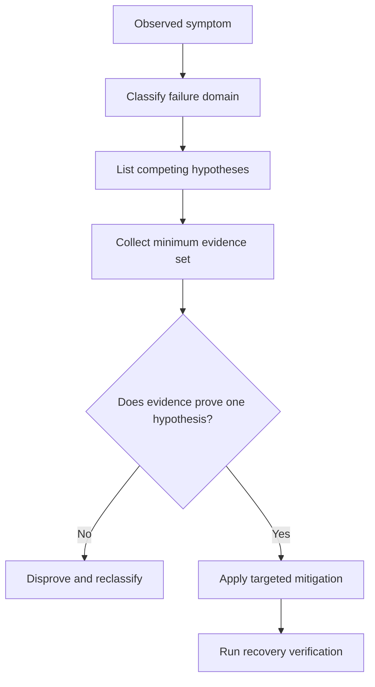
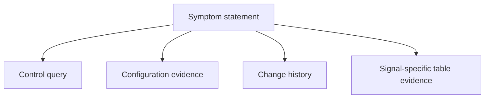
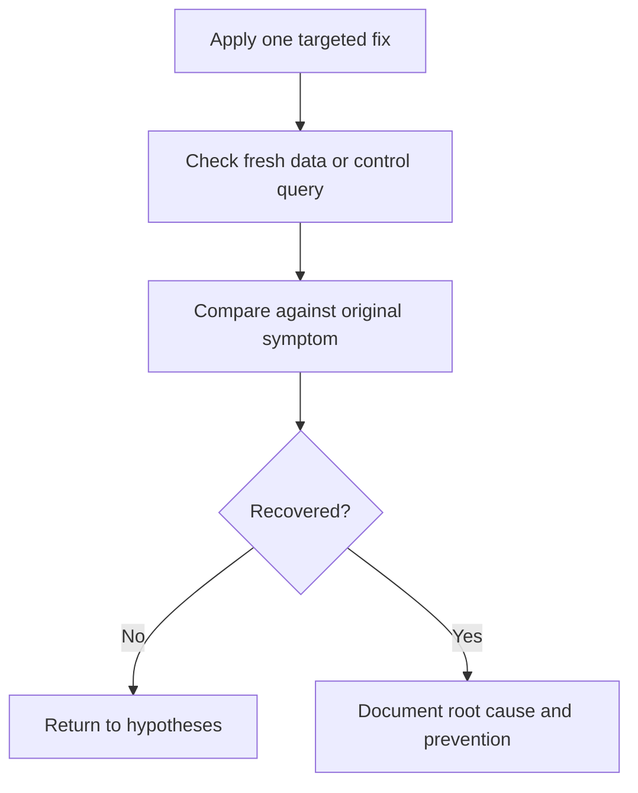

---
content_sources:
  diagrams:
    - id: symptom-to-hypothesis-framework
      type: flowchart
      source: mslearn-adapted
      based_on:
        - https://learn.microsoft.com/en-us/azure/azure-monitor/troubleshoot
        - https://learn.microsoft.com/en-us/azure/azure-monitor/logs/log-analytics-workspace-overview
        - https://learn.microsoft.com/en-us/azure/azure-monitor/logs/query-best-practices
        - https://learn.microsoft.com/en-us/azure/azure-monitor/essentials/create-diagnostic-settings
        - https://learn.microsoft.com/en-us/azure/azure-monitor/app/app-insights-overview
    - id: 5-minimum-evidence-set
      type: flowchart
      source: mslearn-adapted
      based_on:
        - https://learn.microsoft.com/en-us/azure/azure-monitor/troubleshoot
        - https://learn.microsoft.com/en-us/azure/azure-monitor/logs/log-analytics-workspace-overview
        - https://learn.microsoft.com/en-us/azure/azure-monitor/logs/query-best-practices
        - https://learn.microsoft.com/en-us/azure/azure-monitor/essentials/create-diagnostic-settings
        - https://learn.microsoft.com/en-us/azure/azure-monitor/app/app-insights-overview
    - id: 9-recovery-verification-model
      type: flowchart
      source: mslearn-adapted
      based_on:
        - https://learn.microsoft.com/en-us/azure/azure-monitor/troubleshoot
        - https://learn.microsoft.com/en-us/azure/azure-monitor/logs/log-analytics-workspace-overview
        - https://learn.microsoft.com/en-us/azure/azure-monitor/logs/query-best-practices
        - https://learn.microsoft.com/en-us/azure/azure-monitor/essentials/create-diagnostic-settings
        - https://learn.microsoft.com/en-us/azure/azure-monitor/app/app-insights-overview
---

# Troubleshooting Mental Model

This page provides a practical thinking model for Azure Monitor incidents so you can move from symptom to verified root cause without skipping disproof.

**Core idea**: treat every incident as a path from **symptom → hypothesis → validation → disproof → mitigation**. Azure Monitor problems are often misclassified because operators jump from one visible symptom to one familiar cause.

## Why this model matters

Most troubleshooting delays come from category mistakes:

- ingestion gaps investigated as query bugs
- alert-rule failures investigated as workspace outages
- slow workbooks investigated as portal problems instead of KQL shape problems
- missing application telemetry investigated as platform regression when the connection string changed

This model keeps the investigation falsifiable.

## Symptom-to-hypothesis framework

<!-- diagram-id: symptom-to-hypothesis-framework -->

## 1) Start with the exact symptom

Capture one precise statement before touching tooling.

| Weak statement | Better statement |
|---|---|
| Azure Monitor is broken | AKS container logs stopped arriving in one workspace after 09:10 UTC |
| Alerts do not work | One scheduled query rule did not fire although matching rows existed between 10:00 and 10:15 UTC |
| Queries are slow | One workbook query against `AzureDiagnostics` times out for 24 hours but succeeds for 30 minutes |

The better statement creates falsifiable boundaries: workload, signal type, time window, and blast radius.

## 2) Classify the failure domain first

Use four domains only.

| Domain | Meaning | Typical symptom |
|---|---|---|
| Source | Telemetry was never emitted correctly | Missing requests, traces, or guest logs |
| Routing | Telemetry was emitted but not delivered correctly | Wrong workspace, missing categories, DCR mismatch |
| Data store | Telemetry arrived but is delayed, expired, or queried in the wrong place | Historical gaps, wrong table, retention confusion |
| Consumer | Data exists, but the query, alert, or workbook is wrong | Slow KQL, bad thresholds, workbook fan-out |

!!! tip "Do not start with root cause labels"
    Start with a failure domain, not with a favorite explanation such as "platform issue" or "networking issue".

## 3) Build competing hypotheses

For each incident, create at least three plausible explanations.

| Symptom | Good competing hypotheses |
|---|---|
| No logs in workspace | diagnostic setting missing, wrong workspace target, ingestion delay |
| App telemetry gap | SDK misconfiguration, sampling, network egress restriction |
| Alert never fires | no underlying data, bad query logic, wrong evaluation window |
| Slow query | broad time range, weak predicates, workbook/cross-workspace overhead |

If you only have one hypothesis, you are usually guessing.

## 4) Ask evidence questions, not fix questions

Wrong question: *What should I change?*

Better questions:

- What evidence would prove the data never arrived?
- What evidence would show the workspace is healthy but the query is bad?
- What evidence would disprove a service-side incident?
- What changed immediately before the symptom started?

This prevents premature mitigation that destroys useful evidence.

## 5) Minimum evidence set

<!-- diagram-id: 5-minimum-evidence-set -->

Use one artifact from each category whenever possible.

| Evidence category | Example |
|---|---|
| Control query | `Heartbeat` or `Usage` narrow query |
| Configuration evidence | diagnostic settings, DCR, alert rule, Application Insights settings |
| Change history | Activity Log around incident start |
| Signal-specific evidence | `requests`, `AppRequests`, `AzureDiagnostics`, `ContainerLogV2` |

## 6) Validation logic: prove and disprove

Every hypothesis needs both sides.

| Hypothesis | Proves if | Disproves if |
|---|---|---|
| Workspace outage | multiple trivial control queries are slow for unrelated tables | narrow control queries are healthy |
| Diagnostic setting issue | Activity Log shows change and target categories or destination are wrong | settings are unchanged and another routing issue explains gap |
| Query-shape issue | small-window or selective rewrite is dramatically faster | performance stays poor even with narrow selective probes |
| Sampling issue | requests arrive but traces are selectively reduced per configuration | traffic is absent across all signal types |

If you cannot state the disproof condition, the hypothesis is not ready.

## 7) Common Azure Monitor failure patterns

### Pattern A: "No data" is really wrong routing

- Resource exists and is healthy.
- Metrics may still appear.
- Workspace query is empty because diagnostic settings or DCR target is wrong.

### Pattern B: "Application Insights is down" is really app-side config drift

- Requests drop after deployment.
- Connection string or SDK package changed.
- Platform is healthy, but source emission changed.

### Pattern C: "Query engine is slow" is really data volume plus bad KQL

- Control query is fast.
- Slow query uses wide windows, `contains`, or joins high-cardinality sets.
- Rewritten query proves the workspace is fine.

### Pattern D: "Alert is broken" is really threshold or cadence mismatch

- Data exists interactively.
- Alert window or aggregation does not align with the observed signal.
- Rule logic fails even though ingestion is healthy.

## 8) Common anti-patterns

| Anti-pattern | Why it slows diagnosis |
|---|---|
| Restarting agents or apps before collecting evidence | destroys timeline and masks intermittent issues |
| Changing diagnostic settings and alert rules together | makes attribution impossible |
| Looking at only one table | creates wrong-table bias |
| Treating portal behavior as proof of platform state | workbook and portal UX can hide the real KQL issue |
| Escalating before running a control query | confuses local design issues with service incidents |

## 9) Recovery verification model

<!-- diagram-id: 9-recovery-verification-model -->

Recovery is not "the command succeeded." Recovery means the original symptom is absent in fresh evidence.

## 10) Incident note template

Use this short structure during investigations:

1. **Symptom**: what is wrong, where, and since when
2. **Failure domain**: source, routing, data store, or consumer
3. **Top hypotheses**: at least three
4. **Evidence collected**: control query, config check, change history, signal-specific query
5. **Current conclusion**: what is disproved, what remains likely

## 11) When to escalate

Escalate to likely Azure-side service impact only when:

- multiple unrelated workloads or tables show the same degradation
- narrow control queries also fail or are abnormally slow
- configuration evidence does not explain the issue
- Service Health or broader tenant evidence fits the incident window

Otherwise, continue disproof inside the relevant playbook.

## See Also

- [Troubleshooting](index.md)
- [Troubleshooting Architecture Overview](architecture-overview.md)
- [Decision Tree](decision-tree.md)
- [Evidence Map](evidence-map.md)
- [Playbooks Index](playbooks/index.md)
- [Slow Query Performance](playbooks/slow-query-performance.md)

## Sources

- [Troubleshoot Azure Monitor](https://learn.microsoft.com/en-us/azure/azure-monitor/troubleshoot)
- [Log Analytics workspace overview](https://learn.microsoft.com/en-us/azure/azure-monitor/logs/log-analytics-workspace-overview)
- [Best practices for Azure Monitor Logs queries](https://learn.microsoft.com/en-us/azure/azure-monitor/logs/query-best-practices)
- [Create diagnostic settings in Azure Monitor](https://learn.microsoft.com/en-us/azure/azure-monitor/essentials/create-diagnostic-settings)
- [Application Insights overview](https://learn.microsoft.com/en-us/azure/azure-monitor/app/app-insights-overview)
