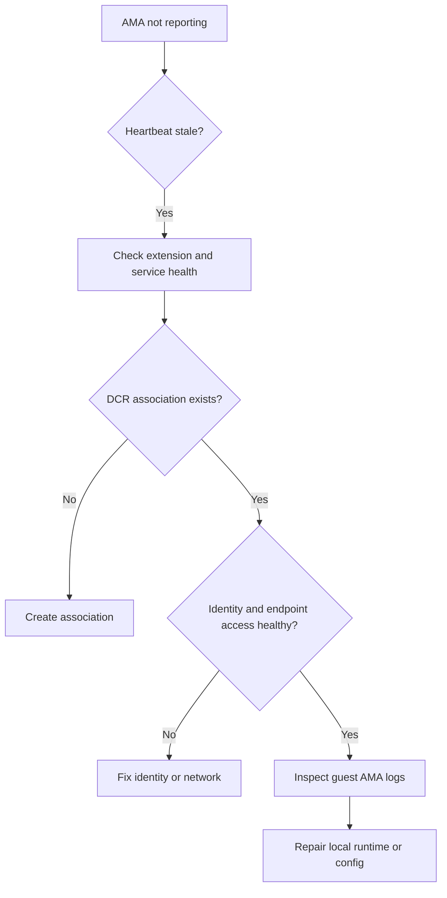

# Agent Not Reporting

## 1. Summary
An Azure Monitor Agent (AMA) extension appears installed on a VM or Arc-enabled server, but the machine stops sending heartbeats, performance counters, event logs, or syslog records to the Log Analytics workspace. This playbook applies when the problem is tied to AMA-collected data and you need to prove whether the failure is in extension health, DCR association, managed identity, guest runtime state, or outbound connectivity.

The key Microsoft Learn guidance is that a successful extension deployment does not prove the agent is healthy at runtime. AMA needs a valid data collection rule, access to identity and configuration endpoints, local service health, and network reachability to Azure Monitor. Use this playbook when `Heartbeat` is stale, when a newly onboarded VM never reports, or when only AMA-driven tables are missing while platform logs still arrive.

**Typical incident window**: 10-20 minutes from first missed heartbeat to human detection when stale-heartbeat alerting is in place.
**Time to resolution**: 30 minutes to 2 hours depending on whether the break is DCR association, identity, guest runtime, or egress.

Use it when:

- `Heartbeat` is stale for one VM, a scale set set, or an Arc server fleet.
- The extension says `Succeeded`, but no new data reaches `Perf`, `InsightsMetrics`, or event tables.
- Data stopped after network changes, identity changes, or DCR rollout changes.
- Only AMA-collected tables are missing; other workspace tables still update.



## 2. Common Misreadings
| Observation | Often Misread As | Actually Means |
|---|---|---|
| VM extension state is `Succeeded` | AMA is healthy | Extension deployment succeeded, but the service may still fail after startup. |
| `Heartbeat` is empty for one machine | Workspace ingestion is broken | The issue is usually machine-specific: DCR, identity, service state, or egress. |
| DCR exists in Azure | The VM must be using it | The resource also needs a valid DCR association. |
| Platform logs for the VM still arrive | AMA is fine | Platform logs use a different pipeline than AMA-collected guest telemetry. |
| Data stopped after firewall changes | AMA bug | AMA depends on documented Azure Monitor and IMDS endpoints that may now be blocked. |
| One VM in a subnet stopped reporting while others are healthy | Random host issue | Compare DCR association, identity, and local guest logs before assuming corruption. |

## 3. Competing Hypotheses
| Hypothesis | Likelihood | Key Discriminator |
|---|---|---|
| No DCR association exists for the resource | High | `az monitor data-collection rule association list` returns no association for the VM or Arc resource. |
| AMA extension or service runtime is unhealthy | High | Extension is missing, failed, or guest logs show local service errors. |
| Managed identity or access token flow is broken | Medium | Guest logs show authentication or authorization errors and the VM identity is missing or changed. |
| Endpoint access to IMDS or Azure Monitor is blocked | Medium | DCR exists, extension exists, but the source cannot reach required endpoints. |
| DCR is present but configured for different streams than expected | Medium | Heartbeat may exist, but the missing table is not included in the DCR data flows. |
| Workspace-side issue is being blamed incorrectly | Low | Other AMA machines report normally to the same workspace. |

## 4. What to Check First
1. **Confirm the VM identity state used by AMA-related calls**

    ```bash
    az vm show \
        --resource-group $RG \
        --name $VM_NAME \
        --query "identity"
    ```

2. **Confirm AMA extension deployment and publisher details**

    ```bash
    az vm extension list \
        --resource-group $RG \
        --vm-name $VM_NAME \
        --query "[].{name:name,provisioningState:provisioningState,publisher:publisher}"
    ```

3. **Query the workspace for current heartbeat state before changing the VM**

    ```bash
    az monitor log-analytics query \
        --workspace $WORKSPACE_ID \
        --analytics-query "Heartbeat | where TimeGenerated > ago(1d) | summarize LastHeartbeat=max(TimeGenerated) by Computer, _ResourceId | order by LastHeartbeat asc" \
        --timespan "P1D"
    ```

4. **List DCR associations on the affected resource**

    ```bash
    az monitor data-collection rule association list \
        --resource $RESOURCE_ID \
        --output json
    ```

5. **Inspect the DCR data flows and destination workspace**

    ```bash
    az monitor data-collection rule show \
        --resource-group $RG \
        --name $DCR_NAME \
        --output json
    ```

6. **If Arc is involved, inspect the connected machine resource state**

    ```bash
    az connectedmachine show \
        --resource-group $RG \
        --name $MACHINE_NAME \
        --query "{status:status,location:location,id:id}"
    ```

## 5. Evidence to Collect
### 5.1 KQL Queries
```kusto
// Last heartbeat per computer
Heartbeat
| where TimeGenerated > ago(3d)
| summarize LastHeartbeat=max(TimeGenerated) by Computer, OSType, _ResourceId
| order by LastHeartbeat asc
| take 30
```

| Column | Example data | Interpretation |
|---|---|---|
| `Computer` | `vm-prod-02` | Target machine for guest-side inspection. |
| `OSType` | `Windows` | Determines which local service name and log path to use. |
| `_ResourceId` | `/subscriptions/<subscription-id>/resourceGroups/rg-prod/providers/Microsoft.Compute/virtualMachines/vm-prod-02` | Use this value in DCR association checks. |
| `LastHeartbeat` | `2026-04-05T05:42:00Z` | Stale values prove the liveness path is broken. |

!!! tip "How to Read This"
    Sort oldest first. If multiple stale machines share a subnet, policy assignment, or DCR, investigate the shared dependency before treating each VM as an isolated incident.

```kusto
// Compare AMA freshness against other workspace activity
union isfuzzy=true
    (Heartbeat | summarize LastSeen=max(TimeGenerated), Rows=count() by TableName="Heartbeat"),
    (AzureActivity | summarize LastSeen=max(TimeGenerated), Rows=count() by TableName="AzureActivity"),
    (Operation | summarize LastSeen=max(TimeGenerated), Rows=count() by TableName="Operation")
| extend MinutesSinceLastSeen = datetime_diff('minute', now(), LastSeen) * -1
| order by MinutesSinceLastSeen desc
```

| Column | Example data | Interpretation |
|---|---|---|
| `TableName` | `Heartbeat` | AMA-driven signal. |
| `LastSeen` | `2026-04-05T06:00:00Z` | If stale while other tables are fresh, the workspace is not the main issue. |
| `Rows` | `15243` | History exists even if current ingestion is failing. |
| `MinutesSinceLastSeen` | `83` | Large gap on `Heartbeat` only points back to source or AMA path. |

!!! tip "How to Read This"
    This query disproves the statement "the workspace is down" when `AzureActivity` and `Operation` remain current. That saves time by keeping the investigation on the AMA path.

```kusto
// Missing or stale heartbeat concentration by resource group pattern
Heartbeat
| where TimeGenerated > ago(3d)
| summarize LastHeartbeat=max(TimeGenerated), Computers=dcount(Computer) by ResourceGroup=extract(@"resourceGroups/([^/]+)/", 1, _ResourceId)
| order by LastHeartbeat asc
```

| Column | Example data | Interpretation |
|---|---|---|
| `ResourceGroup` | `rg-prod-eastus` | Shared administrative boundary. |
| `LastHeartbeat` | `2026-04-05T04:58:00Z` | If many machines in one group are stale, look for shared policy or rollout issues. |
| `Computers` | `18` | Higher counts support a shared root cause. |

!!! tip "How to Read This"
    A resource-group cluster of failures usually means a shared DCR, policy, or network dependency changed. A single-host failure usually means local runtime or identity drift.

```kusto
// Estimate ingestion delay for recent heartbeats where data still flows
Heartbeat
| where TimeGenerated > ago(6h)
| extend DelayMinutes = datetime_diff('minute', ingestion_time(), TimeGenerated)
| summarize AvgDelay=avg(DelayMinutes), P95Delay=percentile(DelayMinutes, 95), MaxDelay=max(DelayMinutes) by OSType
```

| Column | Example data | Interpretation |
|---|---|---|
| `OSType` | `Linux` | Compare platform-specific delay patterns. |
| `AvgDelay` | `1.1` | Healthy heartbeat flow should remain low. |
| `P95Delay` | `14` | High delay can make the agent look down when it is only degraded. |
| `MaxDelay` | `31` | Large spikes justify checking endpoint latency and backlog. |

!!! tip "How to Read This"
    Use this to avoid false positives. If stale data later appears, you may have a degraded transport path instead of a dead agent.

### 5.2 CLI Investigation
```bash
# Check VM identity and provisioning basics
az vm show \
    --resource-group $RG \
    --name $VM_NAME \
    --output json
```

Sample output:

```json
{
  "id": "/subscriptions/<subscription-id>/resourceGroups/rg-prod/providers/Microsoft.Compute/virtualMachines/vm-prod-02",
  "identity": {
    "type": "SystemAssigned",
    "principalId": "<object-id>",
    "tenantId": "<tenant-id>"
  },
  "location": "eastus",
  "name": "vm-prod-02"
}
```

Interpretation:

- Missing identity can block AMA token acquisition scenarios that depend on managed identity.
- Identity drift after rebuilds or automation changes is a common hidden cause.
- Capture this before spending time on guest-side remediation.

```bash
# Confirm AMA extension deployment on the VM
az vm extension list \
    --resource-group $RG \
    --vm-name $VM_NAME \
    --output table
```

Sample output:

```text
Name                    Publisher                   ProvisioningState
----------------------  --------------------------  -----------------
AzureMonitorWindowsAgent Microsoft.Azure.Monitor    Succeeded
```

Interpretation:

- No AMA row means there is no agent to troubleshoot.
- `Succeeded` narrows the problem to runtime state, DCR, identity, or network.
- Extension name differs by OS, so compare against the expected Windows or Linux package.

```bash
# Check DCR association for the affected resource
az monitor data-collection rule association list \
    --resource $RESOURCE_ID \
    --output json
```

Sample output:

```json
[
  {
    "dataCollectionRuleId": "/subscriptions/<subscription-id>/resourceGroups/rg-monitor/providers/Microsoft.Insights/dataCollectionRules/dcr-vm-baseline",
    "name": "ama-baseline",
    "provisioningState": "Succeeded"
  }
]
```

Interpretation:

- Empty result means the VM cannot receive AMA collection instructions.
- If the wrong DCR is associated, data may flow but not for the expected streams.
- Use the returned DCR ID in the next command to inspect data flows.

```bash
# Inspect DCR streams and destination workspace
az monitor data-collection rule show \
    --resource-group $RG \
    --name $DCR_NAME \
    --output json
```

Sample output:

```json
{
  "dataFlows": [
    {
      "streams": [
        "Microsoft-Perf",
        "Microsoft-Event",
        "Microsoft-Syslog"
      ],
      "destinations": [
        "la-workspace"
      ]
    }
  ],
  "destinations": {
    "logAnalytics": [
      {
        "workspaceResourceId": "/subscriptions/<subscription-id>/resourceGroups/rg-monitor/providers/Microsoft.OperationalInsights/workspaces/law-prod"
      }
    ]
  }
}
```

Interpretation:

- If the missing stream is not listed, the agent may be healthy but collecting the wrong data set.
- Wrong workspace destination explains why a machine appears silent in the expected workspace.
- DCR content also helps prove whether this is one-machine drift or a fleet-wide configuration issue.

## 6. Validation and Disproof by Hypothesis
### Hypothesis 1: No DCR association exists for the resource
**Proves if**: Section 5.2 CLI command 3 returns no association or a failed association.

**Disproves if**: A valid association exists and points to the intended DCR.

**Test with**: Section 5.2 CLI command 3.

### Hypothesis 2: AMA extension or service runtime is unhealthy
**Proves if**: Section 5.1 Query 1 shows stale heartbeat and guest logs show service startup, plugin, or configuration errors.

**Disproves if**: Heartbeat is fresh or guest logs show healthy runtime.

**Test with**: Section 5.1 Query 1 plus Section 5.2 CLI command 2, then inspect guest logs under the Microsoft Learn-documented AMA log locations.

### Hypothesis 3: Managed identity or token flow is broken
**Proves if**: Section 5.2 CLI command 1 shows missing or changed identity and AMA guest logs show authentication failures.

**Disproves if**: Identity is present and guest logs show successful configuration retrieval.

**Test with**: Section 5.2 CLI command 1 and guest-side AMA logs.

### Hypothesis 4: Endpoint access to IMDS or Azure Monitor is blocked
**Proves if**: DCR and extension are present but the guest cannot reach IMDS or required Azure Monitor endpoints.

**Disproves if**: Endpoint checks succeed and another hypothesis fits better.

**Test with**: Section 5.2 CLI commands 3 and 4 for expected config, then validate network reachability from the guest host.

### Hypothesis 5: DCR exists but does not contain the expected streams
**Proves if**: Heartbeat may exist but the missing data type is absent from `dataFlows.streams`.

**Disproves if**: The stream is present and properly routed.

**Test with**: Section 5.2 CLI command 4.

### Hypothesis 6: Workspace-side issue is being blamed incorrectly
**Proves if**: Other machines still report to the same workspace and Section 5.1 Query 2 shows other workspace tables are current.

**Disproves if**: Many unrelated senders are stale too.

**Test with**: Section 5.1 Queries 2 and 3.

## 7. Likely Root Cause Patterns
| Pattern | Evidence | Resolution |
|---|---|---|
| VM onboarded with AMA but never associated to a DCR | Extension exists, heartbeat absent, association list is empty | Create the association and confirm the correct workspace destination. |
| Shared DCR changed and removed a required stream | Heartbeat exists but one table stopped after DCR modification | Restore the needed stream or attach the correct DCR. |
| Firewall or proxy change blocked required endpoints | Multiple machines in one subnet stopped together and guest logs show reachability failures | Restore access to IMDS and Azure Monitor endpoints. |
| Identity drift after rebuild or policy change | VM identity missing or new principal is not functioning for AMA | Re-enable managed identity and verify token retrieval. |
| Guest runtime corruption or service failure | Extension is present but guest logs show repeated startup errors | Repair or redeploy the AMA extension and restart the service. |

### Normal vs Abnormal Comparison
| Metric/Log | Normal State | Abnormal State | Threshold |
|---|---|---|---|
| `Heartbeat` cadence | New row roughly every minute per healthy machine | No fresh row for the monitored machine | > 5 min gap |
| AMA extension state | Extension present with `Succeeded` provisioning state | Extension missing, failed, or wrong publisher/name | Any non-healthy state |
| DCR association | At least one expected association exists for the resource | Association list is empty | Zero expected associations |
| DCR stream coverage | Required streams such as `Microsoft-Perf`, `Microsoft-Event`, or `Microsoft-Syslog` are present | Missing stream explains missing downstream table | Missing required stream |
| Workspace control query | Other machines still emit fresh heartbeat to the same workspace | Many unrelated machines are also stale | Shared-staleness across fleet |

## 8. Immediate Mitigations
1. Recreate the missing DCR association.

    ```bash
    az monitor data-collection rule association create \
        --name ama-baseline \
        --resource $RESOURCE_ID \
        --rule-id $DCR_ID
    ```

2. Reinstall or update AMA if the extension is missing or damaged.

    ```bash
    az vm extension set \
        --resource-group $RG \
        --vm-name $VM_NAME \
        --publisher Microsoft.Azure.Monitor \
        --name AzureMonitorLinuxAgent \
        --enable-auto-upgrade true
    ```

3. Restart AMA after configuration repair.

    ```bash
    az vm run-command invoke \
        --resource-group $RG \
        --name $VM_NAME \
        --command-id RunShellScript \
        --scripts "sudo systemctl restart azuremonitoragent"
    ```

4. Restore system-assigned identity when it was removed.

    ```bash
    az vm identity assign \
        --resource-group $RG \
        --name $VM_NAME
    ```

5. If the issue is stream mismatch, attach the correct DCR or restore missing streams immediately.

    ```bash
    az monitor data-collection rule show \
        --resource-group $RG \
        --name $DCR_NAME \
        --query "dataFlows"
    ```

## 9. Prevention
Prevent AMA reporting failures by treating onboarding as a four-part contract: extension, identity, DCR association, and endpoint access. Missing any one of them causes silent collection gaps.

Audit DCR associations regularly for monitored machines.

```bash
az monitor data-collection rule association list \
    --resource $RESOURCE_ID \
    --output table
```

Keep identity configuration explicit in VM build templates and post-deployment validation.

```bash
az vm show \
    --resource-group $RG \
    --name $VM_NAME \
    --query "identity.type"
```

Use standard network validation for Azure Monitor and IMDS endpoints when firewalls or private routing change.

```bash
az monitor data-collection rule show \
    --resource-group $RG \
    --name $DCR_NAME \
    --query "destinations"
```

Create a stale-heartbeat alert so a failed agent path is detected quickly.

```bash
az monitor scheduled-query create \
    --name "ama-heartbeat-stale" \
    --resource-group "$RG" \
    --scopes "$WORKSPACE_ID" \
    --condition "count 'StaleHeartbeat' > 0" \
    --condition-query "StaleHeartbeat=Heartbeat | where TimeGenerated < ago(15m)" \
    --evaluation-frequency "5m" \
    --window-size "5m" \
    --severity 2 \
    --skip-query-validation true \
    --description "Trigger when AMA heartbeat data is older than fifteen minutes." \
    --output json
```

Finally, review guest log paths during runbook design. Microsoft Learn explicitly directs troubleshooters to local AMA logs because workspace queries alone cannot explain why a machine never started sending.

## See Also
- [No Data in Workspace](no-data-in-workspace.md)
- [Operations: Data Collection Rules](../../operations/data-collection-rules-ops.md)
- [Operations: Workspace Management](../../operations/workspace-management.md)
- [KQL: Resource Health](../kql/log-analytics/resource-health.md)

## Sources
- [Microsoft Learn: Troubleshoot Azure Monitor Agent on Windows virtual machines](https://learn.microsoft.com/en-us/azure/azure-monitor/agents/azure-monitor-agent-troubleshoot-windows-vm)
- [Microsoft Learn: Troubleshoot Azure Monitor Agent on Linux virtual machines](https://learn.microsoft.com/en-us/azure/azure-monitor/agents/azure-monitor-agent-troubleshoot-linux-vm)
- [Microsoft Learn: Azure Monitor Agent overview](https://learn.microsoft.com/en-us/azure/azure-monitor/agents/azure-monitor-agent-overview)
- [Microsoft Learn: Data collection rules in Azure Monitor](https://learn.microsoft.com/en-us/azure/azure-monitor/data-collection/data-collection-rule-overview)
- [Microsoft Learn: Heartbeat table reference](https://learn.microsoft.com/en-us/azure/azure-monitor/reference/tables/heartbeat)
