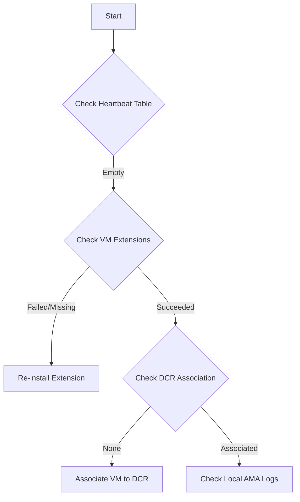

# Playbook: Agent Not Reporting

## 1. Summary
The Azure Monitor Agent (AMA) is installed on a virtual machine but is not reporting heartbeats or telemetry to the Log Analytics workspace.

## 2. Common Misreadings
-   "The extension is failed" – The extension may show "Succeeded" in the Portal, but the underlying service can still be stopped.
-   "Check the Logs" – If the agent is not reporting, the `Heartbeat` table will be empty; you must check the **resource's local logs**.

## 3. Competing Hypotheses
-   **Missing DCR Association**: The VM is not associated with any Data Collection Rule (DCR).
-   **Identity Issues**: Managed Identity (System or User-assigned) is not enabled or lacks permissions.
-   **Network Block**: Outbound access to Azure Monitor endpoints (IMDS, Global/Regional ingestion) is blocked.
-   **Extension Corruption**: The `AzureMonitorWindowsAgent` or `AzureMonitorLinuxAgent` extension is corrupted.

## 4. What to Check First


## 5. Evidence to Collect
-   **Heartbeat check**:
    ```kusto
    Heartbeat 
    | where Computer == "YourComputerName"
    | summarize LastHeartbeat = max(TimeGenerated) by Computer
    ```
-   **Local logs**:
    -   **Windows**: `C:\WindowsAzure\Logs\Plugins\Microsoft.Azure.Monitor.AzureMonitorWindowsAgent`
    -   **Linux**: `/var/opt/microsoft/azuremonitoragent/log`

## 6. Validation by Hypothesis
-   **Hypothesis: DCR**: Verify the file `mcsconfig.latest.xml` exists in the AMA directory to confirm DCR sync.
-   **Hypothesis: Identity**: Check the **Identity** blade for the VM in the Portal; ensure a System-assigned identity exists.

## 7. Root Cause Patterns
-   AMA requires **IMDS** access (169.254.169.254) to fetch its configuration; firewalls blocking this IP prevent agent startup.
-   DCR is in a different region than the Workspace, causing alignment issues (though technically supported, check alignment).

## 8. Mitigations
-   Re-associate the VM with the DCR in the Monitor Portal.
-   Verify outbound network rules for the required **Service Tags**: `AzureMonitor` and `MicrosoftContainerRegistry`.
-   Restart the `Azure Monitor Agent` service on the VM.

## See Also
- [No Data in Workspace](no-data-in-workspace.md)
- [Evidence Map](../evidence-map.md)

## Sources
- [MS Learn: Troubleshoot the Azure Monitor agent](https://learn.microsoft.com/azure/azure-monitor/agents/azure-monitor-agent-troubleshoot-windows-vm)
- [MS Learn: Azure Monitor Agent overview](https://learn.microsoft.com/azure/azure-monitor/agents/azure-monitor-agent-overview)
