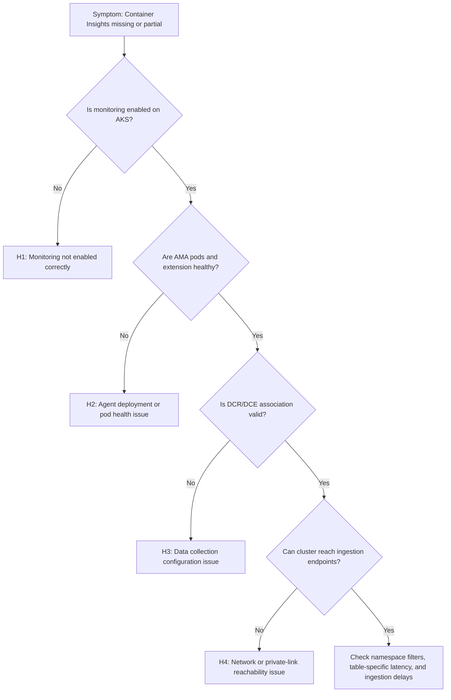

# AKS Container Insights Issues

## 1. Summary

Use this playbook when Azure Monitor Container Insights for AKS shows no data, partial data, or stale data for pods, nodes, or cluster inventory. In current Azure Monitor guidance, most incidents fall into one of four buckets: monitoring was never fully enabled, the Azure Monitor Agent extension or pods are unhealthy, the data collection rule path is misconfigured, or the cluster cannot reach the required ingestion endpoints.

This playbook is for cases where the Azure portal shows an AKS cluster, but Container Insights pages are empty, only some namespaces appear, logs arrive without metrics, metrics arrive without logs, or agents restart repeatedly. The objective is to prove whether the failure is in enablement, agent runtime, data collection rule plumbing, or network reachability.

**Typical incident window**: 10-20 minutes from missing namespace, pod, or node visibility to clear identification that Container Insights is stale.
**Time to resolution**: 30 minutes to 2 hours depending on whether the break is extension health, DCR/DCE path, or network egress.

### Troubleshooting decision flow



## 2. Common Misreadings

| Observation | Often Misread As | Actually Means |
|---|---|---|
| Cluster appears in Azure portal but Container Insights charts are blank | Azure portal rendering issue | AKS resource exists, but monitoring path may still be disabled or broken. |
| `ama-logs` pods are running | Monitoring is healthy | Running pods do not prove DCR association, endpoint reachability, or ingestion success. |
| Metrics are visible but logs are missing | Workspace problem only | Logs and metrics can fail independently depending on configuration and table path. |
| One namespace has no logs | Entire cluster ingestion outage | Namespace filtering, opt-out configuration, or workload-specific log generation may explain it. |
| Recent cluster upgrade happened | Upgrade caused every symptom | Upgrades can correlate, but many issues are still DCR, extension, or outbound network problems. |

## 3. Competing Hypotheses

| Hypothesis | Likelihood | Key Discriminator |
|---|---|---|
| H1: Monitoring was not enabled or not fully attached to the workspace | Medium | AKS addon/extension state or workspace association is missing or failed. |
| H2: AMA extension or pods are unhealthy on the cluster | High | `ama-logs` or `ama-metrics` pods crash, restart, or fail readiness checks. |
| H3: DCR, DCE, or association settings are incorrect | High | Extension exists, but DCR or destination details do not line up with the workspace. |
| H4: Network reachability to ingestion endpoints is blocked | Medium | Agents run, configuration is present, but logs show endpoint/connectivity failures. |

## 4. What to Check First

1. **Confirm Container Insights is enabled on the AKS resource**

    ```bash
    az aks show \
        --resource-group "$RG" \
        --name "$AKS_NAME" \
        --query "{clusterName:name,monitoringEnabled:addonProfiles.omsagent.enabled,identityType:identity.type,location:location}"
    ```

2. **Check Azure Monitor extension provisioning state**

    ```bash
    az k8s-extension show \
        --cluster-name "$AKS_NAME" \
        --resource-group "$RG" \
        --cluster-type managedClusters \
        --name azuremonitor-containers \
        --query "{name:name,provisioningState:provisioningState,extensionType:extensionType,version:version}"
    ```

3. **Check `ama-logs` pod status in `kube-system`**

    ```bash
    kubectl get pods \
        --namespace kube-system \
        --selector component=ama-logs \
        --output wide
    ```

4. **Confirm the AKS cluster has a DCR association**

    ```bash
    az monitor data-collection rule association list \
        --resource "/subscriptions/<subscription-id>/resourceGroups/$RG/providers/Microsoft.ContainerService/managedClusters/$AKS_NAME" \
        --query "[].{association:name,dcrId:dataCollectionRuleId,description:description}"
    ```

5. **Run a narrow control query for heartbeat and Container Insights tables**

    ```bash
    az monitor log-analytics query \
        --workspace "$WORKSPACE_ID" \
        --analytics-query "union isfuzzy=true (Heartbeat | where TimeGenerated > ago(15m) | summarize LastSeen=max(TimeGenerated) by TableName='Heartbeat'), (KubeNodeInventory | where TimeGenerated > ago(15m) | summarize LastSeen=max(TimeGenerated) by TableName='KubeNodeInventory'), (ContainerLogV2 | where TimeGenerated > ago(15m) | summarize LastSeen=max(TimeGenerated) by TableName='ContainerLogV2')" \
        --timespan "PT15M"
    ```

6. **Review recent AMA logs for endpoint or config failures**

    ```bash
    kubectl logs \
        --namespace kube-system \
        --selector component=ama-logs \
        --tail 100
    ```

## 5. Evidence to Collect

Use the same 15-minute and 1-hour windows across KQL, AKS configuration, and pod inspection. Microsoft Learn guidance for Container Insights troubleshooting is easiest to apply when you can show the exact point where the signal disappears: AKS addon state, pod runtime, DCR path, or network path.

### 5.1 KQL Queries

#### Query 1: Cluster heartbeat from Azure Monitor Agent

```kusto
Heartbeat
| where TimeGenerated > ago(15m)
| where Category == "Azure Monitor Agent"
| summarize LastHeartbeat = max(TimeGenerated), Agents = dcount(Computer) by ResourceGroup, Resource
| order by LastHeartbeat desc
```

**Sample Output**

| ResourceGroup | Resource | LastHeartbeat | Agents | Interpretation |
|---|---|---|---|---|
| rg-aks | aks-production | 2026-04-05 10:41:58 | 6 | Agent heartbeats are current, so at least part of the monitoring path is alive. |
| rg-aks | aks-staging | 2026-04-05 09:52:11 | 3 | Stale heartbeat indicates cluster-specific ingestion or agent issue. |

!!! tip "How to Read This"
    Heartbeat proves the agent is talking to Azure Monitor, but it does not prove every table is healthy. Use it as a control signal, not the final answer.

#### Query 2: Container log arrival by namespace

```kusto
ContainerLogV2
| where TimeGenerated > ago(1h)
| summarize LogLines = count(), LastSeen = max(TimeGenerated) by ClusterName, PodNamespace
| order by LogLines desc
| take 15
```

**Sample Output**

| ClusterName | PodNamespace | LogLines | LastSeen | Interpretation |
|---|---|---|---|---|
| aks-production | app | 84211 | 2026-04-05 10:41:57 | Normal active namespace. |
| aks-production | ingress-nginx | 11620 | 2026-04-05 10:41:55 | Infrastructure namespace is collecting as expected. |
| aks-production | payments | 0 |  | If workload is active, missing logs may indicate namespace exclusion or app-side log behavior. |

!!! tip "How to Read This"
    Compare active namespaces you know should emit logs. A single missing namespace often points to filtering or workload behavior, not total monitoring failure.

#### Query 3: Metrics path health for Container Insights

```kusto
InsightsMetrics
| where TimeGenerated > ago(30m)
| where Origin == "container.azm.ms"
| summarize Samples = count(), LastSeen = max(TimeGenerated) by Namespace
| order by Samples desc
| take 10
```

**Sample Output**

| Namespace | Samples | LastSeen | Interpretation |
|---|---|---|---|
| container.azm.ms/disk | 4920 | 2026-04-05 10:41:59 | Metrics path is alive. |
| container.azm.ms/cpu | 4918 | 2026-04-05 10:41:59 | Node and pod CPU metrics are arriving. |
| container.azm.ms/memory | 4918 | 2026-04-05 10:41:58 | Metrics arriving while logs are absent narrows the problem to log collection path. |

!!! tip "How to Read This"
    If `InsightsMetrics` is fresh but `ContainerLogV2` is empty, focus on log collection settings, namespace filters, or agent log pipeline errors.

#### Query 4: Inventory completeness check

```kusto
KubePodInventory
| where TimeGenerated > ago(30m)
| summarize Pods = dcount(PodUid), LastSeen = max(TimeGenerated) by ClusterName, Namespace
| order by Pods desc
| take 15
```

**Sample Output**

| ClusterName | Namespace | Pods | LastSeen | Interpretation |
|---|---|---|---|---|
| aks-production | app | 148 | 2026-04-05 10:41:58 | Pod inventory is current. |
| aks-production | kube-system | 42 | 2026-04-05 10:41:58 | System namespace inventory is healthy. |
| aks-production | payments | 0 |  | Inventory gap plus log gap suggests namespace/workload visibility problem. |

!!! tip "How to Read This"
    Inventory gaps are useful because they do not depend on application log volume. If inventory is missing too, investigate agent, DCR, or connectivity before app logging.

### 5.2 CLI Investigation

#### Command 1: Verify AKS monitoring and addon state

```bash
az aks show \
    --resource-group "$RG" \
    --name "$AKS_NAME" \
    --query "{clusterName:name, monitoringEnabled:addonProfiles.omsagent.enabled, identityType:identity.type, location:location}"
```

**Sample Output (sanitized)**

```json
{
  "clusterName": "aks-production",
  "identityType": "SystemAssigned",
  "location": "koreacentral",
  "monitoringEnabled": true
}
```

Interpretation: Monitoring is enabled at the cluster level, so continue to extension, pod, and DCR validation.

#### Command 2: Check Azure Monitor extension provisioning state

```bash
az k8s-extension show \
    --cluster-name "$AKS_NAME" \
    --resource-group "$RG" \
    --cluster-type managedClusters \
    --name azuremonitor-containers \
    --query "{name:name, provisioningState:provisioningState, extensionType:extensionType, version:version}"
```

**Sample Output (sanitized)**

```json
{
  "extensionType": "Microsoft.AzureMonitor.Containers",
  "name": "azuremonitor-containers",
  "provisioningState": "Succeeded",
  "version": "1.24.2"
}
```

Interpretation: Extension deployment is healthy; if data is still missing, inspect pods, DCR association, and network path.

#### Command 3: Inspect AMA pod runtime state

```bash
kubectl get pods \
    --namespace kube-system \
    --selector component=ama-logs \
    --output wide
```

**Sample Output (sanitized)**

```text
NAME                    READY   STATUS    RESTARTS   AGE   NODE
ama-logs-7d4jz          1/1     Running   0          2d    aks-nodepool1-000001
ama-logs-84ghp          1/1     Running   0          2d    aks-nodepool1-000002
ama-logs-rs-75f7b7c7c   1/1     Running   0          2d    aks-nodepool1-000003
```

Interpretation: Running pods are necessary but not sufficient. Continue with logs and DCR validation if workspace tables remain empty.

#### Command 4: Inspect DCR association path

```bash
az monitor data-collection rule association list \
    --resource "/subscriptions/<subscription-id>/resourceGroups/$RG/providers/Microsoft.ContainerService/managedClusters/$AKS_NAME" \
    --query "[].{association:name, dcrId:dataCollectionRuleId, description:description}"
```

**Sample Output (sanitized)**

```json
[
  {
    "association": "MSCI-aks-production-association",
    "dcrId": "/subscriptions/<subscription-id>/resourceGroups/rg-monitoring/providers/Microsoft.Insights/dataCollectionRules/MSCI-aks-production",
    "description": "Container Insights association"
  }
]
```

Interpretation: If the cluster has no DCR association, H3 becomes much more likely even when the extension exists.

#### Command 5: Review recent AMA logs for ingestion failures

```bash
kubectl logs \
    --namespace kube-system \
    --selector component=ama-logs \
    --tail 100
```

**Sample Output (sanitized)**

```text
2026-04-05T10:39:12Z INFO  Start config processing
2026-04-05T10:39:16Z INFO  Successfully applied DCR settings
2026-04-05T10:40:02Z WARN  Retry sending telemetry to https://<dce-name>.<region>.ingest.monitor.azure.com/
2026-04-05T10:40:03Z WARN  Connection timed out to ingestion endpoint
```

Interpretation: Endpoint timeout messages strongly support H4 when extension and DCR configuration are otherwise healthy.

## 6. Validation and Disproof by Hypothesis

### Hypothesis H1: Monitoring was not enabled or not fully attached

**Proves if**: `az aks show` reports monitoring disabled, the Azure Monitor extension is missing or failed, or the workspace association is absent.

**Disproves if**: Monitoring is enabled, the extension is `Succeeded`, and the cluster has the expected DCR association.

**Tests**

```bash
az aks show \
    --resource-group "$RG" \
    --name "$AKS_NAME" \
    --query "addonProfiles.omsagent.enabled"
```

```bash
az k8s-extension show \
    --cluster-name "$AKS_NAME" \
    --resource-group "$RG" \
    --cluster-type managedClusters \
    --name azuremonitor-containers \
    --query "provisioningState"
```

If either command fails or returns disabled/failed state, resolve enablement before looking at tables.

### Hypothesis H2: AMA extension or pods are unhealthy

**Proves if**: `ama-logs` or `ama-metrics` pods are not ready, restart repeatedly, or show events about OOM, scheduling, or readiness failures.

**Disproves if**: Pods are stable, current, and have no recurring runtime errors.

**Tests**

```bash
kubectl get pods \
    --namespace kube-system \
    --selector component=ama-logs \
    --output wide
```

```bash
kubectl get events \
    --namespace kube-system \
    --sort-by=.lastTimestamp
```

```bash
kubectl describe daemonset \
    --namespace kube-system \
    ama-logs
```

Resource pressure, image pull issues, or readiness failures all strengthen H2.

### Hypothesis H3: DCR, DCE, or association settings are incorrect

**Proves if**: The cluster lacks a DCR association, the DCR points to the wrong workspace, or collection filters exclude expected namespaces/tables.

**Disproves if**: DCR association, destination, and collection rules match the intended workspace and namespaces.

**Tests**

```bash
az monitor data-collection rule show \
    --name "$DCR_NAME" \
    --resource-group "$MONITORING_RG" \
    --query "{destinations:destinations.logAnalytics, dataFlows:dataFlows, dataSources:dataSources}"
```

```bash
kubectl get configmap \
    --namespace kube-system \
    container-azm-ms-agentconfig \
    --output yaml
```

If the workspace resource ID, namespace filters, or data sources are wrong, fix H3 before debugging networking.

### Hypothesis H4: Network reachability to ingestion endpoints is blocked

**Proves if**: AMA logs show retries or timeout errors to Azure Monitor endpoints and in-cluster connectivity tests fail.

**Disproves if**: Endpoint reachability is good and agent logs show successful sends while data still does not land.

**Tests**

```bash
kubectl run monitor-endpoint-test \
    --rm \
    --stdin \
    --tty \
    --image=curlimages/curl \
    --restart Never \
    --command -- sh
```

From the shell, test:

```bash
curl --verbose "https://<dce-name>.<region>.ingest.monitor.azure.com"
curl --verbose "https://<workspace-id>.ods.opinsights.azure.com"
```

If DNS, TLS, or TCP connection fails from inside the cluster, network policy, firewall, proxy, or private endpoint routing is the likely blocker.

### Decision guide after validation

If H1 is proven, re-enable or correctly attach Container Insights before doing deeper pod forensics. If H2 is proven, fix agent runtime health first because DCR and workspace checks will otherwise be misleading. If H3 is proven, correct the DCR destination, association, or filters before testing connectivity again. If H4 is proven, coordinate with network owners on outbound allow rules, DNS, proxy, or private-link routing.

## 7. Likely Root Cause Patterns

| Pattern | Evidence | Resolution |
|---|---|---|
| Monitoring enabled flag missing or stale | AKS addon or extension absent; no DCR association | Re-enable Container Insights and verify workspace linkage. |
| AMA pod instability | Pod restarts, OOM, unschedulable events, readiness failures | Fix node capacity, daemonset health, or extension rollout issues. |
| Wrong workspace or DCR destination | DCR points to unexpected workspace or missing log destination | Correct DCR destination and re-associate the cluster. |
| Namespace or collection filtering | Only selected namespaces missing; ConfigMap excludes them | Update ConfigMap or collection settings and restart agent pods if required. |
| Blocked ingestion endpoints | AMA logs show retry/connect timeout to Azure Monitor endpoints | Restore DNS, proxy, firewall, NSG, or private endpoint routing. |

### Normal vs Abnormal Comparison

| Metric/Log | Normal State | Abnormal State | Threshold |
|---|---|---|---|
| `Heartbeat` | Fresh for all nodes | Stale or absent for one cluster | > 5 min gap |
| `ContainerLogV2` | Active namespaces produce steady rows | Empty or selective gaps in expected namespaces | Any unexpected zero namespace |
| `InsightsMetrics` | Fresh `container.azm.ms` samples | Metrics absent or much fresher than logs | > 10 min skew |
| AMA pod state | Running with low restart count | CrashLoopBackOff, repeated restarts, not ready | Repeated restarts |
| DCR association | Present and points to correct workspace | Missing, wrong, or partially configured | Zero expected associations |

### Operator notes

- Do not conclude success from pod `Running` state alone; the agent can run and still fail to send data.
- Namespace-specific gaps often come from collection settings rather than a whole-cluster outage.
- Inventory tables such as `KubePodInventory` are useful controls because they do not depend on application log verbosity.
- After any DCR or ConfigMap change, allow for propagation time and verify fresh timestamps rather than historical rows only.

## 8. Immediate Mitigations

1. Re-enable monitoring or recreate the Azure Monitor extension if enablement state is failed or missing.
2. Restart `ama-logs` and `ama-metrics` pods only after capturing logs and events needed for evidence.
3. Correct DCR associations or workspace destination mismatches before changing workload logging.
4. Remove overly broad namespace exclusions when expected workloads are accidentally filtered.
5. Temporarily allow outbound HTTPS to documented Azure Monitor endpoints while permanent network rules are being corrected.
6. Communicate that historical gaps may remain even after recovery; verify fresh data arrival first.

## 9. Prevention

- Include Container Insights validation in AKS provisioning pipelines: addon state, extension state, DCR association, and control queries.
- Document required egress destinations for Azure Monitor and review them whenever firewall, proxy, or private-link architecture changes.
- Alert on stale `Heartbeat`, disappearing `KubeNodeInventory`, and sustained gaps in `ContainerLogV2` for production clusters.
- Keep namespace filtering under change control so operators know when missing logs are intentional.
- Revalidate monitoring after cluster upgrades, node pool changes, and workspace migrations.

### Prevention checklist

- Verify at least one log, one metric, and one inventory control query after every AKS rollout.
- Record the intended workspace and DCR names in runbooks and infrastructure code.
- Monitor agent restart counts and kube-system events as part of platform health.
- Review Microsoft Learn updates for Container Insights onboarding and troubleshooting when Azure Monitor agent behavior changes.

## See Also

- [Slow Query Performance](slow-query-performance.md)
- [Application Insights Data Gaps](application-insights-gaps.md)
- [No Data in Workspace](no-data-in-workspace.md)
- [Missing Application Telemetry](missing-application-telemetry.md)

## Sources

- [Container insights overview](https://learn.microsoft.com/en-us/azure/azure-monitor/containers/container-insights-overview)
- [Enable monitoring for AKS clusters](https://learn.microsoft.com/en-us/azure/azure-monitor/containers/container-insights-enable-aks)
- [Troubleshoot Container insights](https://learn.microsoft.com/en-us/azure/azure-monitor/containers/container-insights-troubleshoot)
- [Configure log collection in Container insights](https://learn.microsoft.com/en-us/azure/azure-monitor/containers/container-insights-data-collection-filter)
- [Data collection rules in Azure Monitor](https://learn.microsoft.com/en-us/azure/azure-monitor/data-collection/data-collection-rule-overview)
- [ContainerLogV2 table reference](https://learn.microsoft.com/en-us/azure/azure-monitor/reference/tables/containerlogv2)
- [Heartbeat table reference](https://learn.microsoft.com/en-us/azure/azure-monitor/reference/tables/heartbeat)
