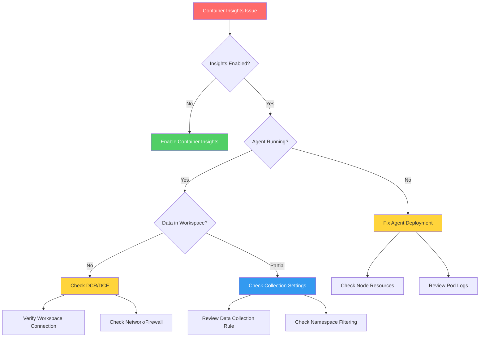
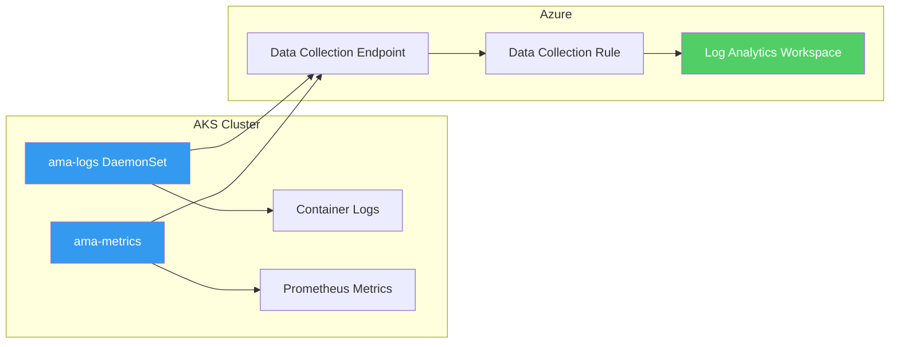

# AKS Container Insights Issues

Systematic troubleshooting for Azure Monitor Container Insights problems on AKS clusters.

## Symptoms

- Container Insights shows no data
- Missing node or pod metrics
- Logs not appearing in Log Analytics
- Container Insights agent (AMA) pods failing
- Partial data collection (metrics but no logs)

## Diagnostic Flowchart



## Investigation Steps

### Step 1: Verify Container Insights Status

```bash
# Check if monitoring is enabled
az aks show \
    --resource-group "rg-aks" \
    --name "aks-production" \
    --query "addonProfiles.omsagent.enabled"
```

For AMA-based monitoring:

```bash
# Check Azure Monitor extension
az k8s-extension show \
    --cluster-name "aks-production" \
    --resource-group "rg-aks" \
    --cluster-type managedClusters \
    --name azuremonitor-containers \
    --query "{name:name, provisioningState:provisioningState, version:version}"
```

### Step 2: Check Agent Pod Status

```bash
# Check ama-logs pods (Azure Monitor Agent)
kubectl get pods -n kube-system -l component=ama-logs

# Check for any pod issues
kubectl describe pod -n kube-system -l component=ama-logs

# Check ama-metrics pods
kubectl get pods -n kube-system -l app.kubernetes.io/name=ama-metrics
```

Expected output:
```
NAME                          READY   STATUS    RESTARTS   AGE
ama-logs-xxxxx                1/1     Running   0          2d
ama-logs-rs-xxxxx             1/1     Running   0          2d
```

### Step 3: Review Agent Logs

```bash
# Check AMA logs for errors
kubectl logs -n kube-system -l component=ama-logs --tail=100

# Look for specific errors
kubectl logs -n kube-system -l component=ama-logs | grep -i error

# Check recent events
kubectl get events -n kube-system --sort-by='.lastTimestamp' | grep ama
```

### Step 4: Verify Data Collection Rule

```bash
# List data collection rules
az monitor data-collection-rule list \
    --resource-group "rg-monitoring" \
    --query "[?contains(name, 'MSCI')].{name:name, provisioningState:provisioningState}"
```

```bash
# Check DCR details
az monitor data-collection-rule show \
    --name "MSCI-aks-production" \
    --resource-group "rg-monitoring" \
    --query "{destinations:destinations, dataFlows:dataFlows, dataSources:dataSources}"
```

### Step 5: Check Data Collection Endpoint

```bash
# Verify DCE
az monitor data-collection-endpoint list \
    --resource-group "rg-monitoring" \
    --query "[].{name:name, provisioningState:provisioningState, logsIngestion:logsIngestion}"
```

### Step 6: Verify Workspace Connection

```kusto
// Check if any data is arriving from the cluster
ContainerLog
| where TimeGenerated > ago(1h)
| where ClusterName contains "aks-production"
| summarize Count = count() by ClusterName
```

```kusto
// Check heartbeat from agents
Heartbeat
| where TimeGenerated > ago(1h)
| where Category == "Azure Monitor Agent"
| where Computer contains "aks"
| summarize LastHeartbeat = max(TimeGenerated) by Computer
```

## Architecture Overview



## Resolution Actions

### Fix 1: Enable Container Insights

```bash
# Enable with Azure Monitor Agent
az aks enable-addons \
    --resource-group "rg-aks" \
    --name "aks-production" \
    --addons monitoring \
    --workspace-resource-id "/subscriptions/{sub}/resourceGroups/{rg}/providers/Microsoft.OperationalInsights/workspaces/law-production"
```

### Fix 2: Reinstall Azure Monitor Extension

```bash
# Delete and recreate extension
az k8s-extension delete \
    --cluster-name "aks-production" \
    --resource-group "rg-aks" \
    --cluster-type managedClusters \
    --name azuremonitor-containers \
    --yes

az k8s-extension create \
    --cluster-name "aks-production" \
    --resource-group "rg-aks" \
    --cluster-type managedClusters \
    --name azuremonitor-containers \
    --extension-type Microsoft.AzureMonitor.Containers \
    --configuration-settings "logAnalyticsWorkspaceResourceID=/subscriptions/{sub}/resourceGroups/{rg}/providers/Microsoft.OperationalInsights/workspaces/law-production"
```

### Fix 3: Fix Agent Resource Issues

```bash
# Check node resource pressure
kubectl top nodes

# Check if agent pods are being evicted
kubectl get events -n kube-system --field-selector reason=Evicted

# Increase agent resource limits if needed
kubectl edit daemonset ama-logs -n kube-system
```

### Fix 4: Update Data Collection Settings

```bash
# Create or update ConfigMap for collection settings
cat <<EOF | kubectl apply -f -
apiVersion: v1
kind: ConfigMap
metadata:
  name: container-azm-ms-agentconfig
  namespace: kube-system
data:
  schema-version: v1
  config-version: ver1
  log-data-collection-settings: |
    [log_collection_settings]
       [log_collection_settings.stdout]
          enabled = true
          exclude_namespaces = ["kube-system","gatekeeper-system"]
       [log_collection_settings.stderr]
          enabled = true
          exclude_namespaces = ["kube-system","gatekeeper-system"]
       [log_collection_settings.env_var]
          enabled = true
EOF
```

### Fix 5: Fix Network Connectivity

Required endpoints for Container Insights:

```bash
# Test connectivity from inside cluster
kubectl run test-connectivity --rm -i --tty --image=curlimages/curl -- sh

# Test DCE endpoint
curl -v https://<dce-name>.<region>.ingest.monitor.azure.com

# Test workspace endpoint  
curl -v https://<workspace-id>.ods.opinsights.azure.com
```

Required outbound rules:
- `*.ods.opinsights.azure.com` (Port 443)
- `*.oms.opinsights.azure.com` (Port 443)
- `*.monitoring.azure.com` (Port 443)
- `*.ingest.monitor.azure.com` (Port 443)

### Fix 6: Restart Agent Pods

```bash
# Rolling restart of ama-logs
kubectl rollout restart daemonset ama-logs -n kube-system

# Check rollout status
kubectl rollout status daemonset ama-logs -n kube-system
```

## Verification

After applying fixes:

```kusto
// Verify container logs arriving
ContainerLogV2
| where TimeGenerated > ago(15m)
| summarize Count = count() by PodNamespace
| order by Count desc
```

```kusto
// Verify metrics arriving
InsightsMetrics
| where TimeGenerated > ago(15m)
| where Origin == "container.azm.ms"
| summarize Count = count() by Namespace
```

```bash
# Check agent health
kubectl get pods -n kube-system -l component=ama-logs -o wide
kubectl top pods -n kube-system -l component=ama-logs
```

## Prevention

- Monitor agent pod health with alerts
- Set up heartbeat alerts for Container Insights
- Document required network rules in cluster setup
- Include Container Insights validation in cluster provisioning pipeline

## Related Playbooks

- [No Data in Workspace](no-data-in-workspace.md)
- [Missing Application Telemetry](missing-application-telemetry.md)

## Sources

- [Container insights overview](https://learn.microsoft.com/en-us/azure/azure-monitor/containers/container-insights-overview)
- [Enable Container insights](https://learn.microsoft.com/en-us/azure/azure-monitor/containers/container-insights-enable-aks)
- [Troubleshoot Container insights](https://learn.microsoft.com/en-us/azure/azure-monitor/containers/container-insights-troubleshoot)
- [Container insights agent configuration](https://learn.microsoft.com/en-us/azure/azure-monitor/containers/container-insights-agent-config)
