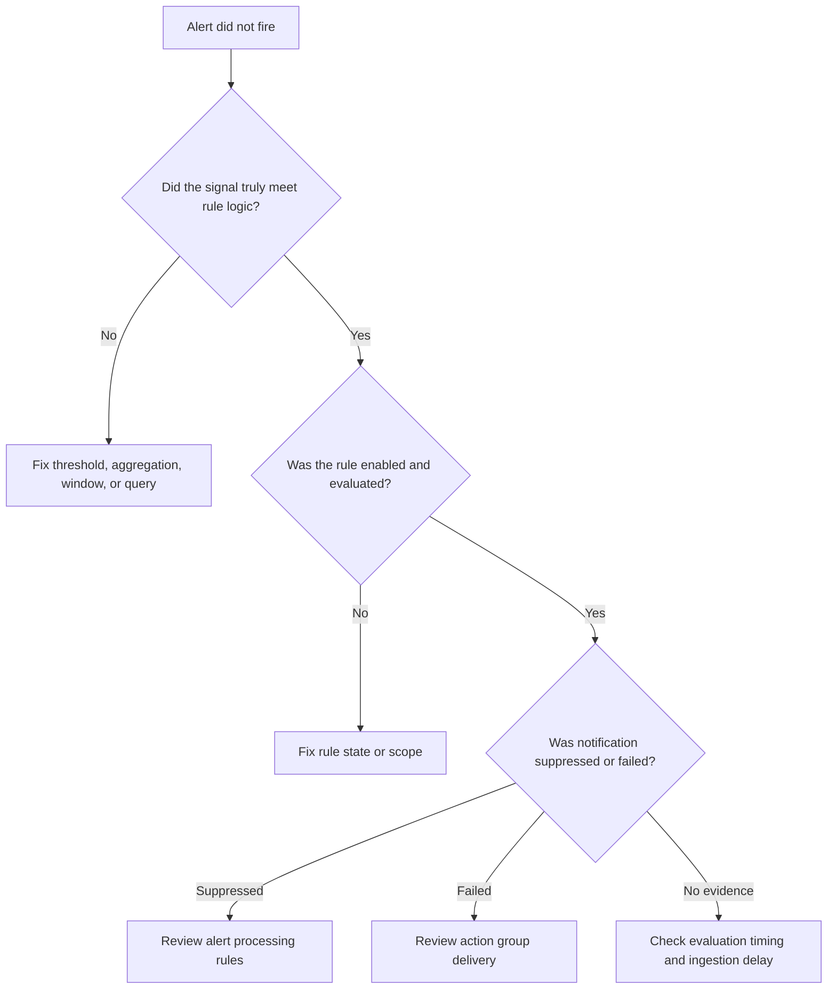

# Alert Not Firing

## 1. Summary
An Azure Monitor alert rule exists, the underlying symptom appears real, but no alert is created or no notification reaches the responders. This playbook applies to metric alerts, scheduled query alerts, and the handoff from rule evaluation to action group delivery. Use it when teams say "the threshold definitely happened" yet the incident history shows no matching alert or only a partial alert lifecycle.

Microsoft Learn troubleshooting guidance separates this scenario into three layers: the monitored signal, the alert rule evaluation logic, and the notification path. Most "did not fire" incidents are not platform outages. They are timing mismatches, aggregation misunderstandings, disabled rules, alert processing rules, or action group delivery failures.

**Typical incident window**: 5-15 minutes for metric alerts and 10-20 minutes for scheduled query rules, depending on evaluation frequency and window size.
**Time to resolution**: 30 minutes to 2 hours depending on whether the miss is signal logic, rule state, suppression, or receiver delivery.

Use it when:

- A metric clearly spiked, but the metric alert did not activate.
- A log query returns rows in Logs, but the scheduled query rule did not fire.
- An alert activated in history, but email, webhook, ITSM, or automation never triggered.
- Maintenance suppression, auto-mitigation, or dimension configuration may have changed the outcome.



## 2. Common Misreadings
| Observation | Often Misread As | Actually Means |
|---|---|---|
| Portal chart shows a spike | Alert should have fired automatically | Metric alerts evaluate aggregation, frequency, dimensions, and threshold, not screenshots of the chart. |
| Log query returns rows right now | The scheduled query rule should have fired earlier | The rule ran on an earlier window and may have seen no rows yet because of ingestion delay or different time grain. |
| Alert history is empty | Notification failed | The rule may never have activated, so the investigation must start before action groups. |
| Alert is in history but no email arrived | Rule logic is wrong | The rule may have worked and the failure is in action group delivery or suppression. |
| Dynamic threshold or dimensions were enabled | Azure Monitor is unpredictable | Those features change how the signal is evaluated and can suppress what looks obvious in a raw chart. |
| Auto-mitigated alert resolved quickly | The alert never happened | The alert may have activated and resolved before responders saw the notification. |

## 3. Competing Hypotheses
| Hypothesis | Likelihood | Key Discriminator |
|---|---|---|
| The signal never met the exact rule logic | High | Manual replay of the same aggregation, dimensions, and window disproves the assumption that the threshold was crossed. |
| The alert rule was disabled, mis-scoped, or unhealthy | High | CLI shows disabled state, wrong scopes, or unexpected rule configuration. |
| Evaluation timing or ingestion delay prevented activation | Medium | Log data appears later than the rule window, or the metric spike was shorter than the evaluation criteria. |
| An alert processing rule suppressed notifications | Medium | Alert history shows activation or expected conditions, but processing rules target the scope and time. |
| Action group delivery failed | Medium | Alert history exists but email, webhook, SMS, or automation execution failed. |
| Dimensions or dynamic thresholds changed the expected result | Low | The rule uses per-dimension evaluation or adaptive thresholds that differ from the operator's mental model. |

## 4. What to Check First
1. **Show metric alert rule state, scope, window, and evaluation frequency**

    ```bash
    az monitor metrics alert show \
        --resource-group $RG \
        --name $ALERT_RULE_NAME \
        --output json
    ```

2. **If it is a scheduled query rule, inspect evaluation settings and scopes**

    ```bash
    az monitor scheduled-query show \
        --resource-group $RG \
        --name $ALERT_RULE_NAME \
        --output json
    ```

3. **Replay a control query against the workspace when the rule is log-based**

    ```bash
    az monitor log-analytics query \
        --workspace $WORKSPACE_ID \
        --analytics-query "Perf | where TimeGenerated > ago(15m) | where ObjectName == 'Processor' and CounterName == '% Processor Time' | summarize AvgCPU=avg(CounterValue) by bin(TimeGenerated, 5m), Computer" \
        --timespan "PT15M"
    ```

4. **List action groups wired to the rule**

    ```bash
    az monitor action-group list \
        --resource-group $RG \
        --output table
    ```

5. **Review alert processing rules that can suppress notifications**

    ```bash
    az monitor alert-processing-rule list \
        --resource-group $RG \
        --output json
    ```

6. **Confirm the target resource and dimensions actually match the rule scope**

    ```bash
    az resource show \
        --ids $RESOURCE_ID \
        --query "{id:id,type:type,name:name,location:location}"
    ```

## 5. Evidence to Collect
### 5.1 KQL Queries
```kusto
// Alert-related Azure Activity entries for recent rule operations
AzureActivity
| where TimeGenerated > ago(7d)
| where OperationNameValue has_any ("Microsoft.Insights/metricAlerts", "Microsoft.Insights/scheduledQueryRules", "Microsoft.Insights/actionGroups")
| project TimeGenerated, OperationNameValue, ActivityStatusValue, ResourceGroup, ResourceId, Caller
| order by TimeGenerated desc
```

| Column | Example data | Interpretation |
|---|---|---|
| `OperationNameValue` | `Microsoft.Insights/scheduledQueryRules/write` | Confirms when the rule was created or updated. |
| `ActivityStatusValue` | `Succeeded` | A recent config change may align with the missed alert. |
| `ResourceId` | `/subscriptions/<subscription-id>/resourceGroups/rg-monitor/providers/Microsoft.Insights/scheduledQueryRules/cpu-breach` | Use this to confirm the exact rule under investigation. |
| `Caller` | `<object-id>` | Identify who or what changed the rule. |

!!! tip "How to Read This"
    Start with recent writes or deletes. Many missed alerts follow an innocent change to frequency, scopes, dimensions, or action groups rather than a platform malfunction.

```kusto
// Check whether action-group delivery failures were recorded
AzureActivity
| where TimeGenerated > ago(7d)
| where OperationNameValue == "Microsoft.Insights/actionGroups/notification/action"
| summarize Attempts=count(), Failures=countif(ActivityStatusValue == "Failed") by ResourceGroup, ActivityStatusValue, bin(TimeGenerated, 1h)
| order by TimeGenerated desc
```

| Column | Example data | Interpretation |
|---|---|---|
| `Attempts` | `12` | Notification pipeline was exercised. |
| `Failures` | `3` | Nonzero values point to delivery issues, not evaluation logic. |
| `ActivityStatusValue` | `Failed` | Failures justify checking action group endpoints and receivers. |
| `TimeGenerated` | `hourly bucket` | Correlate to the expected incident window. |

!!! tip "How to Read This"
    If this query is empty and alert history is also empty, stop blaming the action group. The rule probably never activated.

```kusto
// Example replay pattern for a scheduled query alert signal
Perf
| where TimeGenerated between (ago(2h) .. now())
| where ObjectName == "Processor" and CounterName == "% Processor Time"
| summarize AvgCPU = avg(CounterValue) by bin(TimeGenerated, 5m), Computer
| order by TimeGenerated asc
```

| Column | Example data | Interpretation |
|---|---|---|
| `Computer` | `vm-prod-01` | Evaluate whether the rule should have fired per machine or across the fleet. |
| `TimeGenerated` | `5-minute bucket` | Match this to the alert evaluation frequency and window. |
| `AvgCPU` | `91.7` | Compare to the actual rule threshold and operator. |
| Series shape | `brief spike` | A short spike can look severe in a chart but still fail the alert's evaluation logic. |

!!! tip "How to Read This"
    Replay the signal exactly as the rule evaluates it. If the rule uses 5-minute averages and two evaluation periods, a one-minute spike is not enough evidence.

```kusto
// Estimate ingestion delay for a log-search alert source table
Perf
| where TimeGenerated > ago(6h)
| extend DelayMinutes = datetime_diff('minute', ingestion_time(), TimeGenerated)
| summarize AvgDelay=avg(DelayMinutes), P95Delay=percentile(DelayMinutes, 95), MaxDelay=max(DelayMinutes)
```

| Column | Example data | Interpretation |
|---|---|---|
| `AvgDelay` | `1.6` | Typical ingestion lag. |
| `P95Delay` | `9` | If this approaches the rule window, misses become plausible. |
| `MaxDelay` | `17` | Large delay spikes justify widening alert windows or fixing the source pipeline. |

!!! tip "How to Read This"
    Scheduled query rules are only as good as the data they can see in their evaluation window. If delay is close to or larger than that window, late data can make the rule look broken.

### 5.2 CLI Investigation
```bash
# Inspect a metric alert rule
az monitor metrics alert show \
    --resource-group $RG \
    --name $ALERT_RULE_NAME \
    --output json
```

Sample output:

```json
{
  "enabled": true,
  "evaluationFrequency": "PT1M",
  "scopes": [
    "/subscriptions/<subscription-id>/resourceGroups/rg-prod/providers/Microsoft.Compute/virtualMachines/vm-prod-01"
  ],
  "severity": 2,
  "windowSize": "PT5M"
}
```

Interpretation:

- `enabled` must be true.
- `evaluationFrequency` and `windowSize` define what a real threshold crossing means.
- Incorrect `scopes` are a common explanation for "this alert never fires."

```bash
# Inspect a scheduled query rule
az monitor scheduled-query show \
    --resource-group $RG \
    --name $ALERT_RULE_NAME \
    --output json
```

Sample output:

```json
{
  "enabled": true,
  "evaluationFrequency": "PT5M",
  "scopes": [
    "/subscriptions/<subscription-id>/resourceGroups/rg-monitor/providers/Microsoft.OperationalInsights/workspaces/law-prod"
  ],
  "windowSize": "PT10M"
}
```

Interpretation:

- Replay the rule against the same `windowSize` and `evaluationFrequency`.
- Disabled or mis-scoped rules are configuration problems, not alerting bugs.
- Keep this output beside the manual KQL replay to avoid comparing different windows.

```bash
# List alert processing rules that may suppress notifications
az monitor alert-processing-rule list \
    --resource-group $RG \
    --output json
```

Sample output:

```json
[
  {
    "enabled": true,
    "name": "suppress-maintenance-window",
    "scopes": [
      "/subscriptions/<subscription-id>/resourceGroups/rg-prod"
    ]
  }
]
```

Interpretation:

- If scope and schedule overlap the incident, notifications may be intentionally suppressed.
- This does not necessarily stop the alert from evaluating; it changes downstream delivery.
- Always compare suppression scope with the rule target resource.

```bash
# Inspect the action group tied to the rule
az monitor action-group show \
    --resource-group $RG \
    --name $ACTION_GROUP_NAME \
    --output json
```

Sample output:

```json
{
  "enabled": true,
  "emailReceivers": [
    {
      "name": "oncall-email",
      "status": "Enabled"
    }
  ],
  "webhookReceivers": [
    {
      "name": "incident-webhook",
      "serviceUri": "https://example.invalid/alerts"
    }
  ]
}
```

Interpretation:

- Disabled or misconfigured receivers explain missing notifications after activation.
- Check webhook endpoints and automation permissions if delivery is inconsistent.
- Keep the action group investigation separate from rule evaluation logic.

## 6. Validation and Disproof by Hypothesis
### Hypothesis 1: The signal never met the exact rule logic
**Proves if**: Section 5.1 Query 3 fails to cross the actual threshold across the actual window and dimensions.

**Disproves if**: Manual replay exactly matches the rule logic and should have activated.

**Test with**: Section 5.1 Query 3 plus Section 5.2 CLI command 1 or 2.

### Hypothesis 2: The alert rule was disabled, mis-scoped, or unhealthy
**Proves if**: CLI shows `enabled: false`, wrong scope, or configuration drift.

**Disproves if**: Rule state and scope are correct.

**Test with**: Section 5.2 CLI command 1 or 2 and Section 5.1 Query 1.

### Hypothesis 3: Evaluation timing or ingestion delay prevented activation
**Proves if**: Data arrives after the rule window or only brief spikes occur inside a longer evaluation window.

**Disproves if**: Delay is low and the signal sustained the threshold across the required period.

**Test with**: Section 5.1 Queries 3 and 4.

### Hypothesis 4: An alert processing rule suppressed notifications
**Proves if**: Processing rules target the same scope and time as the missed incident.

**Disproves if**: No relevant processing rule exists.

**Test with**: Section 5.2 CLI command 3.

### Hypothesis 5: Action group delivery failed
**Proves if**: Alert history or Azure Activity shows activation but notification actions failed.

**Disproves if**: There is no evidence the alert ever activated.

**Test with**: Section 5.1 Query 2 plus Section 5.2 CLI command 4.

### Hypothesis 6: Dimensions or dynamic thresholds changed the expected result
**Proves if**: The rule uses dimensions or adaptive logic that differ from the operator's broad chart view.

**Disproves if**: The rule uses simple static thresholds with no dimension splits.

**Test with**: Section 5.2 CLI command 1 or 2 and manual signal replay per dimension.

## 7. Likely Root Cause Patterns
| Pattern | Evidence | Resolution |
|---|---|---|
| Threshold replay was done with the wrong window | Operator uses raw chart, but rule uses averaged evaluation periods | Replay with exact rule window, frequency, and dimension handling. |
| Rule was disabled or scope drifted after maintenance | Azure Activity shows a recent write and CLI reveals changed settings | Restore the intended enabled state and target scope. |
| Scheduled query alert window was too short for ingestion delay | KQL results appear after the expected evaluation window | Increase evaluation window or fix source-side delay. |
| Alert processing rule suppressed expected notification | Rule history exists or conditions were met, but suppression scope matches the resource | Narrow or disable the suppression during the relevant period. |
| Action group receiver failed after activation | Notification attempts show failures while rule configuration is otherwise correct | Repair receiver configuration, endpoint health, or permissions. |

### Normal vs Abnormal Comparison
| Metric/Log | Normal State | Abnormal State | Threshold |
|---|---|---|---|
| Metric alert evaluation | Signal exceeds threshold across the configured `windowSize` and `evaluationFrequency` | Signal spikes briefly but does not satisfy the actual rule window | Rule-specific |
| Scheduled query alert data freshness | Source table data arrives inside the evaluation window | Ingestion delay pushes rows outside the evaluation window | Delay near `windowSize` |
| Alert rule state | `enabled` is true and scope matches intended target | Disabled rule or wrong scope/resource | Any mismatch |
| Alert processing rules | No overlapping suppression for the incident scope and time | Scope and schedule suppress expected notifications | Any overlapping suppress rule |
| Action group delivery | Receivers enabled and reachable | Alert activates but notifications fail or never leave the action group | Any failed delivery |

## 8. Immediate Mitigations
1. Re-enable the alert rule if it was disabled.

    ```bash
    az monitor metrics alert update \
        --resource-group $RG \
        --name $ALERT_RULE_NAME \
        --enabled true
    ```

2. Widen the scheduled query alert window when late data is the issue.

    ```bash
    az monitor scheduled-query update \
        --resource-group $RG \
        --name $ALERT_RULE_NAME \
        --evaluation-frequency 5m \
        --window-size 15m
    ```

3. Disable or narrow an overlapping alert processing rule.

    ```bash
    az monitor alert-processing-rule update \
        --resource-group $RG \
        --name $PROCESSING_RULE_NAME \
        --enabled false
    ```

4. Repair action group receivers and revalidate delivery.

    ```bash
    az monitor action-group show \
        --resource-group $RG \
        --name $ACTION_GROUP_NAME \
        --query "{enabled:enabled,emailReceivers:emailReceivers,webhookReceivers:webhookReceivers}"
    ```

5. If dimensions caused the miss, temporarily simplify to the exact monitored target.

    ```bash
    az monitor metrics alert show \
        --resource-group $RG \
        --name $ALERT_RULE_NAME \
        --query "{scopes:scopes,criteria:criteria}"
    ```

## 9. Prevention
Prevent missed alerts by validating the whole alert path, not just the threshold. Replay the rule logic against real historical data before relying on it in production.

Keep alert rule configuration review in change management.

```bash
az monitor scheduled-query show \
    --resource-group $RG \
    --name $ALERT_RULE_NAME \
    --query "{enabled:enabled,scopes:scopes,evaluationFrequency:evaluationFrequency,windowSize:windowSize}"
```

Avoid windows shorter than normal ingestion latency for log alerts.

```bash
az monitor scheduled-query update \
    --resource-group $RG \
    --name $ALERT_RULE_NAME \
    --window-size 15m
```

Keep suppression rules narrow in scope and duration.

```bash
az monitor alert-processing-rule list \
    --resource-group $RG \
    --output table
```

Test action groups as part of onboarding and after receiver changes.

```bash
az monitor action-group show \
    --resource-group $RG \
    --name $ACTION_GROUP_NAME \
    --output table
```

Finally, document whether each alert is per-resource, per-dimension, or fleet-wide. Most operator confusion comes from expecting one model while the rule actually uses another.

## See Also
- [Alert Storm](alert-storm.md)
- [Operations: Alert Rule Management](../../operations/alert-rule-management.md)
- [KQL: Alert Firing History](../kql/alerts/alert-firing-history.md)
- [KQL: Action Group Failures](../kql/alerts/action-group-failures.md)

## Sources
- [Microsoft Learn: Troubleshoot Azure Monitor alerts](https://learn.microsoft.com/en-us/azure/azure-monitor/alerts/alerts-troubleshoot)
- [Microsoft Learn: Troubleshoot metric alerts in Azure Monitor](https://learn.microsoft.com/en-us/azure/azure-monitor/alerts/alerts-troubleshoot-metric)
- [Microsoft Learn: Alerts processing rules in Azure Monitor](https://learn.microsoft.com/en-us/azure/azure-monitor/alerts/alerts-processing-rules)
- [Microsoft Learn: Action groups in Azure Monitor](https://learn.microsoft.com/en-us/azure/azure-monitor/alerts/action-groups)
- [Microsoft Learn: Log search alerts in Azure Monitor](https://learn.microsoft.com/en-us/azure/azure-monitor/alerts/alerts-types#log-search-alerts)
- [Microsoft Learn: Perf table reference](https://learn.microsoft.com/en-us/azure/azure-monitor/reference/tables/perf)
