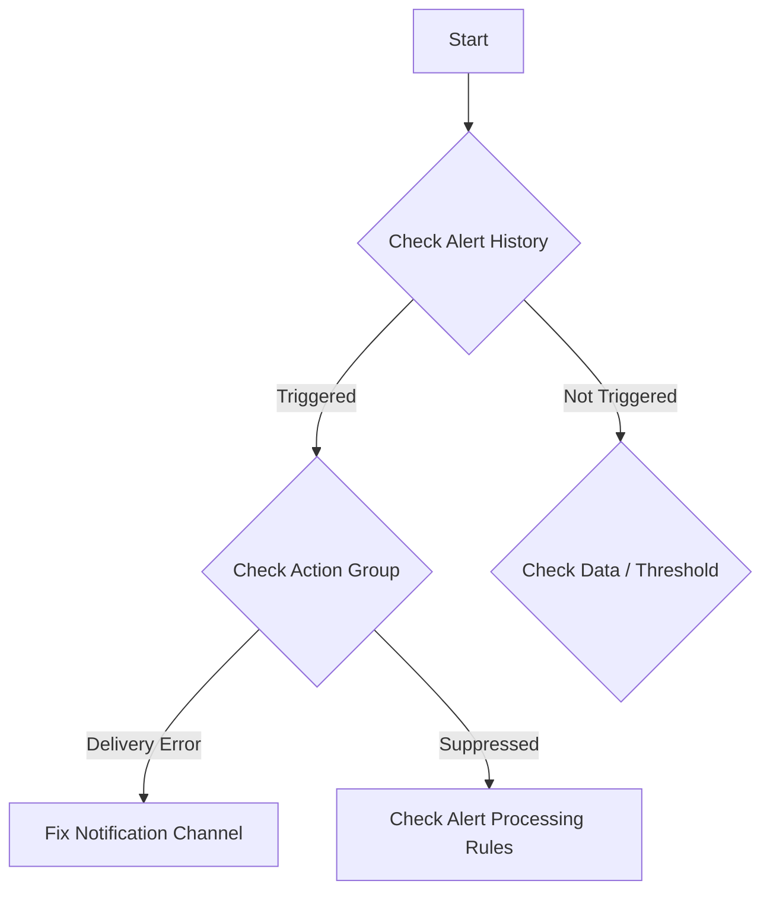

# Playbook: Alert Not Firing

## 1. Summary
A monitoring condition was met, but the alert did not fire, or notifications were not received. This covers rule logic, suppression, and notification delivery.

## 2. Common Misreadings
-   "The alert failed to trigger" – Check **Alert History**; it may have triggered but failed to notify.
-   "The query is correct" – Check the **Aggregation Granularity** vs. **Evaluation Frequency**.

## 3. Competing Hypotheses
-   **Rule Logic**: The threshold was not crossed based on the query's aggregation.
-   **Rule Status**: The alert rule is disabled or in a "Resolved" state.
-   **Suppression**: An **Alert Processing Rule** is suppressing notifications for the resource.
-   **Action Group Error**: The email/SMS/webhook failed to deliver.

## 4. What to Check First


## 5. Evidence to Collect
-   **Alert history**: Monitor -> Alerts -> History.
-   **Suppression check**: Monitor -> Alerts -> Alert processing rules.
-   **Action group failures**:
    ```kusto
    AzureActivity
    | where OperationNameValue == "Microsoft.Insights/actionGroups/notification/action"
    | where ActivityStatusValue == "Failed"
    ```

## 6. Validation by Hypothesis
-   **Hypothesis: Threshold**: Manually run the alert query in Logs with the same time window and aggregation.
-   **Hypothesis: Suppression**: Check for active "Suppression" rules targeting the resource.

## 7. Root Cause Patterns
-   Query returns zero results due to late-arriving data (latency).
-   Threshold was exceeded momentarily, but the average/count didn't meet the alert's aggregation over the full window.

## 8. Mitigations
-   Increase **Aggregation Granularity** to account for ingestion latency.
-   Test Action Groups using the **Test Action Group** feature in the Portal.
-   Disable overlapping suppression rules.

## See Also
- [Alert Storm](alert-storm.md)
- [KQL: Alert History](../kql/alerts/index.md)

## Sources
- [MS Learn: Troubleshooting Azure Monitor alerts](https://learn.microsoft.com/azure/azure-monitor/alerts/alerts-troubleshoot)
- [MS Learn: Troubleshoot metric alerts](https://learn.microsoft.com/azure/azure-monitor/alerts/alerts-troubleshoot-metric)
