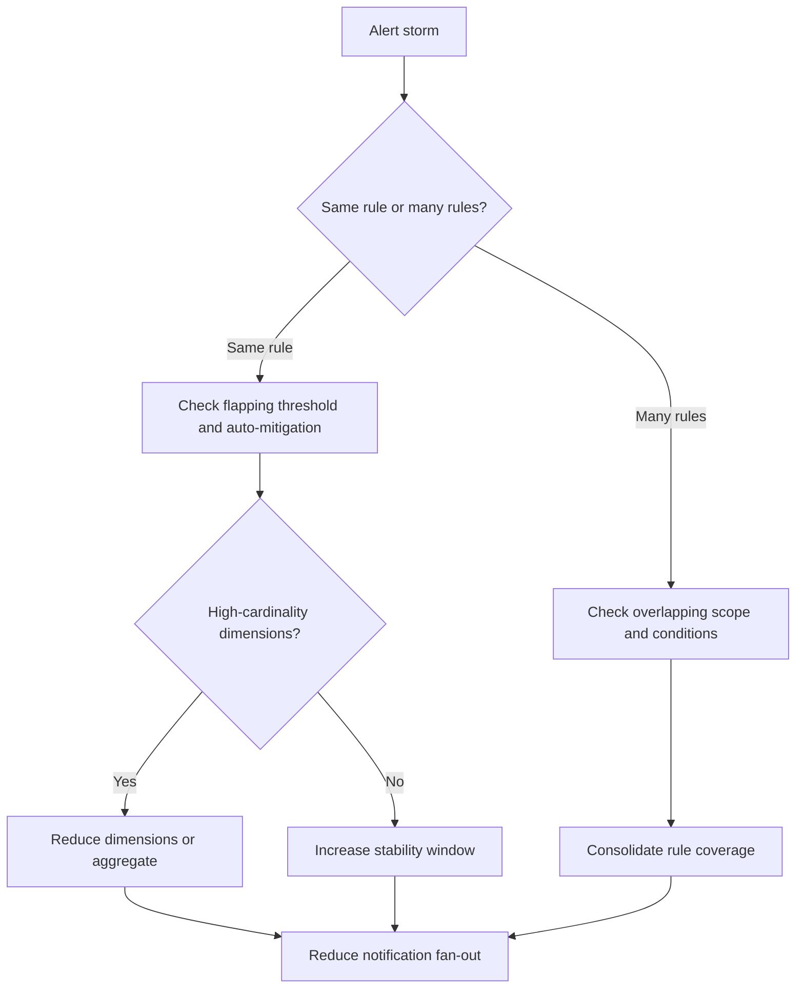

# Alert Storm

## 1. Summary
An alert storm happens when responders receive far too many alerts for the same underlying issue or for routine noise that should never have paged anyone. This playbook applies when one rule fires repeatedly, many overlapping rules trigger on the same event, or a dimension-heavy design multiplies one symptom into dozens or hundreds of notifications.

Microsoft Learn guidance on alert best practices focuses on reducing duplicate signals, choosing stable thresholds, and avoiding overly broad scopes and dimensions. Use this playbook when the problem is not that alerts are absent, but that too many alerts are drowning the signal and making incident response slower.

**Typical incident window**: 5-15 minutes from the first duplicate pages to clear recognition that the incident is alert noise rather than service expansion.
**Time to resolution**: 30 minutes to 2 hours depending on whether the storm comes from flapping thresholds, overlapping rules, or receiver fan-out.

Use it when:

- The same alert or action group fires repeatedly within minutes.
- A single noisy resource produces many alerts across overlapping rules.
- Per-dimension alerting explodes into high-cardinality notification volume.
- Thresholds appear technically correct but produce unacceptable operational noise.



## 2. Common Misreadings
| Observation | Often Misread As | Actually Means |
|---|---|---|
| Hundreds of alerts arrive at once | The platform is failing everywhere | One bad rule, one flapping metric, or one high-cardinality dimension set may be enough. |
| A rule fires every evaluation cycle | Azure Monitor is duplicating alerts | The monitored signal may be flapping around the threshold or auto-mitigation may be disabled. |
| Multiple different alerts page for one incident | The service must have many independent failures | Overlapping scopes and similar conditions may be duplicating the same root cause. |
| Dynamic thresholds are noisy | Dynamic thresholds are always bad | They may be misapplied to short-lived workloads or combined with dimensions that create too many series. |
| Suppressing alerts is the only fix | Alerting design is fine | Suppression can help, but often the rule logic or scope needs redesign first. |
| Alert history shows many activations | Action groups are broken | Delivery may be working correctly; the signal design is what needs correction. |

## 3. Competing Hypotheses
| Hypothesis | Likelihood | Key Discriminator |
|---|---|---|
| One flapping rule is repeatedly crossing the threshold | High | Alert history shows the same rule activating and resolving in short cycles. |
| Multiple rules monitor the same scope and symptom | High | Azure Activity and rule inventory show overlapping scopes, metrics, or queries. |
| Per-dimension alerting created high notification cardinality | Medium | One rule creates many alert instances split by instance, pod, host, or other dimension. |
| Evaluation frequency is too aggressive for signal update rate | Medium | Alerts fire on transient noise because rule frequency is faster than signal stabilization. |
| Action group fan-out magnifies an otherwise manageable alert volume | Medium | Alert count is moderate but notification volume is very high across receivers. |
| Maintenance or planned load caused expected but unsuppressed alerts | Low | Spike aligns to maintenance windows or known deployments, and suppression was absent or too narrow. |

## 4. What to Check First
1. **Inventory metric alert rules in the affected resource group**

    ```bash
    az monitor metrics alert list \
        --resource-group $RG \
        --output table
    ```

2. **Inventory scheduled query rules when log alerts may be contributing**

    ```bash
    az monitor scheduled-query list \
        --resource-group $RG \
        --output table
    ```

3. **Review alert processing rules that may already suppress or reroute storms**

    ```bash
    az monitor alert-processing-rule list \
        --resource-group $RG \
        --output json
    ```

4. **Review action groups attached to storming rules**

    ```bash
    az monitor action-group list \
        --resource-group $RG \
        --output table
    ```

5. **Inspect one storming metric alert in detail**

    ```bash
    az monitor metrics alert show \
        --resource-group $RG \
        --name $ALERT_RULE_NAME \
        --output json
    ```

6. **Replay the underlying signal for the worst resource before changing rule design**

    ```bash
    az monitor log-analytics query \
        --workspace $WORKSPACE_ID \
        --analytics-query "Perf | where TimeGenerated > ago(30m) | where ObjectName == 'Processor' and CounterName == '% Processor Time' | summarize AvgCPU=avg(CounterValue) by bin(TimeGenerated, 5m), Computer" \
        --timespan "PT30M"
    ```

## 5. Evidence to Collect
### 5.1 KQL Queries
```kusto
// Alert operation activity by hour
AzureActivity
| where TimeGenerated > ago(7d)
| where OperationNameValue has_any ("Microsoft.Insights/metricAlerts", "Microsoft.Insights/scheduledQueryRules")
| summarize Events=count() by OperationNameValue, ActivityStatusValue, bin(TimeGenerated, 1h)
| order by TimeGenerated desc
```

| Column | Example data | Interpretation |
|---|---|---|
| `OperationNameValue` | `Microsoft.Insights/metricAlerts/write` | Changes to rules may align with the start of the storm. |
| `ActivityStatusValue` | `Succeeded` | Successful writes are still relevant if they introduced noisy logic. |
| `Events` | `47` | Spikes indicate change activity or repeated alert-related operations. |
| `TimeGenerated` | `hourly bucket` | Correlate changes with first excessive alert window. |

!!! tip "How to Read This"
    This query helps you answer whether the storm began after a rule change. If there was no change, focus faster on signal design, dimensions, and workload behavior.

```kusto
// Notification activity for action groups
AzureActivity
| where TimeGenerated > ago(24h)
| where OperationNameValue == "Microsoft.Insights/actionGroups/notification/action"
| summarize Notifications=count() by ResourceGroup, ActivityStatusValue, bin(TimeGenerated, 15m)
| order by TimeGenerated desc
```

| Column | Example data | Interpretation |
|---|---|---|
| `Notifications` | `96` | This is the operational pain, even if root cause is only one noisy rule. |
| `ActivityStatusValue` | `Succeeded` | Notification fan-out is working exactly as configured. |
| `ResourceGroup` | `rg-monitor` | Use to narrow which rule set is driving the storm. |
| `TimeGenerated` | `15-minute bucket` | Shows burst intensity and persistence. |

!!! tip "How to Read This"
    If notifications are high but alert rule count is low, receiver fan-out or repetition from the same rule is likely. If both are high, check scope overlap and dimensions.

```kusto
// Example replay for a noisy metric pattern
Perf
| where TimeGenerated > ago(6h)
| where ObjectName == "Processor" and CounterName == "% Processor Time"
| summarize AvgCPU = avg(CounterValue) by bin(TimeGenerated, 5m), Computer
| order by TimeGenerated asc
```

| Column | Example data | Interpretation |
|---|---|---|
| `Computer` | `vm-prod-04` | Identify whether one host is flapping or many hosts are noisy. |
| `AvgCPU` | `81.2` | Compare to the threshold that is causing repeated pages. |
| `TimeGenerated` | `5-minute bucket` | Look for repeated crossings above and below the threshold. |
| Pattern | `saw-tooth` | Flapping behavior usually calls for wider windows or dynamic thresholds. |

!!! tip "How to Read This"
    Alert storms often come from a signal hovering around the threshold rather than staying clearly above it. A saw-tooth pattern is a rule-tuning problem more than an outage-detection success.

```kusto
// Top noisy computers by high CPU samples
Perf
| where TimeGenerated > ago(24h)
| where ObjectName == "Processor" and CounterName == "% Processor Time"
| where CounterValue > 80
| summarize BreachSamples=count() by Computer
| order by BreachSamples desc
| take 20
```

| Column | Example data | Interpretation |
|---|---|---|
| `Computer` | `vm-prod-04` | Repeated top contributor often maps to repeated alerting. |
| `BreachSamples` | `267` | High counts justify per-resource root-cause work before global alert changes. |
| Top 20 | `ranked set` | Helps separate one noisy source from systemic resource pressure. |

!!! tip "How to Read This"
    Use this to decide whether to fix one misbehaving resource or redesign the broader alert rule. If one source dominates, start there.

### 5.2 CLI Investigation
```bash
# Inspect the storming metric alert
az monitor metrics alert show \
    --resource-group $RG \
    --name $ALERT_RULE_NAME \
    --output json
```

Sample output:

```json
{
  "autoMitigate": true,
  "enabled": true,
  "evaluationFrequency": "PT1M",
  "windowSize": "PT5M",
  "severity": 2
}
```

Interpretation:

- Fast `evaluationFrequency` plus a narrow `windowSize` can amplify flapping.
- `autoMitigate` affects whether repeated recover-and-fire cycles generate more noise.
- Keep this output beside the replayed metric pattern.

```bash
# List alert processing rules that shape suppression or routing
az monitor alert-processing-rule list \
    --resource-group $RG \
    --output json
```

Sample output:

```json
[
  {
    "enabled": true,
    "name": "maintenance-window-suppress",
    "scopes": [
      "/subscriptions/<subscription-id>/resourceGroups/rg-prod"
    ]
  }
]
```

Interpretation:

- If no relevant suppression exists, expected maintenance can still create a storm.
- Do not use suppression as the only remedy for a badly designed rule.
- Compare scope carefully; broad suppression can hide real incidents while narrow suppression may do nothing.

```bash
# Inspect action-group receiver fan-out
az monitor action-group show \
    --resource-group $RG \
    --name $ACTION_GROUP_NAME \
    --output json
```

Sample output:

```json
{
  "emailReceivers": [
    {
      "name": "oncall-email"
    },
    {
      "name": "manager-email"
    }
  ],
  "smsReceivers": [
    {
      "name": "primary-sms"
    }
  ],
  "webhookReceivers": [
    {
      "name": "incident-webhook"
    }
  ]
}
```

Interpretation:

- One alert can become many human interrupts when receiver fan-out is large.
- The action group is not the cause of the alert storm, but it often magnifies impact.
- During mitigation, reducing fan-out can buy time while rule logic is fixed.

```bash
# Inventory metric alerts to find overlap in one resource group
az monitor metrics alert list \
    --resource-group $RG \
    --output json
```

Sample output:

```json
[
  {
    "name": "cpu-high-vm",
    "scopes": [
      "/subscriptions/<subscription-id>/resourceGroups/rg-prod/providers/Microsoft.Compute/virtualMachines/vm-prod-04"
    ]
  },
  {
    "name": "cpu-high-rg",
    "scopes": [
      "/subscriptions/<subscription-id>/resourceGroups/rg-prod"
    ]
  }
]
```

Interpretation:

- Scope overlap explains duplicate pages for the same underlying symptom.
- Compare per-resource and group-wide rules carefully before adding more suppression.
- Inventory evidence is essential before consolidating rules.

## 6. Validation and Disproof by Hypothesis
### Hypothesis 1: One flapping rule is repeatedly crossing the threshold
**Proves if**: Manual replay shows repeated threshold crossings and the same rule dominates alert activity.

**Disproves if**: The signal is stable and the storm comes from overlapping rules instead.

**Test with**: Section 5.1 Queries 3 and 4 plus Section 5.2 CLI command 1.

### Hypothesis 2: Multiple rules monitor the same scope and symptom
**Proves if**: Rule inventory shows overlapping scopes and similar conditions.

**Disproves if**: Only one relevant rule exists.

**Test with**: Section 5.2 CLI command 4.

### Hypothesis 3: Per-dimension alerting created high cardinality
**Proves if**: One rule generates many alert instances split by host, instance, or pod.

**Disproves if**: The rule is not dimensioned or only one series is firing.

**Test with**: Section 5.2 CLI command 1 and the underlying signal grouped by dimension in Section 5.1 Query 3.

### Hypothesis 4: Evaluation frequency is too aggressive for signal update rate
**Proves if**: Fast evaluation catches normal jitter or short spikes that wider windows would smooth out.

**Disproves if**: The signal remains consistently unhealthy across broader windows.

**Test with**: Section 5.2 CLI command 1 plus Section 5.1 Query 3.

### Hypothesis 5: Action group fan-out magnifies the pain
**Proves if**: Alert count is moderate but notification count and receiver count are high.

**Disproves if**: Notification volume closely matches actual useful alert count.

**Test with**: Section 5.1 Query 2 and Section 5.2 CLI command 3.

### Hypothesis 6: Maintenance or planned load caused expected but unsuppressed alerts
**Proves if**: Storm timing aligns with change windows and no relevant suppression exists.

**Disproves if**: No maintenance or planned load aligned with the storm.

**Test with**: Section 5.1 Query 1 and Section 5.2 CLI command 2.

## 7. Likely Root Cause Patterns
| Pattern | Evidence | Resolution |
|---|---|---|
| Threshold flapping around a narrow static limit | Signal oscillates around the breach line and the same rule repeats | Widen windows, adjust threshold, or consider dynamic thresholds. |
| Overlapping rules for one symptom | Rule inventory shows per-resource and broad-scope rules both targeting the same metric | Consolidate rules and make ownership explicit. |
| High-cardinality dimensions create alert multiplication | One rule fires once per host, pod, or instance | Reduce dimensions, aggregate, or change paging policy. |
| Aggressive evaluation interval outruns metric stabilization | One-minute evaluation catches normal jitter | Align evaluation frequency with how the signal actually updates. |
| Action-group fan-out turns noise into an incident | Few alerts create many emails, SMS messages, and webhooks | Reduce temporary fan-out while redesigning rule logic. |

### Normal vs Abnormal Comparison
| Metric/Log | Normal State | Abnormal State | Threshold |
|---|---|---|---|
| Alert activation count | Single or low-count activations tied to distinct incidents | Same rule or same symptom activates repeatedly in a short period | > 3 repeats in 15 min |
| Scope overlap | One alert family owns one symptom per scope | Per-resource and broad-scope rules fire for the same condition | Any duplicated coverage |
| Dimension cardinality | Paging dimensions limited to actionable splits | One rule creates many alert instances by host, pod, or instance | Dozens of instances per event |
| Evaluation cadence | Frequency matches how fast the signal stabilizes | Frequency is faster than the signal can settle | 1-min checks on jittery signals |
| Action-group fan-out | Small receiver set aligned to operational need | Each activation fans out to many emails, SMS, and webhooks | High receiver count per alert |

## 8. Immediate Mitigations
1. Increase rule stability by widening evaluation windows.

    ```bash
    az monitor metrics alert update \
        --resource-group $RG \
        --name $ALERT_RULE_NAME \
        --window-size 15m \
        --evaluation-frequency 5m
    ```

2. Disable or narrow a duplicate alert temporarily.

    ```bash
    az monitor metrics alert update \
        --resource-group $RG \
        --name $DUPLICATE_ALERT_RULE_NAME \
        --enabled false
    ```

3. Add or enable maintenance suppression during known noisy windows.

    ```bash
    az monitor alert-processing-rule list \
        --resource-group $RG \
        --output table
    ```

4. Reduce action group fan-out while the storm is active.

    ```bash
    az monitor action-group show \
        --resource-group $RG \
        --name $ACTION_GROUP_NAME \
        --query "{emailReceivers:emailReceivers,smsReceivers:smsReceivers,webhookReceivers:webhookReceivers}"
    ```

5. If one resource is dominating, fix or isolate the source before broad alert redesign.

    ```bash
    az resource show \
        --ids $RESOURCE_ID \
        --query "{id:id,type:type,name:name}"
    ```

## 9. Prevention
Prevent alert storms by designing alerts around operator actionability rather than raw detectability. Microsoft Learn best practices consistently favor consolidated coverage, explicit ownership, and stable thresholds.

Review overlap before adding new rules.

```bash
az monitor metrics alert list \
    --resource-group $RG \
    --output table
```

Prefer wider windows and deliberate dimensions for paging rules.

```bash
az monitor metrics alert show \
    --resource-group $RG \
    --name $ALERT_RULE_NAME \
    --query "{evaluationFrequency:evaluationFrequency,windowSize:windowSize,criteria:criteria}"
```

Keep suppression rules ready for maintenance, but do not use them to hide permanently noisy design.

```bash
az monitor alert-processing-rule list \
    --resource-group $RG \
    --output table
```

Review receiver fan-out with the same care you apply to thresholds.

```bash
az monitor action-group list \
    --resource-group $RG \
    --output table
```

Finally, make one team responsible for each alert family. Ownership clarity prevents a natural tendency to add overlapping "just in case" alerts that create storms later.

## See Also
- [Alert Not Firing](alert-not-firing.md)
- [Operations: Alert Rule Management](../../operations/alert-rule-management.md)
- [KQL: Alert Firing History](../kql/alerts/alert-firing-history.md)
- [KQL: Action Group Failures](../kql/alerts/action-group-failures.md)

## Sources
- [Microsoft Learn: Troubleshoot Azure Monitor alerts](https://learn.microsoft.com/en-us/azure/azure-monitor/alerts/alerts-troubleshoot)
- [Microsoft Learn: Azure Monitor alerts best practices](https://learn.microsoft.com/en-us/azure/azure-monitor/alerts/alerts-best-practices)
- [Microsoft Learn: Alerts processing rules in Azure Monitor](https://learn.microsoft.com/en-us/azure/azure-monitor/alerts/alerts-processing-rules)
- [Microsoft Learn: Action groups in Azure Monitor](https://learn.microsoft.com/en-us/azure/azure-monitor/alerts/action-groups)
- [Microsoft Learn: Perf table reference](https://learn.microsoft.com/en-us/azure/azure-monitor/reference/tables/perf)
