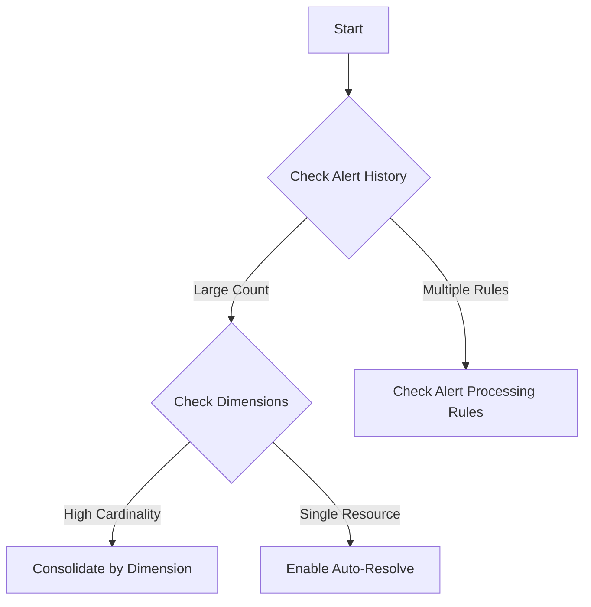

# Playbook: Alert Storm

## 1. Summary
Too many alerts or notifications are received for the same underlying issue or due to overly sensitive thresholds. This playbook focuses on alert reduction and grouping.

## 2. Common Misreadings
-   "The system is down" – Large numbers of alerts can be noise from a single flapping resource.
-   "Action Groups are broken" – Repeated notifications are the primary sign of an alert storm.

## 3. Competing Hypotheses
-   **Noisy Resource**: A single server or service is flapping (repeatedly crossing and then falling below a threshold).
-   **Overlapping Scopes**: Multiple alert rules are monitoring the same resource with similar conditions.
-   **Broad Thresholds**: Alert thresholds are set too low, triggering on normal background noise.
-   **Dimension Overload**: Alert rules configured to alert on every dimension (e.g., every instance) result in thousands of alerts.

## 4. What to Check First


## 5. Evidence to Collect
-   **Alert volume count**:
    ```kusto
    AzureActivity
    | where OperationNameValue == "Microsoft.Insights/alertRules/activated/action"
    | summarize count() by OperationNameValue, bin(TimeGenerated, 1h)
    ```
-   **Recent Alert changes**: Check `AzureActivity` for modifications to thresholds or alert scopes.

## 6. Validation by Hypothesis
-   **Hypothesis: Noisy Rule**: Look for the rule name in `AzureActivity` with the highest frequency.
-   **Hypothesis: Dimensions**: Check if the alert is splitting by many instances (e.g., `*` dimension).

## 7. Root Cause Patterns
-   Evaluation frequency is higher than the resource's telemetry update interval.
-   Alert Rule is monitoring a broad scope (e.g., a whole subscription) instead of a specific Resource Group.

## 8. Mitigations
-   Increase **Evaluation Frequency** to reduce rapid-fire alerts.
-   Implement **Alert Processing Rules** for suppression during known maintenance or high-noise windows.
-   Enable **Automatically Resolve Alerts** to prevent duplicates in the Monitor dashboard.
-   Switch from Static to **Dynamic Thresholds**.

## See Also
- [Alert Not Firing](alert-not-firing.md)
- [Alert Rule Management](../../operations/alert-rule-management.md)

## Sources
- [MS Learn: Troubleshooting Azure Monitor alerts](https://learn.microsoft.com/azure/azure-monitor/alerts/alerts-troubleshoot)
- [MS Learn: Best practices for Azure Monitor alerts](https://learn.microsoft.com/azure/azure-monitor/alerts/alerts-best-practices)
