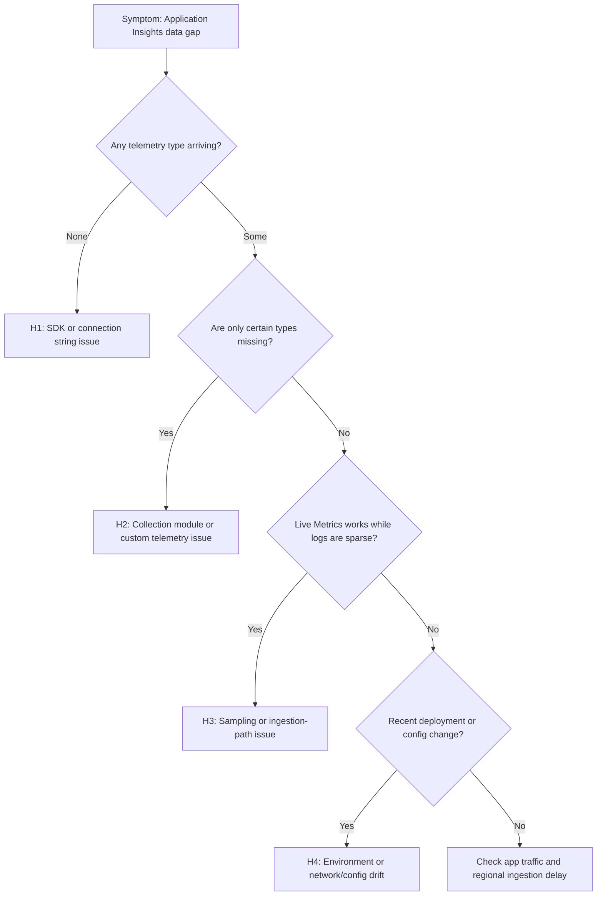

# Application Insights Data Gaps

## 1. Summary

Use this playbook when Application Insights is missing telemetry entirely or shows unexplained gaps for requests, dependencies, traces, exceptions, custom events, or custom metrics. According to Microsoft Learn troubleshooting guidance, the most common causes are incorrect SDK or connection-string configuration, adaptive or fixed sampling reducing visibility, ingestion-path or network restrictions, and misunderstandings caused by Live Metrics showing activity while the analytics pipeline stays incomplete.

This playbook is appropriate when a service was previously visible and is now partially missing, when one telemetry type disappears but others remain, when gaps appear after a deployment, or when operators suspect sampling but have not yet proved it. The aim is to separate collection problems, filtering/sampling behavior, and ingestion delay from application inactivity.

**Typical incident window**: 10-20 minutes from a deployment, networking change, or SDK drift to visible gaps in App* telemetry.
**Time to resolution**: 30 minutes to 2 hours depending on whether the break is configuration, sampling, or endpoint/network path.

### Troubleshooting decision flow



## 2. Common Misreadings

| Observation | Often Misread As | Actually Means |
|---|---|---|
| Live Metrics shows requests but `requests` table is sparse | Application Insights is healthy | Live Metrics and analytics ingestion are different paths; analytics can still be filtered, delayed, or misconfigured. |
| Request count drops after deployment | Traffic dropped | Deployment may have changed connection string, middleware order, or sampling behavior. |
| `itemCount` is greater than 1 | Duplicate telemetry | Sampling is estimating actual volume, not duplicating rows. |
| Only dependencies are missing | Global ingestion outage | Dependency auto-collection can fail independently from requests and traces. |
| No exceptions appear | App is healthy | Exceptions may be excluded by sampling, filtering, or SDK initialization gaps. |

## 3. Competing Hypotheses

| Hypothesis | Likelihood | Key Discriminator |
|---|---|---|
| H1: SDK or connection string configuration is wrong or missing | High | App settings or code do not point to the intended Application Insights resource. |
| H2: Specific auto-collection or custom telemetry path is not enabled | Medium-High | Requests arrive, but dependencies, traces, or custom events do not. |
| H3: Sampling or ingestion delay is causing apparent gaps | High | `itemCount` indicates sampling or `ingestion_time()` shows significant delay. |
| H4: Environment, network, or private-link changes are blocking ingestion | Medium | Recent config drift aligns with failed sends, missing connection strings, or endpoint reachability issues. |

## 4. What to Check First

1. **Verify the exact Application Insights component and connection string**

    ```bash
    az monitor app-insights component show \
        --app "$APP_INSIGHTS_NAME" \
        --resource-group "$RG" \
        --query "{name:name,location:location,workspaceResourceId:workspaceResourceId,connectionString:connectionString}"
    ```

2. **Check host application settings for the expected connection string**

    ```bash
    az webapp config appsettings list \
        --name "$APP_NAME" \
        --resource-group "$APP_RG" \
        --query "[?name=='APPLICATIONINSIGHTS_CONNECTION_STRING' || name=='APPINSIGHTS_INSTRUMENTATIONKEY' || name=='APPLICATIONINSIGHTS_ENABLE_AGENT'].{name:name,value:value}"
    ```

3. **Run a control query that compares major telemetry tables together**

    ```bash
    az monitor log-analytics query \
        --workspace "$WORKSPACE_ID" \
        --analytics-query "union isfuzzy=true AppRequests, AppDependencies, AppTraces, AppExceptions | where TimeGenerated > ago(15m) | summarize Count=count(), LastSeen=max(TimeGenerated) by Type | order by Count desc" \
        --timespan "PT15M"
    ```

4. **Check whether AppRequests show sampling behavior**

    ```bash
    az monitor log-analytics query \
        --workspace "$WORKSPACE_ID" \
        --analytics-query "AppRequests | where TimeGenerated > ago(1h) | summarize Recorded=count(), Estimated=sum(ItemCount) | extend EffectiveSamplingPercent=round(100.0 * todouble(Recorded) / todouble(Estimated), 2)" \
        --timespan "PT1H"
    ```

5. **Review recent deployment timing before changing telemetry code**

    ```bash
    az webapp deployment list \
        --name "$APP_NAME" \
        --resource-group "$APP_RG" \
        --query "[].{receivedTime:receivedTime,active:active,author:author,message:message}" \
        --output table
    ```

6. **If private networking is involved, inspect related private endpoints**

    ```bash
    az network private-endpoint list \
        --resource-group "$NETWORK_RG" \
        --query "[?contains(name, 'appi') || contains(name, 'monitor')].{name:name,subnet:subnet.id,provisioningState:provisioningState}"
    ```

## 5. Evidence to Collect

Collect evidence from the app configuration, Application Insights tables, and recent deployment/configuration state. Microsoft Learn guidance emphasizes comparing telemetry types together, because an outage that affects all telemetry looks very different from a module-specific or sampling-driven visibility issue.

### 5.1 KQL Queries

#### Query 1: Telemetry arrival by type

```kusto
union isfuzzy=true AppRequests, AppDependencies, AppTraces, AppExceptions, AppEvents
| where TimeGenerated > ago(1h)
| summarize Count = count(), LastSeen = max(TimeGenerated) by TelemetryType = Type
| order by Count desc
```

**Sample Output**

| TelemetryType | Count | LastSeen | Interpretation |
|---|---|---|---|
| request | 18452 | 2026-04-05 10:42:05 | Request collection is active. |
| trace | 9621 | 2026-04-05 10:42:04 | Trace path is active. |
| dependency | 0 |  | Missing dependency rows suggest a module-specific problem, not full ingestion loss. |
| exception | 17 | 2026-04-05 10:40:12 | Exceptions still arrive, so the app and ingestion path are at least partially healthy. |

!!! tip "How to Read This"
    Start by comparing telemetry types in the same hour. If only one type is missing, do not treat it as a total Application Insights outage.

#### Query 2: Sampling effectiveness and apparent gap check

```kusto
AppRequests
| where TimeGenerated > ago(1h)
| summarize Recorded = count(), EstimatedActual = sum(ItemCount), SampledRows = countif(ItemCount > 1)
| extend EffectiveSamplingPercent = round(100.0 * todouble(Recorded) / todouble(EstimatedActual), 2)
```

**Sample Output**

| Recorded | EstimatedActual | SampledRows | EffectiveSamplingPercent | Interpretation |
|---|---|---|---|---|
| 18452 | 92104 | 17309 | 20.03 | Large apparent gaps may be explained by adaptive or fixed sampling. |

!!! tip "How to Read This"
    If effective sampling is far below 100%, low counts do not automatically mean telemetry is being lost. Investigate whether the missing data is actually a sampling policy outcome.

#### Query 3: Ingestion delay vs actual timestamp

```kusto
AppRequests
| where TimeGenerated > ago(2h)
| extend IngestionDelaySeconds = datetime_diff('second', ingestion_time(), TimeGenerated)
| summarize AvgDelaySeconds = avg(IngestionDelaySeconds), P95DelaySeconds = percentile(IngestionDelaySeconds, 95), MaxDelaySeconds = max(IngestionDelaySeconds)
```

**Sample Output**

| AvgDelaySeconds | P95DelaySeconds | MaxDelaySeconds | Interpretation |
|---|---|---|---|
| 48 | 181 | 622 | Short delay is normal; large sustained delay can look like a gap during active incidents. |

!!! tip "How to Read This"
    A few minutes of ingestion delay can create false alarms if operators expect near-real-time analytics visibility from the `requests` table.

#### Query 4: Timeline gaps by role name

```kusto
AppRequests
| where TimeGenerated > ago(6h)
| summarize RequestCount = sum(ItemCount) by bin(TimeGenerated, 5m), AppRoleName
| order by TimeGenerated asc
```

**Sample Output**

| TimeGenerated | AppRoleName | RequestCount | Interpretation |
|---|---|---|---|
| 2026-04-05 09:30:00 | api-production | 1183 | Healthy baseline traffic. |
| 2026-04-05 09:35:00 | api-production | 0 | Gap aligned to deployment or restart window needs further validation. |
| 2026-04-05 09:40:00 | api-production | 1175 | Quick recovery suggests transient configuration or startup issue. |

!!! tip "How to Read This"
    Correlate zero-count bins with deployment time, app restarts, or config changes before concluding the service had no traffic.

### 5.2 CLI Investigation

Capture the configuration evidence before restarting apps or reverting deployments. Microsoft Learn troubleshooting guidance is much easier to apply when you can compare the effective connection string, deployment timing, and current table state in the same investigation window.

#### Command 1: Verify Application Insights component details

```bash
az monitor app-insights component show \
    --app "$APP_INSIGHTS_NAME" \
    --resource-group "$RG" \
    --query "{name:name, location:location, applicationType:applicationType, connectionString:connectionString}"
```

**Sample Output (sanitized)**

```json
{
  "applicationType": "web",
  "connectionString": "<connection-string>",
  "location": "koreacentral",
  "name": "appi-production"
}
```

Interpretation: This is the expected target resource. Next, confirm the application actually uses this connection string.

#### Command 2: Check application configuration for the connection string

```bash
az webapp config appsettings list \
    --name "$APP_NAME" \
    --resource-group "$APP_RG" \
    --query "[?name=='APPLICATIONINSIGHTS_CONNECTION_STRING' || name=='APPINSIGHTS_INSTRUMENTATIONKEY' || name=='APPLICATIONINSIGHTS_ENABLE_AGENT'].{name:name, value:value}"
```

**Sample Output (sanitized)**

```json
[
  {
    "name": "APPLICATIONINSIGHTS_CONNECTION_STRING",
    "value": "<connection-string>"
  },
  {
    "name": "APPLICATIONINSIGHTS_ENABLE_AGENT",
    "value": "true"
  }
]
```

Interpretation: If this list is empty or points elsewhere, H1 becomes highly likely.

#### Command 3: Inspect recent web app deployment and restart context

```bash
az webapp deployment list \
    --name "$APP_NAME" \
    --resource-group "$APP_RG" \
    --query "[].{receivedTime:receivedTime, active:active, author:author, message:message}" \
    --output table
```

**Sample Output (sanitized)**

```text
ReceivedTime               Active  Author        Message
-------------------------  ------  ------------  --------------------------
2026-04-05T09:33:11+00:00  True    github-action Deploy application package
2026-04-04T18:02:44+00:00  False   github-action Deploy application package
```

Interpretation: If the gap begins immediately after deployment, look for config drift, SDK init changes, or startup ordering changes before assuming platform loss.

#### Command 4: Run a control query against Application Insights-backed logs

```bash
az monitor app-insights query \
    --app "$APP_INSIGHTS_NAME" \
    --resource-group "$RG" \
        --analytics-query "AppRequests | where TimeGenerated > ago(15m) | summarize Count=sum(ItemCount), LastSeen=max(TimeGenerated) by AppRoleName"
```

**Sample Output (sanitized)**

```text
AppRoleName  Count  LastSeen
--------------  -----  -------------------------
api-production  4871   2026-04-05T10:42:05Z
```

Interpretation: A healthy control query proves the analytics side is responding. If the expected table is empty while control queries are fast, focus on the telemetry path, not the query engine.

#### Command 5: Check network/private endpoint configuration when applicable

```bash
az network private-endpoint list \
    --resource-group "$NETWORK_RG" \
    --query "[?contains(name, 'appi') || contains(name, 'monitor')].{name:name, subnet:subnet.id, provisioningState:provisioningState}"
```

**Sample Output (sanitized)**

```json
[
  {
    "name": "pe-appi-production",
    "provisioningState": "Succeeded",
    "subnet": "/subscriptions/<subscription-id>/resourceGroups/rg-networking/providers/Microsoft.Network/virtualNetworks/vnet-prod/subnets/snet-privateendpoints"
  }
]
```

Interpretation: Private endpoint changes near the incident increase the probability of H4, especially when apps use locked-down outbound networking.

### Sample evidence patterns

**App setting drift snapshot**

```text
2026-04-05T09:33:14Z APPLICATIONINSIGHTS_CONNECTION_STRING updated
2026-04-05T09:35:00Z requests table shows zero rows for api-production
2026-04-05T09:40:12Z traces resume after rollback
```

**Interpretation**

- Tight alignment between config drift and telemetry disappearance strongly favors H1 or H4.
- Recovery after rollback weakens theories about true traffic loss.
- Keep this timeline beside KQL output so the team does not over-focus on sampling when the root cause is configuration drift.

## 6. Validation and Disproof by Hypothesis

### Hypothesis H1: SDK or connection string configuration is wrong or missing

**Proves if**: The application has no valid `APPLICATIONINSIGHTS_CONNECTION_STRING`, the SDK is not initialized, or the app points to the wrong resource.

**Disproves if**: The correct connection string is present and recent telemetry from the expected role appears in Application Insights.

**Tests**

```bash
az webapp config appsettings list \
    --name "$APP_NAME" \
    --resource-group "$APP_RG" \
    --query "[?name=='APPLICATIONINSIGHTS_CONNECTION_STRING'].value"
```

```kusto
union AppRequests, AppTraces
| where TimeGenerated > ago(30m)
| summarize LastSeen = max(TimeGenerated) by AppRoleName, SDKVersion
```

If settings are absent and no recent rows exist for the role, H1 is strongly supported.

### Hypothesis H2: Specific auto-collection or custom telemetry path is not enabled

**Proves if**: Requests arrive but dependencies, exceptions, traces, or custom events are missing or sharply reduced.

**Disproves if**: All major telemetry types arrive together and only volume varies.

**Tests**

```kusto
union isfuzzy=true AppRequests, AppDependencies, AppTraces, AppExceptions, AppEvents
| where TimeGenerated > ago(1h)
| summarize Count = count() by Type
```

```kusto
AppDependencies
| where TimeGenerated > ago(1h)
| summarize Count = count(), LastSeen = max(TimeGenerated) by Target, DependencyType
| order by Count desc
```

If requests stay healthy but dependencies are absent, inspect dependency tracking modules, instrumentation, and middleware order.

### Hypothesis H3: Sampling or ingestion delay is causing apparent gaps

**Proves if**: `itemCount` indicates reduced sampling percentage or `ingestion_time()` shows sustained lag.

**Disproves if**: Sampling is effectively 100% and ingestion delays are normal while rows are still missing.

**Tests**

```kusto
AppRequests
| where TimeGenerated > ago(1h)
| summarize Recorded=count(), Estimated=sum(ItemCount)
| extend EffectiveSamplingPercent = round(100.0 * todouble(Recorded) / todouble(Estimated), 2)
```

```kusto
AppTraces
| where TimeGenerated > ago(2h)
| extend DelaySeconds = datetime_diff('second', ingestion_time(), TimeGenerated)
| summarize P95DelaySeconds = percentile(DelaySeconds, 95)
```

If sampling is low or delays are elevated, apparent gaps may be expected behavior rather than broken instrumentation.

### Hypothesis H4: Environment, network, or private-link drift is blocking ingestion

**Proves if**: A deployment or network change aligns with the start of the gap and the app cannot reach the intended endpoint path.

**Disproves if**: No relevant changes occurred and the app remains able to send telemetry successfully.

**Tests**

```bash
az webapp deployment list \
    --name "$APP_NAME" \
    --resource-group "$APP_RG" \
    --output table
```

```bash
az network private-endpoint list \
    --resource-group "$NETWORK_RG" \
    --output table
```

When the gap begins immediately after deployment, private endpoint rollout, or app setting change, H4 becomes much more credible.

### Decision guide after validation

If H1 is proven, restore the correct connection string and SDK initialization path first. If H2 is proven, fix the missing module or custom telemetry emission path rather than treating it as full ingestion loss. If H3 is proven, document the sampling rate and delay expectations so teams stop misreading normal behavior as data loss. If H4 is proven, coordinate configuration rollback or network remediation before changing telemetry code again.

## 7. Likely Root Cause Patterns

| Pattern | Evidence | Resolution |
|---|---|---|
| Wrong or missing connection string | App settings missing or changed; all telemetry disappears | Restore correct connection string and restart app if needed. |
| Dependency or custom telemetry module disabled | Requests present, dependencies or custom events absent | Re-enable module/instrumentation in code or agent configuration. |
| Adaptive sampling surprises operators | `itemCount` shows strong down-sampling; low raw row counts | Adjust sampling strategy or exclude critical telemetry from sampling. |
| Ingestion delay mistaken for loss | Rows appear later; `ingestion_time()` lag spikes | Account for delay in alerts and operational expectations. |
| Network/private-link drift | Gap aligns to endpoint or network changes | Fix outbound access, private DNS, private endpoint, or proxy path. |

### Normal vs Abnormal Comparison

| Metric/Log | Normal State | Abnormal State | Threshold |
|---|---|---|---|
| Telemetry type spread | `AppRequests`, `AppTraces`, and `AppDependencies` all remain visible for active roles | One or more major tables fully absent | Any full-table gap |
| Sampling | Known and documented | Unexpected low effective sampling percentage | Unexpected policy drift |
| Ingestion delay | Seconds to a few minutes | Sustained long lag during active traffic | P95 > 10 min |
| Deployment correlation | No change near gap | Gap starts immediately after deployment/config change | Tight deployment correlation |
| Connection string state | Present and correct | Missing, stale, or points to another resource | Any mismatch |

### Operator notes

- Live Metrics is not a substitute for checking analytics tables.
- `itemCount` is essential evidence; teams frequently ignore it and over-diagnose telemetry loss.
- A single missing table usually means collection-path misconfiguration, not an Application Insights regional outage.
- Always confirm the expected `cloud_RoleName` because multi-service resources can make “missing data” look worse than it is.

### Escalation threshold

Escalate as a suspected Azure-side service issue only when control queries are healthy against configuration, the app still emits telemetry with the right connection string, networking remains open, and multiple telemetry types across more than one role or service show unexplained, synchronized gaps.

## 8. Immediate Mitigations

1. Restore the correct connection string or Application Insights agent setting in the application configuration.
2. Roll back the most recent deployment when telemetry vanished immediately after release and no safer targeted fix is available.
3. Temporarily reduce or exclude sampling for critical telemetry types during active incident response.
4. Re-enable dependency or custom telemetry modules if only selected telemetry types disappeared.
5. Validate private endpoint, DNS, firewall, or proxy settings when network hardening coincides with the gap.
6. Use a narrow control query after each change to confirm fresh telemetry arrival before declaring recovery.

## 9. Prevention

- Track connection-string ownership in infrastructure as code so deployments cannot silently repoint telemetry.
- Define and document sampling policy, including excluded critical telemetry types and expected effective rates.
- Include a post-deployment Application Insights smoke test that checks requests, dependencies, and traces in the last 15 minutes.
- Alert on sudden zero-volume or steep drop patterns per `cloud_RoleName`, not only on aggregate resource counts.
- Review private networking changes for Azure Monitor and Application Insights dependencies before production rollout.

### Prevention checklist

- Validate Application Insights app settings during every release.
- Keep one control KQL query per service role for requests, dependencies, and traces.
- Record expected telemetry modules and custom events in service runbooks.
- Educate operators on `itemCount`, `ingestion_time()`, and the difference between Live Metrics and analytics ingestion.

## See Also

- [Slow Query Performance](slow-query-performance.md)
- [AKS Container Insights Issues](aks-container-insights-issues.md)
- [Missing Application Telemetry](missing-application-telemetry.md)
- [Alert Not Firing](alert-not-firing.md)

## Sources

- [Application Insights overview](https://learn.microsoft.com/en-us/azure/azure-monitor/app/app-insights-overview)
- [Troubleshoot missing application telemetry in Azure Monitor Application Insights](https://learn.microsoft.com/en-us/troubleshoot/azure/azure-monitor/app-insights/investigate-missing-telemetry)
- [Sampling in Application Insights](https://learn.microsoft.com/en-us/azure/azure-monitor/app/sampling)
- [Monitor Azure App Service with Application Insights](https://learn.microsoft.com/en-us/azure/azure-monitor/app/azure-web-apps)
- [Azure Monitor private link scope and private endpoints](https://learn.microsoft.com/en-us/azure/azure-monitor/logs/private-link-security)
- [AppRequests table reference](https://learn.microsoft.com/en-us/azure/azure-monitor/reference/tables/apprequests)
- [AppDependencies table reference](https://learn.microsoft.com/en-us/azure/azure-monitor/reference/tables/appdependencies)
- [AppTraces table reference](https://learn.microsoft.com/en-us/azure/azure-monitor/reference/tables/apptraces)
- [AppExceptions table reference](https://learn.microsoft.com/en-us/azure/azure-monitor/reference/tables/appexceptions)
