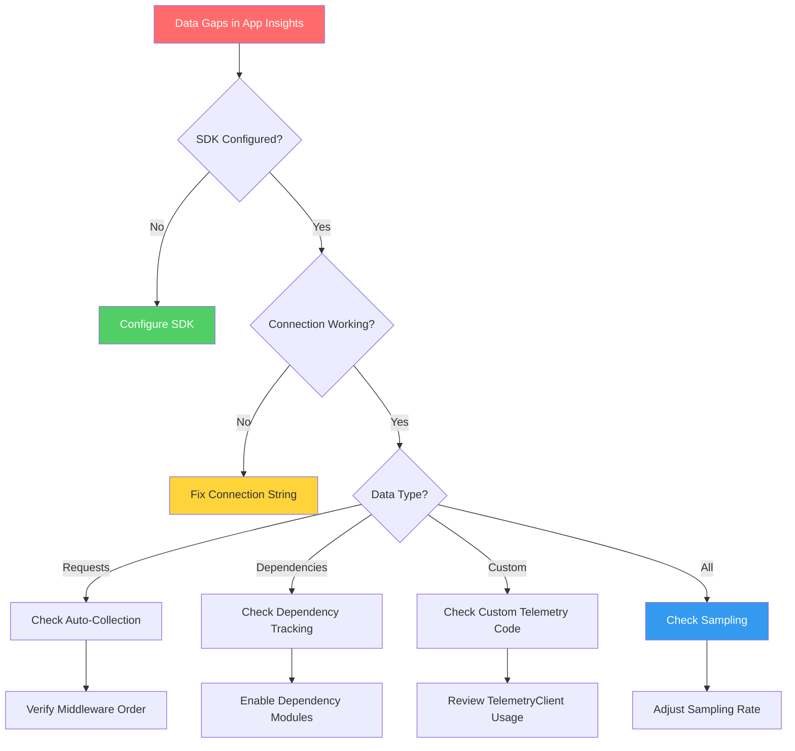
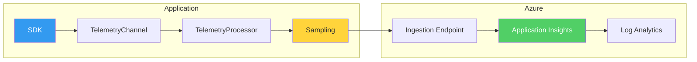

# Application Insights Data Gaps

Systematic troubleshooting for missing or incomplete telemetry in Application Insights.

## Symptoms

- Requests not appearing in Application Insights
- Dependency calls missing
- Custom events/metrics not recorded
- Gaps in telemetry timeline
- Sampling dropping important data
- Live Metrics showing data but logs missing

## Diagnostic Flowchart



## Investigation Steps

### Step 1: Verify SDK Configuration

**.NET Applications:**

```csharp
// Check Program.cs or Startup.cs
builder.Services.AddApplicationInsightsTelemetry();
// or
builder.Services.AddApplicationInsightsTelemetry(options =>
{
    options.ConnectionString = "InstrumentationKey=...;IngestionEndpoint=...";
});
```

**Node.js Applications:**

```javascript
// Check app initialization
const appInsights = require('applicationinsights');
appInsights.setup(process.env.APPLICATIONINSIGHTS_CONNECTION_STRING)
    .setAutoCollectRequests(true)
    .setAutoCollectDependencies(true)
    .start();
```

### Step 2: Check Connection String

```bash
# Verify App Insights resource
az monitor app-insights component show \
    --app "appi-production" \
    --resource-group "rg-monitoring" \
    --query "{connectionString:connectionString, instrumentationKey:instrumentationKey}"
```

Verify application has correct connection string:

```bash
# For App Service
az webapp config appsettings list \
    --name "webapp-production" \
    --resource-group "rg-app" \
    --query "[?name=='APPLICATIONINSIGHTS_CONNECTION_STRING'].value"
```

### Step 3: Check for Telemetry in Portal

```kusto
// Check request telemetry
requests
| where timestamp > ago(1h)
| summarize Count = count() by bin(timestamp, 5m), cloud_RoleName
| render timechart
```

```kusto
// Check for SDK version and cloud role
union requests, dependencies, traces, exceptions
| where timestamp > ago(1h)
| summarize count() by sdkVersion, cloud_RoleName
```

### Step 4: Verify Live Metrics Connection

Open Live Metrics in Azure Portal:
1. Navigate to Application Insights resource
2. Select "Live Metrics" under Investigate
3. Check if servers are connected

If Live Metrics works but logs are missing → Check ingestion pipeline or sampling.

### Step 5: Check Sampling Configuration

```kusto
// Detect sampling impact
requests
| where timestamp > ago(1h)
| summarize 
    TotalCount = count(),
    SampledIn = countif(itemCount == 1),
    SampledEstimate = sum(itemCount)
| extend SamplingRate = round(100.0 * TotalCount / SampledEstimate, 2)
```

```kusto
// Check if specific requests are sampled out
requests
| where timestamp > ago(24h)
| where name contains "critical-endpoint"
| summarize 
    RecordedCount = count(),
    EstimatedActual = sum(itemCount)
```

### Step 6: Check Ingestion Status

```kusto
// Check for ingestion delays
requests
| where timestamp > ago(2h)
| extend IngestionDelay = ingestion_time() - timestamp
| summarize 
    AvgDelaySeconds = avg(IngestionDelay) / 1s,
    MaxDelaySeconds = max(IngestionDelay) / 1s
```

## Data Flow Architecture



## Resolution Actions

### Fix 1: Configure SDK Correctly

**.NET 6+ (Recommended):**

```csharp
// Program.cs
var builder = WebApplication.CreateBuilder(args);

// Add Application Insights
builder.Services.AddApplicationInsightsTelemetry(options =>
{
    options.ConnectionString = builder.Configuration["ApplicationInsights:ConnectionString"];
    options.EnableAdaptiveSampling = true;
    options.EnableQuickPulseMetricStream = true;
});

var app = builder.Build();
```

**Node.js:**

```javascript
const appInsights = require('applicationinsights');

appInsights.setup(process.env.APPLICATIONINSIGHTS_CONNECTION_STRING)
    .setAutoCollectRequests(true)
    .setAutoCollectPerformance(true, true)
    .setAutoCollectExceptions(true)
    .setAutoCollectDependencies(true)
    .setAutoCollectConsole(true, true)
    .setUseDiskRetryCaching(true)
    .setSendLiveMetrics(true)
    .start();
```

### Fix 2: Fix Dependency Tracking

**.NET - Enable SQL and HTTP tracking:**

```csharp
builder.Services.ConfigureTelemetryModule<DependencyTrackingTelemetryModule>((module, o) =>
{
    module.EnableSqlCommandTextInstrumentation = true;
});
```

**Node.js - Enable correlation:**

```javascript
appInsights.setup(connectionString)
    .setAutoCollectDependencies(true)
    .setAutoDependencyCorrelation(true)
    .start();
```

### Fix 3: Adjust Sampling Configuration

**.NET - Configure adaptive sampling:**

```csharp
builder.Services.Configure<TelemetryConfiguration>(config =>
{
    var builder = config.DefaultTelemetrySink.TelemetryProcessorChainBuilder;
    
    builder.UseAdaptiveSampling(excludedTypes: "Exception;Trace", maxTelemetryItemsPerSecond: 10);
    
    // Or use fixed-rate sampling
    // builder.UseSampling(50); // 50% sampling
    
    builder.Build();
});
```

**Exclude critical telemetry from sampling:**

```csharp
builder.Services.AddApplicationInsightsTelemetry(options =>
{
    options.EnableAdaptiveSampling = true;
});

builder.Services.Configure<TelemetryConfiguration>(config =>
{
    var builder = config.DefaultTelemetrySink.TelemetryProcessorChainBuilder;
    builder.UseAdaptiveSampling(excludedTypes: "Request;Exception;Dependency");
    builder.Build();
});
```

### Fix 4: Ensure Custom Telemetry Reaches Ingestion

```csharp
// Proper TelemetryClient usage
public class MyService
{
    private readonly TelemetryClient _telemetryClient;

    public MyService(TelemetryClient telemetryClient)
    {
        _telemetryClient = telemetryClient;
    }

    public void DoWork()
    {
        // Track custom event
        _telemetryClient.TrackEvent("WorkCompleted", new Dictionary<string, string>
        {
            { "WorkType", "ProcessOrder" }
        });

        // Flush if needed (usually not required)
        // _telemetryClient.Flush();
    }
}
```

### Fix 5: Fix Connection Issues

Check and fix connection string format:

```bash
# Correct format
APPLICATIONINSIGHTS_CONNECTION_STRING="InstrumentationKey=xxx;IngestionEndpoint=https://region.in.applicationinsights.azure.com/;LiveEndpoint=https://region.livediagnostics.monitor.azure.com/"
```

For private networks, configure private endpoints:

```bash
# Create private endpoint for Application Insights
az network private-endpoint create \
    --name "pe-appinsights" \
    --resource-group "rg-networking" \
    --vnet-name "vnet-production" \
    --subnet "snet-privateendpoints" \
    --private-connection-resource-id "/subscriptions/{sub}/resourceGroups/{rg}/providers/microsoft.insights/components/appi-production" \
    --group-id "azuremonitor" \
    --connection-name "appi-connection"
```

### Fix 6: Enable Auto-Instrumentation (Codeless)

For App Service without code changes:

```bash
# Enable auto-instrumentation
az webapp config appsettings set \
    --name "webapp-production" \
    --resource-group "rg-app" \
    --settings \
        ApplicationInsightsAgent_EXTENSION_VERSION="~3" \
        APPLICATIONINSIGHTS_CONNECTION_STRING="InstrumentationKey=..."
```

## Verification

After applying fixes:

```kusto
// Verify all telemetry types are arriving
union requests, dependencies, traces, exceptions, customEvents
| where timestamp > ago(30m)
| summarize Count = count() by Type = itemType
| order by Count desc
```

```kusto
// Check for gaps in timeline
requests
| where timestamp > ago(2h)
| summarize Count = count() by bin(timestamp, 1m)
| where Count == 0
```

```kusto
// Verify sampling rates are acceptable
requests
| where timestamp > ago(1h)
| summarize 
    Recorded = count(),
    Estimated = sum(itemCount)
| extend EffectiveSamplingPercent = round(100.0 * Recorded / Estimated, 1)
```

## Prevention

- Test telemetry in development before production deployment
- Set up availability tests to monitor data flow
- Create alerts for telemetry volume drops
- Document sampling configuration and rationale
- Use connection string (not instrumentation key alone)

## Related Playbooks

- [No Data in Workspace](no-data-in-workspace.md)
- [Missing Application Telemetry](missing-application-telemetry.md)
- [Alert Not Firing](alert-not-firing.md)

## Sources

- [Application Insights overview](https://learn.microsoft.com/en-us/azure/azure-monitor/app/app-insights-overview)
- [Sampling in Application Insights](https://learn.microsoft.com/en-us/azure/azure-monitor/app/sampling)
- [Troubleshoot no data in Application Insights](https://learn.microsoft.com/en-us/troubleshoot/azure/azure-monitor/app-insights/investigate-missing-telemetry)
- [Application Insights SDK for .NET](https://learn.microsoft.com/en-us/azure/azure-monitor/app/asp-net-core)
