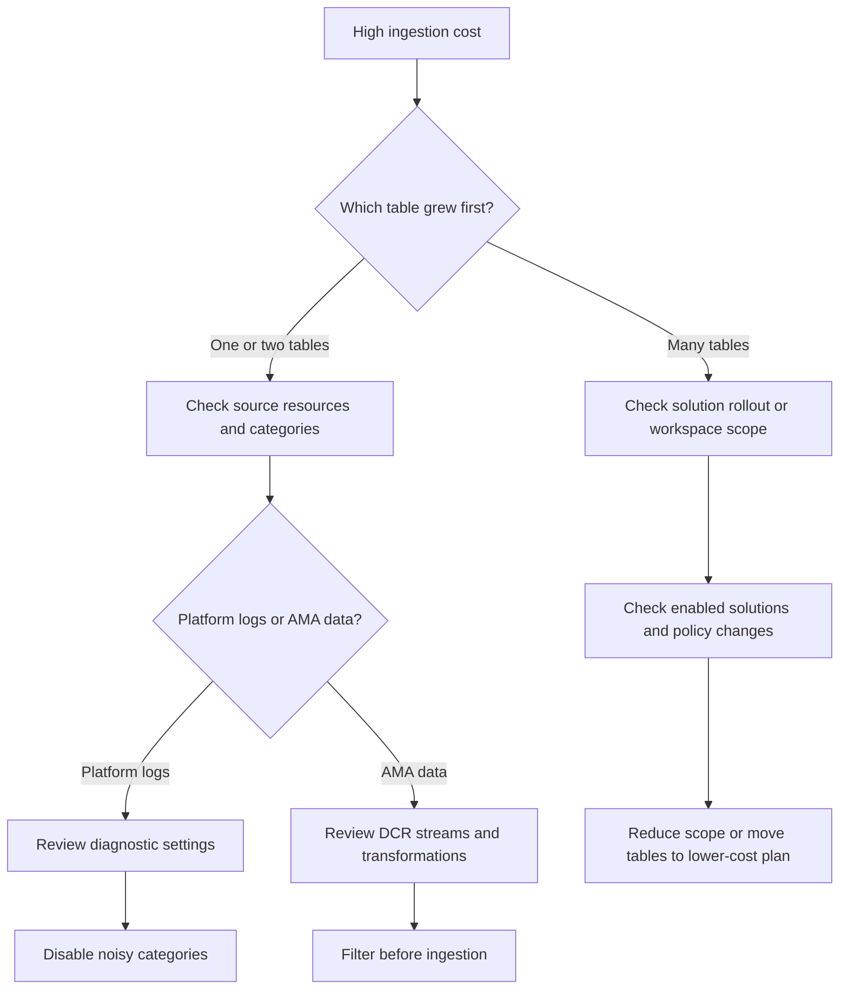

# High Ingestion Cost

## 1. Summary
Your Log Analytics bill is growing faster than expected, or the workspace usage chart shows a sudden step up in daily volume. This playbook applies when the cost problem is primarily ingestion, not query charges or long-term archive retention, and you need to identify which tables, resources, solutions, or categories are driving billable growth.

Azure Monitor cost spikes are usually explainable. Microsoft Learn emphasizes starting with `Usage` and `_Usage`, because most incidents come from noisy diagnostic settings, a new AMA or DCR stream, verbose application logging, or a solution that enabled a wider set of tables than the team expected. Treat this as a data-shape problem before treating it as a billing mystery.

**Typical incident window**: 4-24 hours because ingestion cost anomalies usually surface after an hourly or daily usage step-up.
**Time to resolution**: 1-2 business cycles for full cost normalization, with first mitigations often applied within 30-90 minutes.

Use it when:

- Daily GB jumped after a deployment, policy assignment, or monitoring rollout.
- A workspace is approaching budget even though retention did not change.
- One or two tables suddenly dominate usage charts.
- Teams need evidence before disabling logs or moving tables to Basic plan.



## 2. Common Misreadings
| Observation | Often Misread As | Actually Means |
|---|---|---|
| Workspace bill increased this week | Retention is the main issue | Ingestion is usually the first thing to verify because it drives most day-to-day cost spikes. |
| `AzureDiagnostics` is huge | Azure platform logging is inherently too expensive | One diagnostic setting may be sending unnecessary categories or all logs from a noisy service. |
| `AppTraces` or `AppDependencies` suddenly grew | The application must be healthier because it logs more | Verbose logging, retry storms, or exception loops often cause telemetry volume explosions. |
| Cost spike matches a monitoring rollout | Azure billing error | New AMA streams, VM Insights, Container Insights, or Defender integrations may have increased data collection scope. |
| A table has large total GB | That table must be deleted immediately | First determine whether the table is essential, eligible for Basic plan, or reducible by transformation. |
| Daily cost dropped after midnight | Problem fixed | The spike may still recur daily until the noisy source or category is addressed. |

## 3. Competing Hypotheses
| Hypothesis | Likelihood | Key Discriminator |
|---|---|---|
| A small set of tables is generating most billable GB | High | `Usage` shows a clear top table or top two tables dominating recent volume. |
| A specific resource or diagnostic setting is the main contributor | High | `_Usage` or table-level grouping points to one `_ResourceId` or resource type. |
| A DCR or solution rollout expanded collection scope | Medium | Cost increase aligns with onboarding VMs, Container Insights, VM Insights, or new DCR streams. |
| Application telemetry volume increased because of verbose logs, exceptions, or retries | Medium | `AppTraces`, `AppRequests`, `AppDependencies`, or `exceptions` rose sharply after deployment or incident. |
| Retention and plan choice are making a bad ingestion pattern more expensive | Medium | High-volume tables remain in Analytics plan even though Basic or reduced retention would fit the use case. |
| Daily cap is masking runaway spend without solving it | Low | Cost appears controlled only because ingestion stops after the quota is reached. |

## 4. What to Check First
1. **Capture workspace identifiers before running usage queries**

    ```bash
    az monitor log-analytics workspace show \
        --resource-group $RG \
        --workspace-name $WORKSPACE_NAME \
        --query "{id:id,customerId:customerId}"
    ```

2. **Replay top billable tables directly from the workspace**

    ```bash
    az monitor log-analytics query \
        --workspace $WORKSPACE_ID \
        --analytics-query "Usage | where TimeGenerated > ago(24h) | where IsBillable == true | summarize TotalGB=round(sum(Quantity)/1024.0,2) by DataType | order by TotalGB desc | take 10" \
        --timespan "P1D"
    ```

3. **Review workspace pricing, retention, and cap settings**

    ```bash
    az monitor log-analytics workspace show \
        --resource-group $RG \
        --workspace-name $WORKSPACE_NAME \
        --query "{sku:sku.name,retentionInDays:retentionInDays,workspaceCapping:workspaceCapping.dailyQuotaGb}"
    ```

4. **Verify whether the spike lines up with a DCR rollout**

    ```bash
    az monitor data-collection rule list \
        --resource-group $RG \
        --output table
    ```

5. **If platform logs are implicated, inspect diagnostic settings on a top resource**

    ```bash
    az monitor diagnostic-settings list \
        --resource $RESOURCE_ID \
        --output json
    ```

6. **If Application Insights tables grew, check the component and workspace connection**

    ```bash
    az monitor app-insights component show \
        --app $APP_INSIGHTS_NAME \
        --resource-group $RG \
        --query "{workspaceResourceId:workspaceResourceId,applicationType:applicationType,samplingPercentage:samplingPercentage}"
    ```

## 5. Evidence to Collect

### 5.1 KQL Queries
```kusto
// Billable usage by table for the last 7 days
Usage
| where TimeGenerated > ago(7d)
| where IsBillable == true
| summarize TotalGB = round(sum(Quantity) / 1024, 2) by DataType
| order by TotalGB desc
```

| Column | Example data | Interpretation |
|---|---|---|
| `DataType` | `AzureDiagnostics` | Table contributing to billable ingestion. |
| `TotalGB` | `184.32` | High value means the table deserves immediate source and category review. |
| `IsBillable` | `true` | Focus on billable tables first during cost triage. |
| Sort order | `desc` | Top rows are the fastest path to cost reduction. |

!!! tip "How to Read This"
    Do not start with dozens of tables. If the top one or two tables explain most of the recent GB, reduce those first. Broad optimization is slower and usually unnecessary.

```kusto
// Billable usage by resource for the last 24 hours
_Usage
| where TimeGenerated > ago(24h)
| summarize BillableGB = round(sum(Quantity) / 1024, 2) by _ResourceId, DataType
| order by BillableGB desc
| take 20
```

| Column | Example data | Interpretation |
|---|---|---|
| `_ResourceId` | `/subscriptions/<subscription-id>/resourceGroups/rg-app/providers/Microsoft.Web/sites/app-prod` | The specific source resource driving cost. |
| `DataType` | `AppServiceHTTPLogs` | Tells you which table the resource is inflating. |
| `BillableGB` | `28.4` | Large values from one resource usually indicate a noisy category or workload loop. |
| Top 20 | `ranked set` | Start with the first few rows before changing shared workspace settings. |

!!! tip "How to Read This"
    A single top resource often explains most of the incident. If many resources are evenly distributed, the problem is more likely a solution-wide rollout or an overly broad policy.

```kusto
// Daily trend by top billable tables
Usage
| where TimeGenerated > ago(14d)
| where IsBillable == true
| summarize TotalGB = round(sum(Quantity) / 1024, 2) by bin(TimeGenerated, 1d), DataType
| order by TimeGenerated asc
```

| Column | Example data | Interpretation |
|---|---|---|
| `TimeGenerated` | `2026-04-01T00:00:00Z` | Day on which usage is summarized. |
| `DataType` | `AppTraces` | Table whose trend you want to compare before and after a change. |
| `TotalGB` | `19.8` | Sudden slope change usually points to a rollout or incident window. |
| Time series | `14 days` | Gives enough context to separate baseline growth from a spike. |

!!! tip "How to Read This"
    Correlate the first day of the increase with releases, policy assignments, solution enablement, or a resource incident. A clean step change is usually configuration; a saw-tooth pattern is often workload or retry driven.

```kusto
// Application telemetry mix when App Insights cost appears high
union requests, dependencies, traces, exceptions
| where timestamp > ago(24h)
| summarize Items = sum(itemCount) by itemType, cloud_RoleName
| order by Items desc
```

| Column | Example data | Interpretation |
|---|---|---|
| `itemType` | `trace` | Traces often grow first when verbosity was increased. |
| `cloud_RoleName` | `checkout-api` | Helps isolate the emitting service in a shared workspace. |
| `Items` | `1240000` | High counts with low signal value indicate a telemetry design problem. |
| `exceptions` | `62000` | Exception floods often create both an app incident and a cost incident. |

!!! tip "How to Read This"
    `sum(itemCount)` matters because sampling can make raw row count misleading. If traces or dependencies dwarf requests, inspect SDK settings, log levels, and retry behavior.

### 5.2 CLI Investigation
```bash

# Review workspace commercial settings
az monitor log-analytics workspace show \
    --resource-group $RG \
    --workspace-name $WORKSPACE_NAME \
    --output json
```

Sample output:

```json
{
  "id": "/subscriptions/<subscription-id>/resourceGroups/rg-monitor/providers/Microsoft.OperationalInsights/workspaces/law-prod",
  "name": "law-prod",
  "provisioningState": "Succeeded",
  "retentionInDays": 30,
  "sku": {
    "name": "PerGB2018"
  },
  "workspaceCapping": {
    "dailyQuotaGb": -1
  }
}
```

Interpretation:

- `PerGB2018` means ingestion growth maps directly to cost growth.
- `retentionInDays` matters, but it does not explain a sudden same-day ingestion jump.
- `dailyQuotaGb = -1` means there is no hard cap to stop runaway spend automatically.

```bash

# Inspect a DCR when AMA-collected data is suspected
az monitor data-collection rule show \
    --resource-group $RG \
    --name $DCR_NAME \
    --output json
```

Sample output:

```json
{
  "name": "dcr-vm-baseline",
  "dataFlows": [
    {
      "destinations": [
        "la-workspace"
      ],
      "streams": [
        "Microsoft-Perf",
        "Microsoft-InsightsMetrics",
        "Microsoft-Event"
      ]
    }
  ],
  "destinations": {
    "logAnalytics": [
      {
        "name": "la-workspace",
        "workspaceResourceId": "/subscriptions/<subscription-id>/resourceGroups/rg-monitor/providers/Microsoft.OperationalInsights/workspaces/law-prod"
      }
    ]
  }
}
```

Interpretation:

- New or unnecessary streams can explain cost growth immediately.
- If many machines share this DCR, a small change can multiply workspace volume quickly.
- Absence of transformation rules means all matching source data lands unfiltered.

```bash

# Inspect diagnostic settings on a top contributing resource
az monitor diagnostic-settings list \
    --resource $RESOURCE_ID \
    --output json
```

Sample output:

```json
[
  {
    "logs": [
      {
        "categoryGroup": "allLogs",
        "enabled": true
      }
    ],
    "metrics": [
      {
        "category": "AllMetrics",
        "enabled": true
      }
    ],
    "workspaceId": "/subscriptions/<subscription-id>/resourceGroups/rg-monitor/providers/Microsoft.OperationalInsights/workspaces/law-prod"
  }
]
```

Interpretation:

- `allLogs` is convenient but often expensive on noisy services.
- Category groups hide which specific log types are enabled, so compare against service-level guidance before leaving it broad.
- If the resource is the top `_Usage` contributor, this output often identifies the fastest reduction opportunity.

```bash

# Review Application Insights component configuration when app tables are expensive
az monitor app-insights component show \
    --app $APP_INSIGHTS_NAME \
    --resource-group $RG \
    --output json
```

Sample output:

```json
{
  "applicationType": "web",
  "connectionString": "<connection-string>",
  "name": "appi-prod",
  "samplingPercentage": null,
  "workspaceResourceId": "/subscriptions/<subscription-id>/resourceGroups/rg-monitor/providers/Microsoft.OperationalInsights/workspaces/law-prod"
}
```

Interpretation:

- If `samplingPercentage` is null or effectively disabled, high-volume apps may send far more telemetry than needed.
- A workspace-based component means Application Insights cost appears through the shared Log Analytics workspace.
- Use this output with the application telemetry KQL to decide whether to tune SDK sampling or log levels.

## 6. Validation and Disproof by Hypothesis

### Hypothesis 1: A small set of tables is generating most billable GB
**Proves if**: Section 5.1 Query 1 shows one or two tables dominating recent usage.

**Disproves if**: Volume is broadly distributed with no obvious top table.

**Test with**: Section 5.1 Queries 1 and 3.

### Hypothesis 2: A specific resource or diagnostic setting is the main contributor
**Proves if**: Section 5.1 Query 2 points to a single `_ResourceId` and Section 5.2 CLI command 3 shows broad or noisy categories.

**Disproves if**: No top resource stands out or the top resource is already tightly scoped.

**Test with**: Section 5.1 Query 2 plus Section 5.2 CLI command 3.

### Hypothesis 3: A DCR or solution rollout expanded collection scope
**Proves if**: Cost rose immediately after a DCR update or after enabling VM Insights, Container Insights, or another solution.

**Disproves if**: No rollout aligned with the usage change and DCR streams are unchanged.

**Test with**: Section 5.2 CLI command 2 and the 14-day trend in Section 5.1 Query 3.

### Hypothesis 4: Application telemetry increased because of verbose logs, retries, or exceptions
**Proves if**: `traces`, `dependencies`, or `exceptions` surged in Section 5.1 Query 4 and the Application Insights component is writing to the same workspace.

**Disproves if**: App tables remain flat while another table explains the spend.

**Test with**: Section 5.1 Query 4 plus Section 5.2 CLI command 4.

### Hypothesis 5: Plan choice and retention are amplifying a bad ingestion pattern
**Proves if**: High-volume operational tables remain in Analytics plan even though Basic plan or shorter retention would satisfy the use case.

**Disproves if**: Table plan and retention are already optimized and ingestion volume itself is still the dominant issue.

**Test with**: Section 5.2 CLI command 1, then compare high-volume table purpose against workspace table plan and retention requirements.

### Hypothesis 6: Daily cap is hiding runaway ingestion instead of solving it
**Proves if**: Usage drops only because the cap is reached, not because the source volume was reduced.

**Disproves if**: There is no cap or usage remains below the configured cap.

**Test with**: Section 5.2 CLI command 1 and the workspace `Operation` table if cap-related warnings are suspected.

## 7. Likely Root Cause Patterns
| Pattern | Evidence | Resolution |
|---|---|---|
| Broad diagnostic settings on a noisy resource | `_Usage` shows one top resource and CLI shows `allLogs` or too many categories | Narrow categories to only what operations actually use. |
| DCR collects more streams than intended | Cost rise starts after DCR rollout and DCR output shows extra streams | Remove unnecessary streams or apply transformations before ingestion. |
| Application verbosity or failure loop | `traces`, `dependencies`, or `exceptions` spike after release or incident | Lower log verbosity, fix the failure loop, and re-enable appropriate sampling. |
| Shared workspace absorbed a new monitoring solution | Many resources and tables rise together after a monitoring enablement event | Reduce scope, split workspaces if needed, or revise solution onboarding standards. |
| High-volume table left in Analytics plan by default | Table remains costly even though interactive analytics are rare | Move suitable tables to Basic plan and review retention separately. |

### Normal vs Abnormal Comparison
| Metric/Log | Normal State | Abnormal State | Threshold |
|---|---|---|---|
| `Usage` by `DataType` | Daily GB aligns with known baseline tables | One or two tables suddenly dominate billable volume | > 2x baseline |
| `_Usage` by resource | Top resources are stable and operationally expected | A single resource becomes a runaway contributor | Clear top outlier |
| DCR rollout behavior | Streams match onboarding design | New streams appear without corresponding operational need | Any unplanned stream |
| Diagnostic settings scope | Only needed categories enabled | `allLogs` or broad category sets on noisy services | Broad logging on hot resource |
| App telemetry volume | `AppRequests` roughly tracks workload; traces/exceptions stay proportional | `AppTraces` or `AppExceptions` spike far above normal ratios | Sudden ratio change |

## 8. Immediate Mitigations
1. Disable or narrow noisy diagnostic categories on the top source resource.

    ```bash
    az monitor diagnostic-settings create \
        --name send-to-law \
        --resource $RESOURCE_ID \
        --workspace $WORKSPACE_ID \
        --logs '[{"category":"AppServiceHTTPLogs","enabled":true},{"category":"AppServiceConsoleLogs","enabled":true}]' \
        --metrics '[{"category":"AllMetrics","enabled":true}]'
    ```

2. Remove unnecessary AMA streams or destinations from the DCR.

    ```bash
    az monitor data-collection rule show \
        --resource-group $RG \
        --name $DCR_NAME \
        --query "dataFlows"
    ```

3. Move a suitable high-volume table to Basic plan.

    ```bash
    az monitor log-analytics workspace table update \
        --resource-group $RG \
        --workspace-name $WORKSPACE_NAME \
        --name AppServiceHTTPLogs \
        --plan Basic
    ```

4. Reintroduce or increase telemetry sampling for a high-volume application.

    ```bash
    az monitor app-insights component show \
        --app $APP_INSIGHTS_NAME \
        --resource-group $RG \
        --query "{name:name,workspaceResourceId:workspaceResourceId}"
    ```

5. Use a temporary daily cap only as a guardrail while fixes are being applied.

    ```bash
    az monitor log-analytics workspace update \
        --resource-group $RG \
        --workspace-name $WORKSPACE_NAME \
        --quota 20
    ```

## 9. Prevention
Preventing ingestion cost incidents is mainly about design discipline. Microsoft Learn recommends understanding table usage, choosing the right table plan, and filtering or scoping data before it hits the workspace.

Review top tables and top resources on a schedule, not only during billing incidents.

```bash
az monitor log-analytics workspace show \
    --resource-group $RG \
    --workspace-name $WORKSPACE_NAME \
    --query "{id:id,customerId:customerId,sku:sku.name}"
```

Make DCR streams explicit and minimal, especially when onboarding many VMs or Arc servers.

```bash
az monitor data-collection rule list \
    --resource-group $RG \
    --output table
```

Replace blanket diagnostic settings with category choices that map to real operational use cases.

```bash
az monitor diagnostic-settings categories list \
    --resource $RESOURCE_ID \
    --output table
```

Align table plans with query frequency and retention needs.

```bash
az monitor log-analytics workspace table show \
    --resource-group $RG \
    --workspace-name $WORKSPACE_NAME \
    --name AppServiceHTTPLogs
```

For application telemetry, keep logging levels and sampling part of release review. A bug that floods `traces` or `exceptions` is both a reliability issue and a cost issue.

Finally, do not treat daily cap as your primary budget strategy. It prevents unlimited spend, but it also shuts off observability exactly when noisy incidents are happening.

## See Also
- [No Data in Workspace](no-data-in-workspace.md)
- [Slow Query Performance](slow-query-performance.md)
- [Operations: Cost Control](../../operations/cost-control.md)
- [Operations: Diagnostic Settings](../../operations/diagnostic-settings.md)
- [KQL: Ingestion Volume](../kql/log-analytics/ingestion-volume.md)

## Sources
- [Microsoft Learn: Manage cost and usage in Log Analytics workspaces](https://learn.microsoft.com/en-us/azure/azure-monitor/logs/manage-cost-storage)
- [Microsoft Learn: Data collection rules in Azure Monitor](https://learn.microsoft.com/en-us/azure/azure-monitor/data-collection/data-collection-rule-overview)
- [Microsoft Learn: Create diagnostic settings in Azure Monitor](https://learn.microsoft.com/en-us/azure/azure-monitor/essentials/create-diagnostic-settings)
- [Microsoft Learn: Application Insights pricing and data volume reduction guidance](https://learn.microsoft.com/en-us/azure/azure-monitor/app/pricing)
- [Microsoft Learn: Table plans in Azure Monitor Logs](https://learn.microsoft.com/en-us/azure/azure-monitor/logs/data-platform-logs#table-plans)
- [Microsoft Learn: Usage table reference](https://learn.microsoft.com/en-us/azure/azure-monitor/reference/tables/usage)
