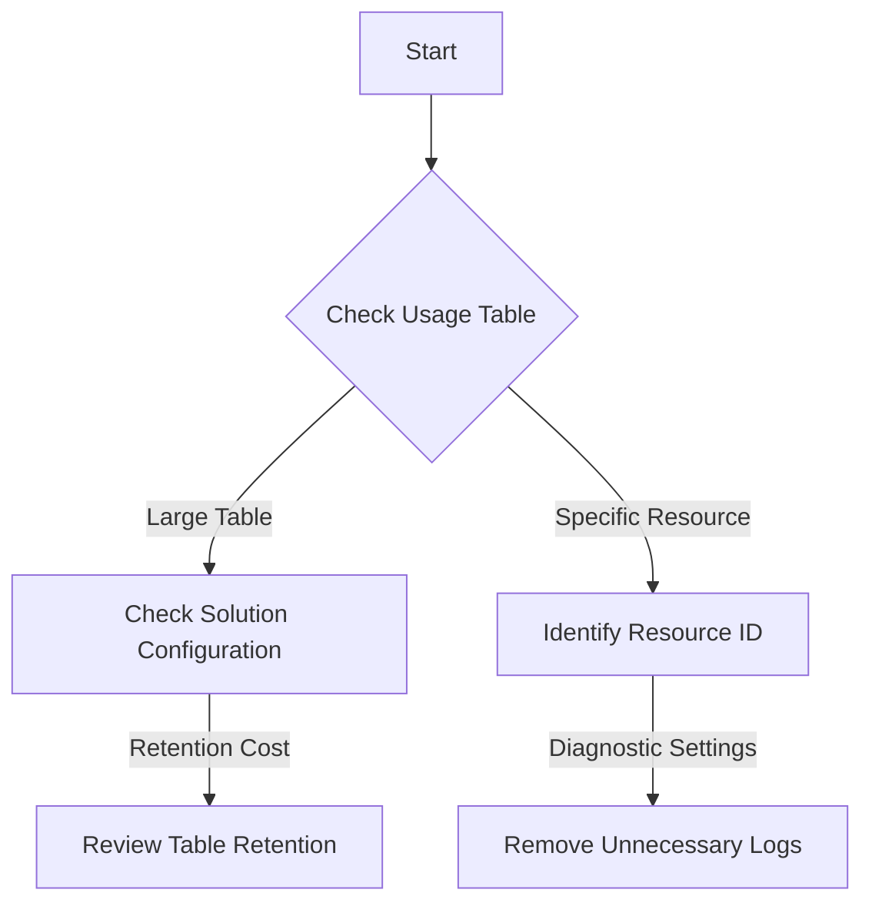

# Playbook: High Ingestion Cost

## 1. Summary
Costs for Log Analytics are higher than budgeted due to excessive data ingestion or long retention periods. This playbook identifies high-volume contributors.

## 2. Common Misreadings
-   "Data is expensive" – In reality, high volume from a single resource often drives the cost.
-   "Retention is the problem" – Ingestion is usually the primary cost driver; check the **Usage** table first.

## 3. Competing Hypotheses
-   **Noisy Diagnostic Settings**: A specific resource is sending excessive logs (e.g., App Service Verbose logs).
-   **Solution Overload**: Too many monitoring solutions (e.g., Sentinel, VM Insights) enabled on a single workspace.
-   **Retention Period**: Retention is set significantly higher than required for compliance (e.g., 2 years instead of 31 days).
-   **Ingestion Spike**: A specific event or application error is causing a log burst.

## 4. What to Check First


## 5. Evidence to Collect
-   **Billable volume by table**:
    ```kusto
    Usage
    | where IsBillable == true
    | summarize TotalGB = sum(Quantity) / 1024 by DataType
    | order by TotalGB desc
    ```
-   **Top resource contributors**:
    ```kusto
    _Usage
    | where TimeGenerated > ago(24h)
    | summarize BillableDataGB = sum(Quantity) / 1024 by _ResourceId
    | order by BillableDataGB desc
    | take 10
    ```

## 6. Validation by Hypothesis
-   **Hypothesis: Noisy Resource**: Use the `_ResourceId` query to find the top 5 resources sending data.
-   **Hypothesis: Solution Cost**: Filter `Usage` by `Solution` to see if a specific solution (e.g., Security) is the driver.

## 7. Root Cause Patterns
-   Verbose logging enabled on production workloads by mistake.
-   Diagnostic settings sending "AllLogs" including noisy debug information.

## 8. Mitigations
-   Disable unnecessary diagnostic log categories in the Portal or CLI.
-   Move large, infrequently queried tables to the **Basic Table Plan** (low ingestion cost).
-   Set **Daily Cap** to prevent unexpected cost runaway.
-   Configure **Data Collection Rules (DCR)** to filter logs before they reach the workspace.

## See Also
- [No Data in Workspace](no-data-in-workspace.md)
- [KQL: Ingestion Volume](../kql/log-analytics/ingestion-volume.md)

## Sources
- [MS Learn: Understand and mitigate high data consumption in Log Analytics](https://learn.microsoft.com/azure/azure-monitor/logs/manage-cost-storage)
- [MS Learn: Monitor usage and estimated costs](https://learn.microsoft.com/azure/azure-monitor/logs/manage-cost-storage#analyze-usage-in-a-log-analytics-workspace)
