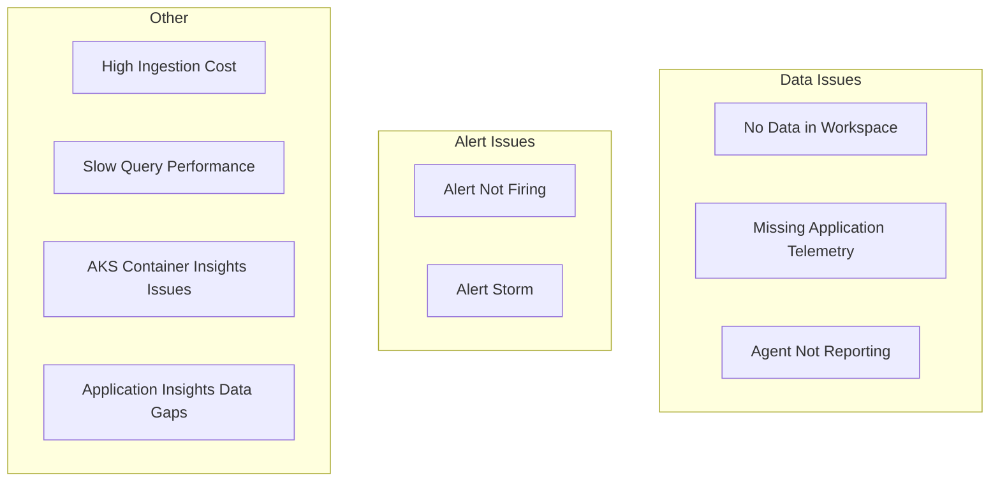

# Playbooks

Step-by-step troubleshooting guides for common Azure Monitor issues.

## Playbooks

| Playbook | Symptom |
|----------|---------|
| [No Data in Workspace](no-data-in-workspace.md) | Data not appearing in Log Analytics |
| [Missing Application Telemetry](missing-application-telemetry.md) | App Insights not showing data |
| [Alert Not Firing](alert-not-firing.md) | Alert rule exists but never triggers |
| [Alert Storm](alert-storm.md) | Excessive alert volume |
| [High Ingestion Cost](high-ingestion-cost.md) | Unexpected cost spike |
| [Slow Query Performance](slow-query-performance.md) | KQL queries execute slowly or time out |
| [Agent Not Reporting](agent-not-reporting.md) | AMA not sending data |
| [AKS Container Insights Issues](aks-container-insights-issues.md) | Container Insights not collecting data |
| [Application Insights Gaps](application-insights-gaps.md) | Gaps or missing telemetry in App Insights |

## See Also

- [Troubleshooting Architecture Overview](../architecture-overview.md)
- [Troubleshooting Mental Model](../mental-model.md)
- [Decision Tree](../decision-tree.md)
- [Evidence Map](../evidence-map.md)
- [KQL Query Packs](../kql/index.md)

## Sources

- [Troubleshoot Azure Monitor](https://learn.microsoft.com/en-us/azure/azure-monitor/troubleshoot)
