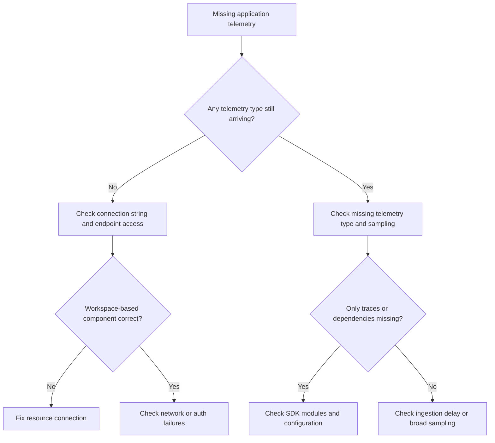

# Missing Application Telemetry

## 1. Summary
Application Insights telemetry is missing, partial, or delayed even though the application is deployed and serving requests. This playbook applies when requests, dependencies, traces, exceptions, or custom events fail to appear in a workspace-based Application Insights resource or when one telemetry type is missing while others still arrive.

Microsoft Learn guidance frames this issue as a pipeline problem with several checkpoints: SDK configuration, connection string, sampling, network reachability, and ingestion visibility. In workspace-based Application Insights, teams often misread the symptom because the data lands in Log Analytics tables instead of a separate legacy store. Use this playbook when you need to prove whether the break is in instrumentation, transport, sampling, or query interpretation.

**Typical incident window**: 10-20 minutes from deployment or connectivity drift to visible telemetry gaps in App* tables.
**Time to resolution**: 30 minutes to 2 hours depending on whether the break is connection string, SDK path, sampling, or endpoint reachability.

Use it when:

- `requests`, `dependencies`, `traces`, or `exceptions` are empty or stale.
- One service in a multi-service application stopped reporting while others still send.
- Data appears in Live Metrics but not in long-term queries.
- A release, firewall change, or SDK configuration change aligned with the telemetry gap.



## 2. Common Misreadings
| Observation | Often Misread As | Actually Means |
|---|---|---|
| Live Metrics shows activity but queries are empty | Application Insights is inconsistent | Live Metrics and standard ingestion are different paths; sampling or ingestion delay may explain the gap. |
| Only `traces` are missing | The whole SDK is broken | Trace logging level, sampling, or logger integration may be the only problem. |
| Data exists in the workspace but not where the team expected | Application Insights lost the data | Workspace-based Application Insights stores telemetry in Log Analytics tables. |
| A connection string exists in app settings | Telemetry must be healthy | The SDK may still be disabled, misordered in startup, or unable to reach the ingestion endpoint. |
| Request count is lower than traffic count | Application Insights is dropping requests | Adaptive or fixed-rate sampling may intentionally reduce telemetry volume. |
| New deployment coincided with missing telemetry | Azure Monitor ingestion outage | Connection string drift, log level changes, or SDK initialization regressions are more common. |

## 3. Competing Hypotheses
| Hypothesis | Likelihood | Key Discriminator |
|---|---|---|
| Connection string or resource linkage is wrong | High | App settings or component configuration show the app is writing to the wrong destination or none at all. |
| SDK initialization or module configuration is incomplete | High | One telemetry type is absent while others remain healthy. |
| Sampling is reducing apparent telemetry too aggressively | Medium | `itemCount` indicates far more real events than raw row count suggests. |
| Network or firewall rules block ingestion endpoints | Medium | Application can run, but SDK logs or environment tests show endpoint failures. |
| Ingestion delay makes telemetry appear missing | Medium | `ingestion_time()` shows rows arriving later than the query window. |
| Workspace-based query expectations are wrong | Low | Data exists, but operators are querying the wrong tables or component scope. |

## 4. What to Check First
1. **Show the Application Insights component and workspace linkage**

    ```bash
    az monitor app-insights component show \
        --app $APP_INSIGHTS_NAME \
        --resource-group $RG \
        --query "{name:name,workspaceResourceId:workspaceResourceId,connectionString:connectionString,applicationType:applicationType}"
    ```

2. **Confirm the host still has the expected connection string setting**

    ```bash
    az webapp config appsettings list \
        --resource-group $RG \
        --name $APP_NAME \
        --query "[?name=='APPLICATIONINSIGHTS_CONNECTION_STRING' || name=='APPINSIGHTS_INSTRUMENTATIONKEY']"
    ```

3. **Run a control query against AppRequests in the workspace**

    ```bash
    az monitor log-analytics query \
        --workspace $WORKSPACE_ID \
        --analytics-query "AppRequests | where TimeGenerated > ago(15m) | summarize Count=sum(ItemCount), LastSeen=max(TimeGenerated) by AppRoleName" \
        --timespan "PT15M"
    ```

4. **Confirm the component is workspace-based and points to the intended workspace**

    ```bash
    az monitor app-insights component show \
        --app $APP_INSIGHTS_NAME \
        --resource-group $RG \
        --query "{workspaceResourceId:workspaceResourceId,connectionString:connectionString}"
    ```

5. **Capture current component-level sampling configuration**

    ```bash
    az monitor app-insights component show \
        --app $APP_INSIGHTS_NAME \
        --resource-group $RG \
        --query "{samplingPercentage:samplingPercentage}"
    ```

6. **Capture workspace identity for direct KQL validation**

    ```bash
    az monitor log-analytics workspace show \
        --resource-group $RG \
        --workspace-name $WORKSPACE_NAME \
        --query "{id:id,customerId:customerId}"
    ```

## 5. Evidence to Collect
### 5.1 KQL Queries
```kusto
// Telemetry volume by type in the last 24 hours
union AppRequests, AppDependencies, AppTraces, AppExceptions
| where TimeGenerated > ago(24h)
| summarize Items=sum(ItemCount), Rows=count() by Type, AppRoleName
| order by Items desc
```

| Column | Example data | Interpretation |
|---|---|---|
| `Type` | `AppRequests` | Telemetry category currently arriving. |
| `AppRoleName` | `checkout-api` | Service or app role producing the telemetry. |
| `Items` | `254000` | Estimated actual event count after sampling is considered. |
| `Rows` | `12700` | Raw rows can be much lower than real traffic if sampling is enabled. |

!!! tip "How to Read This"
    Compare `Items` to `Rows`. If `Items` is much larger, sampling is active and raw row count alone will mislead you.

```kusto
// Detect ingestion delay across major telemetry types
union AppRequests, AppDependencies, AppTraces, AppExceptions
| where TimeGenerated > ago(6h)
| extend DelayMinutes = datetime_diff('minute', ingestion_time(), TimeGenerated)
| summarize AvgDelay=avg(DelayMinutes), P95Delay=percentile(DelayMinutes, 95), MaxDelay=max(DelayMinutes) by Type
| order by P95Delay desc
```

| Column | Example data | Interpretation |
|---|---|---|
| `Type` | `AppTraces` | Telemetry type experiencing lag. |
| `AvgDelay` | `2.1` | Typical lag. |
| `P95Delay` | `13` | High values can make recent dashboards look empty. |
| `MaxDelay` | `25` | Large spikes justify wider alert or workbook windows. |

!!! tip "How to Read This"
    If delay is high but nonzero data exists, the problem is degraded freshness rather than total absence. That changes both mitigation and severity.

```kusto
// Identify services with missing request telemetry
AppRequests
| where TimeGenerated > ago(24h)
| summarize LastSeen=max(TimeGenerated), Requests=sum(ItemCount) by AppRoleName
| order by LastSeen asc
```

| Column | Example data | Interpretation |
|---|---|---|
| `AppRoleName` | `checkout-api` | Role name to compare with deployment and config. |
| `LastSeen` | `2026-04-05T06:14:00Z` | Stale services need targeted investigation. |
| `Requests` | `0` or low count | Confirms the problem is service-specific, not necessarily workspace-wide. |

!!! tip "How to Read This"
    Sort by oldest `LastSeen` values. If only one service is stale, compare that deployment's connection string, SDK version, and environment variables before touching shared monitoring resources.

```kusto
// Check if sampling is changing the apparent request count
AppRequests
| where TimeGenerated > ago(24h)
| summarize RecordedRows=count(), EstimatedActual=sum(ItemCount), SampledRows=countif(ItemCount == 1)
| extend EffectiveSamplingPercent = round(100.0 * RecordedRows / iif(EstimatedActual == 0, 1, EstimatedActual), 2)
```

| Column | Example data | Interpretation |
|---|---|---|
| `RecordedRows` | `12500` | Actual stored rows. |
| `EstimatedActual` | `250000` | Approximate real request count. |
| `EffectiveSamplingPercent` | `5.0` | Low percentage means data is intentionally reduced at the source. |
| `SampledRows` | `12480` | High value indicates most stored rows are unsampled representatives. |

!!! tip "How to Read This"
    If operators expected one row per request, this query quickly disproves that assumption. A low effective sampling percentage can make healthy telemetry look absent.

### 5.2 CLI Investigation
```bash
# Inspect the Application Insights component
az monitor app-insights component show \
    --app $APP_INSIGHTS_NAME \
    --resource-group $RG \
    --output json
```

Sample output:

```json
{
  "applicationType": "web",
  "connectionString": "<connection-string>",
  "name": "appi-prod",
  "samplingPercentage": null,
  "workspaceResourceId": "/subscriptions/<subscription-id>/resourceGroups/rg-monitor/providers/Microsoft.OperationalInsights/workspaces/law-prod"
}
```

Interpretation:

- `workspaceResourceId` confirms where workspace-based telemetry should land.
- Missing or wrong connection information explains total absence quickly.
- `samplingPercentage` helps determine whether sparse data is expected.

```bash
# Verify the application setting on App Service
az webapp config appsettings list \
    --resource-group $RG \
    --name $APP_NAME \
    --output json
```

Sample output:

```json
[
  {
    "name": "APPLICATIONINSIGHTS_CONNECTION_STRING",
    "value": "<connection-string>"
  }
]
```

Interpretation:

- Missing setting means the SDK has no endpoint or key material.
- Old connection strings after resource replacement are a common drift issue.
- Presence alone is not enough; the application must actually consume the setting at startup.

```bash
# Inspect current app runtime configuration at the component level
az monitor app-insights component show \
    --app $APP_INSIGHTS_NAME \
    --resource-group $RG \
    --query "{samplingPercentage:samplingPercentage,workspaceResourceId:workspaceResourceId,applicationType:applicationType}"
```

Sample output:

```json
{
  "applicationType": "web",
  "samplingPercentage": 100,
  "workspaceResourceId": "/subscriptions/<subscription-id>/resourceGroups/rg-monitor/providers/Microsoft.OperationalInsights/workspaces/law-prod"
}
```

Interpretation:

- `samplingPercentage: 100` indicates no sampling at the component configuration level.
- If data is still sparse, look at SDK-level adaptive sampling or logger filtering.
- Wrong workspace binding explains why the team is querying the wrong destination.

```bash
# Capture workspace identity for direct Log Analytics validation
az monitor log-analytics workspace show \
    --resource-group $RG \
    --workspace-name $WORKSPACE_NAME \
    --output json
```

Sample output:

```json
{
  "customerId": "xxxxxxxx-xxxx-xxxx-xxxx-xxxxxxxxxxxx",
  "id": "/subscriptions/<subscription-id>/resourceGroups/rg-monitor/providers/Microsoft.OperationalInsights/workspaces/law-prod",
  "name": "law-prod"
}
```

Interpretation:

- This confirms the workspace used for telemetry queries.
- Use it to rule out cases where the app sends correctly but operators inspect the wrong workspace.
- Capture it before escalating to a workspace-side hypothesis.

## 6. Validation and Disproof by Hypothesis
### Hypothesis 1: Connection string or resource linkage is wrong
**Proves if**: App settings or component output show missing, stale, or wrong destination values.

**Disproves if**: The application and component both point to the intended workspace-based resource.

**Test with**: Section 5.2 CLI commands 1, 2, and 4.

### Hypothesis 2: SDK initialization or module configuration is incomplete
**Proves if**: Only one telemetry type is missing or the affected role stopped after a deployment while others remain healthy.

**Disproves if**: All telemetry types fail equally across the app.

**Test with**: Section 5.1 Queries 1 and 3, then compare the app startup path and SDK configuration for the missing telemetry type.

### Hypothesis 3: Sampling is reducing apparent telemetry too aggressively
**Proves if**: `itemCount` suggests much larger real volume than raw rows and effective sampling is very low.

**Disproves if**: `RecordedRows` and `EstimatedActual` are nearly identical.

**Test with**: Section 5.1 Queries 1 and 4 plus Section 5.2 CLI command 3.

### Hypothesis 4: Network or firewall rules block ingestion endpoints
**Proves if**: Connection settings are correct but the environment cannot reach the Azure Monitor ingestion endpoints.

**Disproves if**: Endpoint access is healthy and another hypothesis better fits the evidence.

**Test with**: Section 5.2 CLI commands 1 and 2 for expected endpoints, then validate outbound connectivity from the runtime environment.

### Hypothesis 5: Ingestion delay makes telemetry appear missing
**Proves if**: Delay metrics are high and telemetry later appears without configuration changes.

**Disproves if**: No data appears even over extended windows.

**Test with**: Section 5.1 Query 2.

### Hypothesis 6: Workspace-based query expectations are wrong
**Proves if**: Data exists in the workspace tables, but teams were looking in the wrong UI or resource context.

**Disproves if**: The tables are actually empty in the intended workspace.

**Test with**: Section 5.2 CLI command 4 and Section 5.1 Query 1.

## 7. Likely Root Cause Patterns
| Pattern | Evidence | Resolution |
|---|---|---|
| Connection string drift after resource recreation | App setting exists but points to old or wrong destination | Update settings and redeploy or restart the app. |
| Only one telemetry module was disabled or not initialized | Requests arrive but dependencies or traces do not | Restore SDK module configuration for the missing type. |
| Sampling made telemetry look absent | `itemCount` is much higher than stored row count | Recalibrate expectations or adjust sampling strategy. |
| Firewall or proxy blocks ingestion | App works, but endpoint reachability or SDK transport fails | Allow documented ingestion endpoints. |
| Operators queried the wrong workspace or wrong tables | Component is workspace-based and data exists elsewhere | Standardize where teams validate telemetry. |

### Normal vs Abnormal Comparison
| Metric/Log | Normal State | Abnormal State | Threshold |
|---|---|---|---|
| `AppRequests` freshness | New rows continue to arrive for active roles | No fresh rows for a role that is still serving traffic | > 5-10 min gap |
| Telemetry spread | `AppRequests`, `AppDependencies`, `AppTraces`, and `AppExceptions` move together within expected ratios | One major table goes empty while peers stay active | Any full-table gap |
| Sampling signal | `ItemCount` behavior matches the documented sampling policy | Effective sampling percent is unexpectedly low or changes after release | Unexpected policy drift |
| Workspace linkage | Component `workspaceResourceId` matches the intended workspace | App points to another component or workspace | Any mismatch |
| Ingestion delay | `ingestion_time()` stays within a few minutes of `TimeGenerated` | Delay becomes long enough to empty recent dashboards | P95 > 10 min |

## 8. Immediate Mitigations
1. Restore or correct the connection string in the host environment.

    ```bash
    az webapp config appsettings set \
        --resource-group $RG \
        --name $APP_NAME \
        --settings APPLICATIONINSIGHTS_CONNECTION_STRING="<connection-string>"
    ```

2. Confirm the Application Insights component points to the intended workspace.

    ```bash
    az monitor app-insights component show \
        --app $APP_INSIGHTS_NAME \
        --resource-group $RG \
        --query "{workspaceResourceId:workspaceResourceId,connectionString:connectionString}"
    ```

3. Temporarily reduce sampling only if necessary for a critical investigation.

    ```bash
    az monitor app-insights component show \
        --app $APP_INSIGHTS_NAME \
        --resource-group $RG \
        --query "{samplingPercentage:samplingPercentage}"
    ```

4. Widen alert or dashboard lookback windows if delay is the primary issue.

    ```bash
    az monitor scheduled-query update \
        --resource-group $RG \
        --name $ALERT_RULE_NAME \
        --evaluation-frequency 5m \
        --window-size 15m
    ```

5. Restart the application after fixing configuration drift.

    ```bash
    az webapp restart \
        --resource-group $RG \
        --name $APP_NAME
    ```

## 9. Prevention
Prevent telemetry gaps by making instrumentation part of application release validation, not an afterthought. Microsoft Learn consistently recommends verifying connection strings, understanding sampling, and testing the real data path into workspace-based tables.

Keep application settings under versioned deployment control.

```bash
az webapp config appsettings list \
    --resource-group $RG \
    --name $APP_NAME \
    --query "[?name=='APPLICATIONINSIGHTS_CONNECTION_STRING']"
```

Review workspace linkage during component creation and migration.

```bash
az monitor app-insights component show \
    --app $APP_INSIGHTS_NAME \
    --resource-group $RG \
    --query "{workspaceResourceId:workspaceResourceId,applicationType:applicationType}"
```

Document whether your SDK uses adaptive or fixed sampling and what operators should expect in KQL.

```bash
az monitor app-insights component show \
    --app $APP_INSIGHTS_NAME \
    --resource-group $RG \
    --query "{samplingPercentage:samplingPercentage}"
```

Create a validation query pack for each service so teams can quickly confirm requests, dependencies, traces, and exceptions after deployment.

```bash
az monitor log-analytics workspace show \
    --resource-group $RG \
    --workspace-name $WORKSPACE_NAME \
    --query "{customerId:customerId,id:id}"
```

Finally, test endpoint reachability during network changes. Telemetry is often the first thing blocked and the last thing remembered.

## See Also
- [No Data in Workspace](no-data-in-workspace.md)
- [Operations: Workspace Management](../../operations/workspace-management.md)
- [KQL: Request Performance](../kql/app-insights/request-performance.md)
- [KQL: Dependency Failures](../kql/app-insights/dependency-failures.md)
- [KQL: Exception Trends](../kql/app-insights/exception-trends.md)

## Sources
- [Microsoft Learn: Troubleshoot missing application telemetry in Application Insights](https://learn.microsoft.com/en-us/azure/azure-monitor/app/opentelemetry-troubleshooting-missing-telemetry)
- [Microsoft Learn: Workspace-based Application Insights resources](https://learn.microsoft.com/en-us/azure/azure-monitor/app/create-workspace-resource)
- [Microsoft Learn: Azure Monitor Application Insights sampling](https://learn.microsoft.com/en-us/azure/azure-monitor/app/sampling)
- [Microsoft Learn: IP addresses used by Azure Monitor](https://learn.microsoft.com/en-us/azure/azure-monitor/fundamentals/ip-addresses)
- [Microsoft Learn: AppRequests table reference](https://learn.microsoft.com/en-us/azure/azure-monitor/reference/tables/apprequests)
- [Microsoft Learn: AppDependencies table reference](https://learn.microsoft.com/en-us/azure/azure-monitor/reference/tables/appdependencies)
- [Microsoft Learn: AppTraces table reference](https://learn.microsoft.com/en-us/azure/azure-monitor/reference/tables/apptraces)
- [Microsoft Learn: AppExceptions table reference](https://learn.microsoft.com/en-us/azure/azure-monitor/reference/tables/appexceptions)
