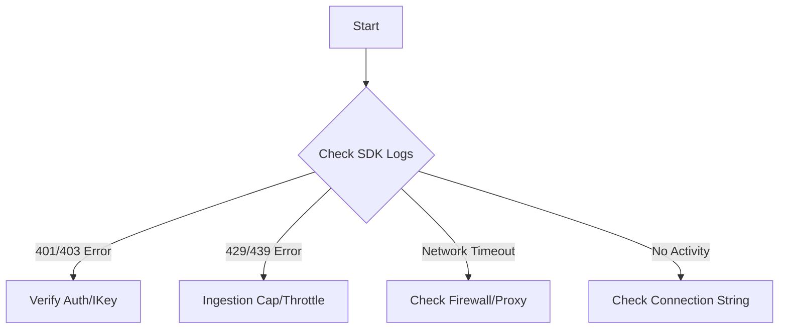

# Playbook: Missing Application Telemetry

## 1. Summary
Telemetry from Application Insights is missing despite successful code deployment. This covers instrumentation errors and client-side blocks.

## 2. Common Misreadings
-   "The SDK is broken" – Often the SDK is fine, but it can't reach the endpoint or is being throttled.
-   "Data is in the workspace but not App Insights" – Check if you're using **Workspace-based Application Insights**.

## 3. Competing Hypotheses
-   **Invalid Connection String**: The instrumentation key or endpoint URL is incorrect.
-   **SDK Sampling**: The SDK is dropping telemetry at the source (e.g., adaptive sampling).
-   **Network/Firewall Block**: Outbound traffic to `*.in.applicationinsights.azure.com` is blocked.
-   **Authentication Failure**: Managed Identity or AD authentication is failing for the ingestion.

## 4. What to Check First


## 5. Evidence to Collect
-   **Client-side SDK logs**: Check for `InternalServerError`, `Unauthorized`, or `Forbidden` response codes from the ingestion endpoint.
-   **Availability Tests**: If configured, check if they are reporting to identify if the ingestion pipeline is generally healthy.
-   **Telemetry count**:
    ```kusto
    union requests, dependencies, exceptions, traces
    | where timestamp > ago(1h)
    | summarize count() by itemType
    ```

## 6. Validation by Hypothesis
-   **Hypothesis: Auth**: Attempt a manual POST to the ingestion endpoint using `curl` to verify the connection string/ikey.
-   **Hypothesis: Sampling**: Set `SamplingPercentage` to `100` in `ApplicationInsights.config` or code.

## 7. Root Cause Patterns
-   Missing `APPLICATIONINSIGHTS_CONNECTION_STRING` environment variable in App Service.
-   Strict outbound firewalls in VNET-integrated environments.

## 8. Mitigations
-   Update connection string in application settings.
-   Whitelist required IP/FQDNs for ingestion.
-   Disable local authentication and switch to **Azure AD authentication** for telemetry.

## See Also
- [Decision Tree](../decision-tree.md)
- [Evidence Map](../evidence-map.md)

## Sources
- [MS Learn: Troubleshoot Application Insights missing telemetry](https://learn.microsoft.com/azure/azure-monitor/app-insights/troubleshoot-missing-telemetry)
- [MS Learn: IP addresses used by Azure Monitor](https://learn.microsoft.com/azure/azure-monitor/app-insights/ip-addresses)
