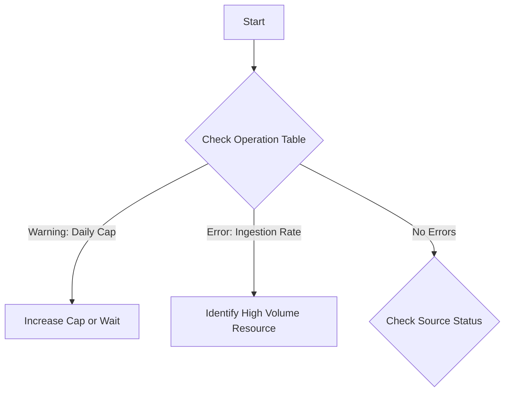

# Playbook: No Data in Workspace

## 1. Summary
Data collection has stopped or telemetry is missing from a Log Analytics workspace. This playbook covers workspace-level blocks and ingestion limits.

## 2. Common Misreadings
-   "Data is lost" – Often data is just delayed or dropped at the ingress point due to limits.
-   "Query is wrong" – Verify the `Operation` table before assuming the KQL is faulty.

## 3. Competing Hypotheses
-   **Daily Cap Reached**: Data collection is paused until the next reset window.
-   **Ingestion Rate Limit**: High volume from a single resource is being throttled (6 GB/min limit).
-   **Subscription Status**: Azure subscription is disabled or suspended.
-   **Workspace State**: Workspace has been deleted or is in a "soft-delete" state.

## 4. What to Check First


## 5. Evidence to Collect
-   **Workspace Health**:
    ```kusto
    Operation 
    | where OperationCategory == 'Data Collection Status'
    | where OperationStatus == 'Warning'
    ```
-   **Ingestion Thresholds**:
    ```kusto
    Operation 
    | where OperationCategory == "Ingestion" 
    | where Detail startswith "The rate of data crossed the threshold"
    ```

## 6. Validation by Hypothesis
-   **Hypothesis: Daily Cap**: Check `Usage` table for `Quantity` vs. `Daily Cap` setting.
-   **Hypothesis: Throttling**: Look for `429` errors in `_LogOperation` or `Operation`.

## 7. Root Cause Patterns
-   Spiky logs from a newly deployed application exceeding 6GB/min.
-   Legacy pricing tier limits (e.g., Free tier 500MB/day).

## 8. Mitigations
-   Adjust Daily Cap in **Usage and estimated costs**.
-   Implement **Data Collection Rules (DCR)** transformation to filter data at the source.
-   Move to **Commitment Tiers** if volume is consistently high.

## See Also
- [High Ingestion Cost](high-ingestion-cost.md)
- [KQL: Ingestion Volume](../kql/log-analytics/ingestion-volume.md)

## Sources
- [MS Learn: Troubleshoot why data is no longer being collected](https://learn.microsoft.com/azure/azure-monitor/logs/data-collection-troubleshoot)
