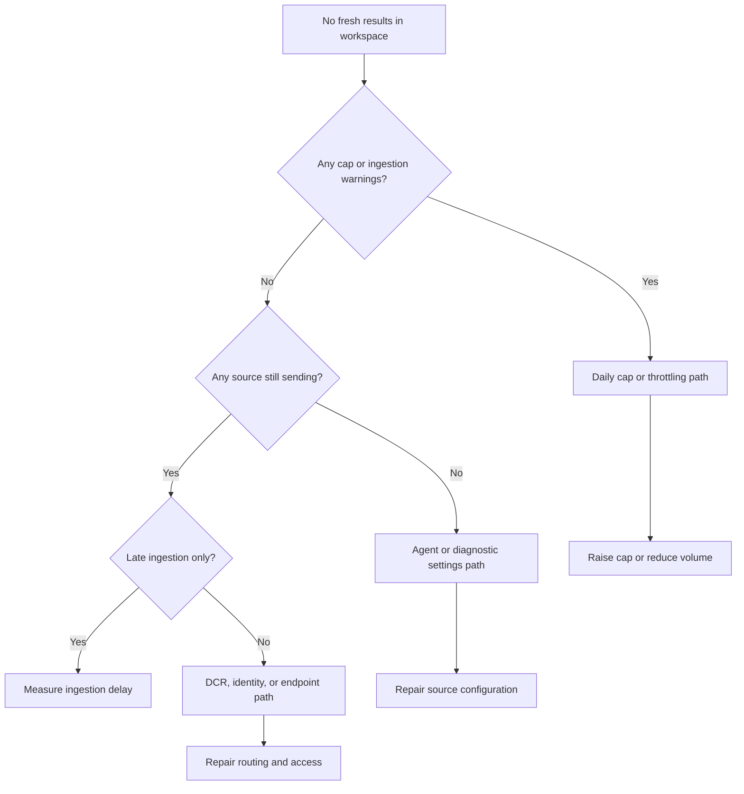

# No Data in Workspace

## 1. Summary
You open a Log Analytics workspace and the results are empty, stale, or missing for tables that normally update every few minutes. This playbook applies when the symptom appears broader than a single KQL mistake: multiple tables are stale, a newly connected resource never starts sending data, or data stopped after a change to cost controls, DCRs, network routing, or diagnostic settings.

In Azure Monitor, "no data" is usually a routing or governance problem before it is a workspace platform problem. Microsoft Learn guidance points first to daily cap, DCR association, diagnostic settings, agent health, and endpoint reachability. Use this playbook to separate true workspace ingestion stops from source-specific breaks and from delayed ingestion that only looks like data loss.

**Typical incident window**: 15-30 minutes from first symptom to operator detection for workspace freshness incidents.
**Time to resolution**: 30 minutes to 2 hours depending on whether the break is cap, DCR, diagnostic settings, or endpoint reachability.

Use it when:

- `Heartbeat`, `Perf`, `AzureDiagnostics`, or `AzureActivity` look older than expected.
- Multiple resources stopped reporting around the same change window.
- One team claims the workspace is broken, but another team sees partial data.
- You need a falsifiable path to prove whether the break is at the workspace, DCR, resource, or network layer.



## 2. Common Misreadings
| Observation | Often Misread As | Actually Means |
|---|---|---|
| `Heartbeat` is stale for many VMs | Azure Monitor is down | The agent path is likely unhealthy, blocked, or missing DCR association. |
| `Usage` shows yesterday's billable data but today's operational tables are empty | Retention problem | Historical data is present; fresh ingestion is the problem. |
| Data appears only after 20-40 minutes | Query engine failure | The source may still send, but ingestion delay is masking freshness. |
| Only `AzureDiagnostics` is empty while `AzureActivity` is current | Workspace-wide outage | Diagnostic settings or category selection is wrong for that resource path. |
| Data returns after midnight UTC | Random self-healing | Daily cap reset likely re-enabled ingestion for a new billing day. |
| One workspace is empty but another workspace has the expected logs | Application stopped logging | Diagnostic settings or DCR destination points somewhere else. |

## 3. Competing Hypotheses
| Hypothesis | Likelihood | Key Discriminator |
|---|---|---|
| Workspace daily cap was reached | High | `Operation` contains cap-related warnings and the workspace cap setting is low relative to normal intake. |
| Diagnostic settings or DCR associations are missing or changed | High | Only specific resources or tables are affected while the workspace remains otherwise healthy. |
| Agents or monitored resources stopped sending | High | `Heartbeat` is stale for affected machines and local agent state is unhealthy. |
| Network path to Azure Monitor endpoints is blocked | Medium | Agent exists and configuration exists, but endpoint reachability fails from the source network. |
| Ingestion delay or throttling is being mistaken for total loss | Medium | `ingestion_time()` shows late arrivals and rows eventually appear. |
| Workspace or subscription state is abnormal | Low | CLI shows non-`Succeeded` provisioning state, deletion, lock, or disabled subscription. |

## 4. What to Check First
1. **Confirm workspace control-plane state and retention**

    ```bash
    az monitor log-analytics workspace show \
        --resource-group $RG \
        --workspace-name $WORKSPACE_NAME \
        --query "{name:name,provisioningState:provisioningState,retentionInDays:retentionInDays,sku:sku.name}"
    ```

2. **Check whether the workspace cap is stopping ingestion**

    ```bash
    az monitor log-analytics workspace show \
        --resource-group $RG \
        --workspace-name $WORKSPACE_NAME \
        --query "workspaceCapping"
    ```

3. **Run a control heartbeat query against the workspace**

    ```bash
    az monitor log-analytics query \
        --workspace $WORKSPACE_ID \
        --analytics-query "Heartbeat | where TimeGenerated > ago(15m) | summarize LastHeartbeat=max(TimeGenerated) by Computer | order by LastHeartbeat asc" \
        --timespan "PT15M"
    ```

4. **Verify that the resource still has diagnostic settings targeting the expected workspace**

    ```bash
    az monitor diagnostic-settings list \
        --resource $RESOURCE_ID \
        --output json
    ```

5. **Verify that AMA-backed resources still have a DCR association**

    ```bash
    az monitor data-collection rule association list \
        --resource $RESOURCE_ID \
        --output json
    ```

6. **Check whether the Azure Monitor Agent extension is still installed on the VM**

    ```bash
    az vm extension list \
        --resource-group $RG \
        --vm-name $VM_NAME \
        --query "[].{name:name,provisioningState:provisioningState,publisher:publisher}"
    ```

## 5. Evidence to Collect

### 5.1 KQL Queries
```kusto
// Operation log evidence for ingestion controls
Operation
| where TimeGenerated > ago(3d)
| where OperationCategory in ("Data Collection Status", "Ingestion", "Workspace")
| project TimeGenerated, OperationCategory, OperationName, OperationDetail, OperationStatus
| order by TimeGenerated desc
```

| Sample value | Example data | Interpretation |
|---|---|---|
| `OperationCategory` | `Data Collection Status` | Workspace recorded a collection-side status message. |
| `OperationName` | `Daily cap reached` | Ingestion stopped because the configured cap was hit. |
| `OperationStatus` | `Warning` | The issue may be administrative or quota-driven, not a service outage. |
| `OperationDetail` | `The daily cap for workspace law-prod was reached` | Treat cap as the leading hypothesis until disproved. |

!!! tip "How to Read This"
    Read this table newest-first. If the first relevant event aligns with the incident start time, prioritize cost and ingestion controls before debugging DCRs or network paths.

```kusto
// Workspace freshness by major table
union isfuzzy=true
    (Heartbeat | summarize LastSeen=max(TimeGenerated), Rows=count() by TableName="Heartbeat"),
    (AzureActivity | summarize LastSeen=max(TimeGenerated), Rows=count() by TableName="AzureActivity"),
    (Perf | summarize LastSeen=max(TimeGenerated), Rows=count() by TableName="Perf"),
    (AzureDiagnostics | summarize LastSeen=max(TimeGenerated), Rows=count() by TableName="AzureDiagnostics")
| extend MinutesSinceLastSeen = datetime_diff('minute', now(), LastSeen) * -1
| order by MinutesSinceLastSeen desc
```

| Column | Example data | Interpretation |
|---|---|---|
| `TableName` | `Heartbeat` | Agent-driven liveness path. |
| `LastSeen` | `2026-04-05T07:14:00Z` | Last time the table ingested a row. |
| `Rows` | `28412` | Confirms the table exists and contains history. |
| `MinutesSinceLastSeen` | `68` | Large values across all tables point to broad collection failure or zero incoming data. |

!!! tip "How to Read This"
    If `AzureActivity` is fresh but `Heartbeat` and `Perf` are stale, the workspace still functions and the failure is probably in agent or resource routing. If every table is stale, include workspace cap and subscription state in the first-response evidence set.

```kusto
// Measure whether data is late rather than absent
union isfuzzy=true Heartbeat, Perf, AzureActivity
| where TimeGenerated > ago(6h)
| extend DelayMinutes = datetime_diff('minute', ingestion_time(), TimeGenerated)
| summarize AvgDelay=avg(DelayMinutes), P95Delay=percentile(DelayMinutes, 95), MaxDelay=max(DelayMinutes) by Type
| order by P95Delay desc
```

| Type | Example data | Interpretation |
|---|---|---|
| `Heartbeat` | `P95Delay = 2` | Usually close to real time. |
| `Perf` | `P95Delay = 24` | The table is still ingesting, but slowly enough to look empty during triage. |
| `MaxDelay` | `41` | Large spikes justify widening alert and dashboard windows while root cause is repaired. |
| `AvgDelay` | `9.5` | Elevated but nonzero flow means the path is degraded, not fully stopped. |

!!! tip "How to Read This"
    This query is the fastest way to disprove the claim "data is gone." If delay is high but rows still land, investigate throttling, network congestion, or source pressure instead of treating the incident as permanent data loss.

```kusto
// Identify stale AMA or VM reporting scope
Heartbeat
| where TimeGenerated > ago(3d)
| summarize LastHeartbeat=max(TimeGenerated) by Computer, OSType, _ResourceId
| order by LastHeartbeat asc
| take 20
```

| Column | Example data | Interpretation |
|---|---|---|
| `Computer` | `vm-prod-03` | Specific machine to validate locally. |
| `OSType` | `Linux` | Helps choose the right service and log path. |
| `_ResourceId` | `/subscriptions/<subscription-id>/resourceGroups/rg-prod/providers/Microsoft.Compute/virtualMachines/vm-prod-03` | Resource for DCR association and extension checks. |
| `LastHeartbeat` | `2026-04-05T05:56:00Z` | If stale for many hosts, suspect shared configuration or network rather than one VM. |

!!! tip "How to Read This"
    Sort ascending and sample the oldest reporters first. If all stale machines share a subnet, policy, or DCR, pivot there before you inspect each host individually.

### 5.2 CLI Investigation
```bash

# Review workspace state and capping settings
az monitor log-analytics workspace show \
    --resource-group $RG \
    --workspace-name $WORKSPACE_NAME \
    --output json
```

Sample output:

```json
{
  "customerId": "xxxxxxxx-xxxx-xxxx-xxxx-xxxxxxxxxxxx",
  "id": "/subscriptions/<subscription-id>/resourceGroups/rg-monitor/providers/Microsoft.OperationalInsights/workspaces/law-prod",
  "location": "eastus",
  "name": "law-prod",
  "provisioningState": "Succeeded",
  "retentionInDays": 30,
  "workspaceCapping": {
    "dailyQuotaGb": 5,
    "quotaNextResetTime": "2026-04-06T00:00:00Z"
  }
}
```

Interpretation:

- `provisioningState` should remain `Succeeded`.
- A low `dailyQuotaGb` is enough to explain a predictable same-day stop.
- `quotaNextResetTime` explains why data may reappear without any other fix.

```bash

# Check DCR associations on an affected source resource
az monitor data-collection rule association list \
    --resource $RESOURCE_ID \
    --output json
```

Sample output:

```json
[
  {
    "dataCollectionRuleId": "/subscriptions/<subscription-id>/resourceGroups/rg-monitor/providers/Microsoft.Insights/dataCollectionRules/dcr-prod-vm",
    "description": "Baseline VM logs and metrics",
    "name": "ama-baseline",
    "provisioningState": "Succeeded"
  }
]
```

Interpretation:

- An empty array means AMA has nowhere to send streams from that resource.
- A wrong `dataCollectionRuleId` explains why one machine differs from the rest of the fleet.
- If the association exists, continue to local service logs and endpoint reachability.

```bash

# Verify diagnostic settings still target the expected workspace
az monitor diagnostic-settings list \
    --resource $RESOURCE_ID \
    --output json
```

Sample output:

```json
[
  {
    "id": "/subscriptions/<subscription-id>/resourceGroups/rg-app/providers/Microsoft.Web/sites/app-prod/providers/microsoft.insights/diagnosticSettings/send-to-law",
    "logs": [
      {
        "categoryGroup": "allLogs",
        "enabled": true
      }
    ],
    "metrics": [
      {
        "category": "AllMetrics",
        "enabled": true
      }
    ],
    "workspaceId": "/subscriptions/<subscription-id>/resourceGroups/rg-monitor/providers/Microsoft.OperationalInsights/workspaces/law-prod"
  }
]
```

Interpretation:

- No result means the resource never writes platform logs to this workspace.
- A `workspaceId` mismatch explains why the application team says logging works while this workspace stays empty.
- Disabled category groups create table-specific gaps that look like ingestion failure.

```bash

# Check Azure Monitor Agent extension presence on a VM
az vm extension list \
    --resource-group $RG \
    --vm-name $VM_NAME \
    --output table
```

Sample output:

```text
Name                    Publisher                   ProvisioningState
----------------------  --------------------------  -----------------
AzureMonitorLinuxAgent  Microsoft.Azure.Monitor     Succeeded
```

Interpretation:

- Missing AMA extension is enough to explain stale `Heartbeat`.
- `Succeeded` only proves deployment, not current runtime health.
- If the extension is present, move next to guest logs, identity, and network tests.

## 6. Validation and Disproof by Hypothesis

### Hypothesis 1: Workspace daily cap was reached
**Proves if**: `Operation` shows cap warnings, the configured quota is low, and ingestion resumes after reset or after raising the cap.
**Disproves if**: No cap signals exist and the quota is effectively unlimited or comfortably above observed usage.
**Test with**: Section 5.1 Query 1 plus Section 5.2 CLI command 1.

### Hypothesis 2: Diagnostic settings or DCR associations are missing or changed
**Proves if**: Affected resources lack diagnostic settings or DCR association while unaffected resources keep their expected configuration.
**Disproves if**: Configuration is present, consistent, and still points to the right workspace.
**Test with**: Section 5.1 Query 4 plus Section 5.2 CLI commands 2 and 3.

### Hypothesis 3: Agents or monitored resources stopped sending
**Proves if**: `Heartbeat` is stale, extension state is missing or unhealthy, or guest-side AMA logs show token, service, or configuration failures.
**Disproves if**: Heartbeats remain fresh while only one downstream table is affected.
**Test with**: Section 5.1 Query 4 and Section 5.2 CLI command 4; then inspect Windows AMA logs under `C:\WindowsAzure\Logs\Plugins\Microsoft.Azure.Monitor.AzureMonitorWindowsAgent` or Linux AMA logs under `/var/opt/microsoft/azuremonitoragent/log`.

### Hypothesis 4: Network path to Azure Monitor endpoints is blocked
**Proves if**: DCR and agent state look correct but the source cannot reach Azure Monitor ingestion endpoints, DCE, or IMDS.
**Disproves if**: Endpoint access is healthy and another cause explains the stop more directly.
**Test with**: Section 5.2 CLI command 2 to confirm the expected DCR path, then validate Azure Monitor and IMDS endpoint reachability from the affected host.

### Hypothesis 5: Ingestion delay or throttling is being mistaken for total loss
**Proves if**: `ingestion_time()` shows large delays and data eventually arrives without configuration repair.
**Disproves if**: No new rows appear during an extended observation window.
**Test with**: Section 5.1 Queries 2 and 3.

### Hypothesis 6: Workspace or subscription state is abnormal
**Proves if**: Workspace or subscription state is disabled, deleted, or not provisioned normally.
**Disproves if**: Control-plane state is healthy.
**Test with**: Section 4 checks 1 and 6, plus `az account show --query "{subscriptionId:id,name:name,state:state}"`.

## 7. Likely Root Cause Patterns
| Pattern | Evidence | Resolution |
|---|---|---|
| Daily cap used as normal cost control | `Operation` warns about cap reach and data resumes after UTC reset | Raise or remove the cap, then control cost with source filtering or table plan choices. |
| DCR association drift after rebuild, policy change, or onboarding | AMA is installed but `association list` is empty on affected resources | Recreate associations and validate correct streams and destinations. |
| Diagnostic settings deleted or redirected | Platform logs still exist somewhere else or nowhere at all | Reapply diagnostic settings with the intended workspace and categories. |
| Shared network change blocked ingestion | Multiple machines in the same subnet stop together and local logs show endpoint failures | Restore access to documented Azure Monitor and IMDS endpoints. |
| Delay interpreted as loss | `ingestion_time()` lag is large but rows still land | Adjust alert windows and investigate throttling or source pressure instead of declaring loss. |

### Normal vs Abnormal Comparison
| Metric/Log | Normal State | Abnormal State | Threshold |
|---|---|---|---|
| `Heartbeat` freshness | Most monitored computers show a row within the last 1-2 minutes | Multiple critical computers are older than 5 minutes | 5 min |
| `AzureActivity` freshness | Control-plane records continue to arrive even during source-side issues | `AzureActivity` is also stale, which broadens the incident beyond one source | 10 min |
| `AzureDiagnostics` routing | Categories enabled and `workspaceId` matches the intended destination | No diagnostic setting, disabled categories, or destination points to another workspace | Any mismatch |
| DCR association state | `az monitor data-collection rule association list` returns the expected rule | Association list is empty or points to the wrong DCR | Zero expected associations |
| Ingestion delay | `ingestion_time()` usually trails `TimeGenerated` by only a few minutes | P95 delay stays high enough to make recent windows look empty | P95 > 15 min |

## 8. Immediate Mitigations
1. Raise the daily cap temporarily if production telemetry is blocked by quota.

    ```bash
    az monitor log-analytics workspace update \
        --resource-group $RG \
        --workspace-name $WORKSPACE_NAME \
        --quota 10
    ```

2. Recreate the DCR association for an affected AMA source.

    ```bash
    az monitor data-collection rule association create \
        --name ama-baseline \
        --resource $RESOURCE_ID \
        --rule-id $DCR_ID
    ```

3. Restore diagnostic settings on a resource whose platform logs stopped flowing.

    ```bash
    az monitor diagnostic-settings create \
        --name send-to-law \
        --resource $RESOURCE_ID \
        --workspace $WORKSPACE_ID \
        --logs '[{"categoryGroup":"allLogs","enabled":true}]' \
        --metrics '[{"category":"AllMetrics","enabled":true}]'
    ```

4. Restart AMA after configuration repair and confirm new heartbeat.

    ```bash
    az vm run-command invoke \
        --resource-group $RG \
        --name $VM_NAME \
        --command-id RunShellScript \
        --scripts "sudo systemctl restart azuremonitoragent"
    ```

5. Widen lookback windows if delayed ingestion is the only immediate issue.

    ```bash
    az monitor scheduled-query update \
        --resource-group $RG \
        --name $ALERT_RULE_NAME \
        --evaluation-frequency 10m \
        --window-size 15m
    ```

## 9. Prevention
Prevent workspace-wide data gaps by treating routing, cost, and freshness as separate controls. Microsoft Learn guidance is consistent here: avoid relying on daily cap as a normal operating control, keep DCR and diagnostic settings under repeatable configuration management, and monitor collection freshness directly.

Use DCR review as part of every onboarding and rebuild flow.

```bash
az monitor data-collection rule show \
    --resource-group $RG \
    --name $DCR_NAME \
    --query "{name:name,dataFlows:dataFlows,destinations:destinations}"
```

Prefer filtering and table plan decisions over hard workspace stoppage.

```bash
az monitor log-analytics workspace table update \
    --resource-group $RG \
    --workspace-name $WORKSPACE_NAME \
    --name AppServiceHTTPLogs \
    --plan Basic
```

Keep diagnostic settings explicit and auditable.

```bash
az monitor diagnostic-settings list \
    --resource $RESOURCE_ID \
    --output table
```

Create an explicit freshness alert so stale ingestion becomes visible quickly.

```bash
az monitor scheduled-query create \
    --name "workspace-freshness-alert" \
    --resource-group "$RG" \
    --scopes "$WORKSPACE_ID" \
    --condition "count 'StaleHeartbeat' > 0" \
    --condition-query "StaleHeartbeat=Heartbeat | where TimeGenerated < ago(15m)" \
    --evaluation-frequency "5m" \
    --window-size "5m" \
    --severity 2 \
    --skip-query-validation true \
    --description "Trigger when heartbeat data in the workspace is older than fifteen minutes." \
    --output json
```

Finally, keep at least one control-plane stream such as `AzureActivity` landing in the workspace. It gives you a fast discriminator between a true workspace problem and a source-specific collection failure.

## See Also
- [Agent Not Reporting](agent-not-reporting.md)
- [High Ingestion Cost](high-ingestion-cost.md)
- [Operations: Cost Control](../../operations/cost-control.md)
- [Operations: Data Collection Rules](../../operations/data-collection-rules-ops.md)
- [KQL: Ingestion Volume](../kql/log-analytics/ingestion-volume.md)

## Sources
- [Microsoft Learn: Troubleshoot data collection in Azure Monitor Logs](https://learn.microsoft.com/en-us/azure/azure-monitor/logs/data-collection-troubleshoot)
- [Microsoft Learn: Manage cost and usage in Log Analytics workspaces](https://learn.microsoft.com/en-us/azure/azure-monitor/logs/manage-cost-storage)
- [Microsoft Learn: Azure Monitor Agent overview](https://learn.microsoft.com/en-us/azure/azure-monitor/agents/azure-monitor-agent-overview)
- [Microsoft Learn: Data collection rules in Azure Monitor](https://learn.microsoft.com/en-us/azure/azure-monitor/data-collection/data-collection-rule-overview)
- [Microsoft Learn: Create diagnostic settings in Azure Monitor](https://learn.microsoft.com/en-us/azure/azure-monitor/essentials/create-diagnostic-settings)
- [Microsoft Learn: Heartbeat table reference](https://learn.microsoft.com/en-us/azure/azure-monitor/reference/tables/heartbeat)
- [Microsoft Learn: AzureDiagnostics table reference](https://learn.microsoft.com/en-us/azure/azure-monitor/reference/tables/azurediagnostics)
- [Microsoft Learn: Log data ingestion time in Azure Monitor](https://learn.microsoft.com/en-us/azure/azure-monitor/logs/data-ingestion-time)
