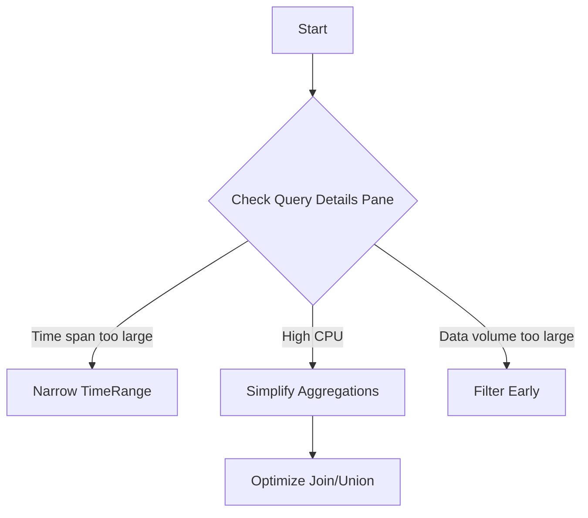

# Playbook: Query Performance

## 1. Summary
Log Analytics queries are slow or timing out. This playbook focuses on optimizing KQL for speed and resource usage.

## 2. Common Misreadings
-   "The query is too complex" – Sometimes a complex query is faster than a simple `search *`.
-   "Log Analytics is slow" – Performance is usually tied to the volume of data scanned, not the workspace itself.

## 3. Competing Hypotheses
-   **No Time Filter**: The query is scanning all data in the table (default 24h is still broad for large tables).
-   **Scan instead of Seek**: Using `search` or `contains` instead of `where` and `==`.
-   **Table Size**: The table is extremely large (e.g., `AppServicePlatformLogs` or `AppRequests`), making even simple queries slow.
-   **Expensive Operators**: Heavy use of `join`, `union`, or `summarize` on high-cardinality fields.

## 4. What to Check First


## 5. Evidence to Collect
-   **Query Details Pane**: Look for **CPU Execution Time**, **Total Data Scanned**, and **Data volume after first filter**.
-   **System Statistics**:
    ```kusto
    _QueryDetails
    | where TimeGenerated > ago(1d)
    | summarize avg(ResponseDurationMilliseconds) by QueryText
    ```

## 6. Validation by Hypothesis
-   **Hypothesis: Time Filter**: Add `where TimeGenerated > ago(1h)` as the first line and re-run.
-   **Hypothesis: Broad Search**: Replace `search "text"` with `where TableName has "text"`.

## 7. Root Cause Patterns
-   Queries that perform `join` or `union` across different regions or workspaces without filtering each side first.
-   Using `summarize` on a field with millions of unique values (e.g., IP address).

## 8. Mitigations
-   Apply **TimeGenerated** filters at the very beginning of the query.
-   Use **project** early to discard unnecessary columns.
-   Avoid **search** and **contains**; prefer **has** or **==** for indexed fields.
-   Move expensive logic (like `parse_json`) after filtering out irrelevant rows.

## See Also
- [High Ingestion Cost](high-ingestion-cost.md)
- [Reference: KQL Quick Reference](../../reference/index.md)

## Sources
- [MS Learn: Optimize log queries in Azure Monitor](https://learn.microsoft.com/azure/azure-monitor/logs/query-optimization)
- [MS Learn: Best practices for Azure Monitor logs](https://learn.microsoft.com/azure/azure-monitor/logs/best-practices)
