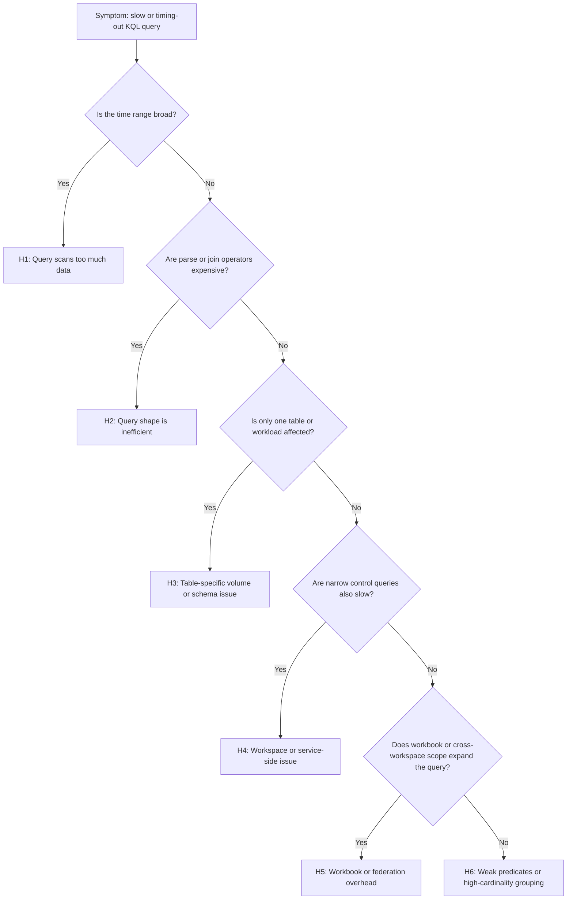

# Slow Query Performance

## 1. Summary

This playbook applies when Log Analytics, workbook, or scheduled query rule KQL is materially slower than expected, intermittently hangs, or times out before operators get usable evidence. The default misdiagnosis is to blame Azure Monitor itself, but Microsoft Learn guidance shows slow queries usually trace back to a smaller set of causes: too much data scanned, weak predicates, expensive operators placed too early, high-cardinality joins or summarizes, or workbook and cross-workspace designs that silently expand scope.

Use this playbook when a query is functionally correct but operationally unhealthy. That includes slow workbook visuals, heavy alert-rule evaluation, ad hoc Logs queries that work only on very small windows, and repeated use of `search *`, broad `contains`, or wide `join` / `union` patterns on hot tables such as `AzureDiagnostics`, `ContainerLogV2`, `AppTraces`, and `AppRequests`.

**Typical incident window**: 10-30 minutes from first timeout or slow workbook report to confirmation that the issue is query shape, data volume, or true workspace degradation.
**Time to resolution**: 30 minutes to 2 hours depending on whether remediation is a query rewrite, reduced scope, or ingestion/data-shape change.



## 2. Common Misreadings

| Observation | Often Misread As | Actually Means |
|---|---|---|
| Query times out at 10 minutes | Log Analytics is down | The query may be scanning too much data or performing late filtering before timeout is reached. |
| Workbook chart is slow but a simple `take 10` query is fast | Portal issue only | Workbook logic, parameters, or joins are expensive even if the portal shell is healthy. |
| `search *` finds the answer reliably | It is a safe default for troubleshooting | It forces broad scans and is usually the most expensive starting point. |
| `contains` returns the right rows | It is as efficient as `has` or `==` | Broad string operators are often much less selective and can inflate scan cost. |
| One saved query is slow while another is fine | Random variance | Saved queries usually differ in time range, predicate selectivity, join cardinality, or summarize strategy. |
| A query returning only a few rows cannot be expensive | Small results mean small work | The engine may still scan gigabytes before producing a tiny output set. |

## 3. Competing Hypotheses

| Hypothesis | Likelihood | Key Discriminator |
|---|---|---|
| H1: The query scans too much data for the selected time range | High | Usage and row-count checks spike for the same interval or table the query targets. |
| H2: The KQL shape is inefficient | High | Moving `where TimeGenerated`, resource filters, and `project` earlier reduces duration and scanned data materially. |
| H3: One table has unexpectedly high volume or expensive dynamic fields | Medium | Slowdown is concentrated on one table such as `AzureDiagnostics`, `ContainerLogV2`, `AppTraces`, or `AppRequests`. |
| H4: Workspace or service-side health issue exists | Low-Medium | Even simple narrow control queries are slow across unrelated tables and users. |
| H5: Workbook, alert-rule, or cross-workspace design adds overhead | Medium | The same logic is faster when tested directly in Logs or against one workspace only. |
| H6: Nonselective text search or high-cardinality grouping is the real bottleneck | Medium | Replacing `search` / `contains` or aggregating on coarser dimensions changes runtime sharply. |

## 4. What to Check First

1. **Capture the exact workspace identity before replaying the query**

    ```bash
    az monitor log-analytics workspace show \
        --resource-group "$RG" \
        --workspace-name "$WORKSPACE_NAME" \
        --query "{id:id,customerId:customerId,sku:sku.name,retentionInDays:retentionInDays,publicNetworkAccessForQuery:publicNetworkAccessForQuery}"
    ```

2. **Run a narrow control query against the workspace**

    ```bash
    az monitor log-analytics query \
        --workspace "$WORKSPACE_ID" \
        --analytics-query "Heartbeat | where TimeGenerated > ago(15m) | summarize LastHeartbeat=max(TimeGenerated) by Computer | take 5" \
        --timespan "PT15M"
    ```

3. **Replay recent usage for the heaviest tables**

    ```bash
    az monitor log-analytics query \
        --workspace "$WORKSPACE_ID" \
        --analytics-query "Usage | where TimeGenerated > ago(24h) | summarize TotalGB=round(sum(Quantity)/1024.0,2) by DataType | order by TotalGB desc | take 10" \
        --timespan "P1D"
    ```

4. **If the query powers an alert, inspect the scheduled query rule cadence**

    ```bash
    az monitor scheduled-query show \
        --resource-group "$RG" \
        --name "$ALERT_RULE_NAME" \
        --output json
    ```

5. **Inspect table settings when one hot table dominates the query path**

    ```bash
    az monitor log-analytics workspace table show \
        --resource-group "$RG" \
        --workspace-name "$WORKSPACE_NAME" \
        --name "$TABLE_NAME" \
        --output json
    ```

6. **Check whether Azure Monitor currently has a service-health event**

    ```bash
    az servicehealth events list \
        --query "[?contains(title, 'Azure Monitor') || contains(title, 'Log Analytics')].{title:title,status:status}"
    ```

## 5. Evidence to Collect

Collect evidence from both KQL and CLI so you can distinguish query-design issues from workspace-level issues. Prefer one shared time window. If the symptom is in a workbook, extract the underlying KQL and test it directly in Logs before changing workbook JSON or blaming the portal.

### 5.1 KQL Queries

#### Query 1: Table volume baseline

```kusto
Usage
| where TimeGenerated > ago(24h)
| summarize TotalGB = round(sum(Quantity) / 1024.0, 2) by DataType
| order by TotalGB desc
| take 10
```

**Sample Output**

| DataType | TotalGB | Interpretation |
|---|---|---|
| ContainerLogV2 | 18.74 | Largest scanned table is likely to dominate broad troubleshooting queries. |
| AppTraces | 9.41 | String-heavy trace searches can be expensive without early filters. |
| AzureDiagnostics | 6.12 | Multi-service schema usually needs explicit `ResourceProvider` or `Category` filters. |

!!! tip "How to Read This"
    Start with the top-volume tables. If your slow query targets one of them, assume data volume is part of the problem until disproved.

#### Query 2: Expensive predicate baseline

```kusto
AppServiceHTTPLogs
| where TimeGenerated > ago(24h)
| where CsUriStem contains "/api/"
| summarize Requests = count() by CsUriStem
| order by Requests desc
```

**Sample Output**

| CsUriStem | Requests | Interpretation |
|---|---|---|
| /api/orders | 125000 | High-row paths need narrower windows or more selective filters. |
| /api/catalog | 73110 | Broad text search scales poorly on busy routes. |

!!! tip "How to Read This"
    Keep this as the expensive baseline. If a more selective operator changes runtime materially, you found a query-shape problem rather than a platform problem.

#### Query 3: Narrow projection and selective operator pattern

```kusto
AppServiceHTTPLogs
| where TimeGenerated > ago(1h)
| where CsUriStem has "/api/orders"
| project TimeGenerated, CsUriStem, ScStatus, TimeTaken
| summarize Requests = count(), P95 = percentile(TimeTaken, 95) by bin(TimeGenerated, 5m)
| order by TimeGenerated asc
```

**Sample Output**

| TimeGenerated | Requests | P95 | Interpretation |
|---|---|---|---|
| 2026-04-05 09:00:00 | 1840 | 1420 | Tighter time range preserves the business answer with far less work. |
| 2026-04-05 09:05:00 | 1774 | 1358 | Early `project` prevents unused columns from flowing into `summarize`. |

!!! tip "How to Read This"
    Optimization is not only about speed. The best rewrite keeps the same analytical answer while reducing scanned rows and carried columns.

### 5.2 CLI Investigation

Before changing the original query, capture control results so you can compare later. Microsoft Learn optimization guidance is most useful when you can show that the same workspace answers narrow control queries quickly while the slow query remains expensive.

#### Command 1: Check workspace configuration and query access state

```bash
az monitor log-analytics workspace show \
    --resource-group "$RG" \
    --workspace-name "$WORKSPACE_NAME" \
    --query "{id:id,name:name,sku:sku.name,retentionInDays:retentionInDays,dailyQuotaGb:workspaceCapping.dailyQuotaGb,publicNetworkAccessForQuery:publicNetworkAccessForQuery}"
```

**Sample Output (sanitized)**

```json
{
  "dailyQuotaGb": 200,
  "id": "/subscriptions/<subscription-id>/resourceGroups/rg-monitor/providers/Microsoft.OperationalInsights/workspaces/law-production",
  "name": "law-production",
  "publicNetworkAccessForQuery": "Enabled",
  "retentionInDays": 30,
  "sku": "PerGB2018"
}
```

Interpretation: Workspace settings are normal and do not immediately explain one slow query. This weakens H4 unless many workspaces show the same behavior.

#### Command 2: Run a narrow control query from CLI

```bash
az monitor log-analytics query \
    --workspace "$WORKSPACE_ID" \
    --analytics-query "Heartbeat | where TimeGenerated > ago(15m) | summarize LastHeartbeat=max(TimeGenerated) by Computer | take 5" \
    --timespan "PT15M"
```

**Sample Output (sanitized)**

```text
Computer            LastHeartbeat
------------------  -------------------------
aks-nodepool1-0001  2026-04-05T10:42:12Z
aks-nodepool1-0002  2026-04-05T10:42:09Z
vm-prod-01          2026-04-05T10:42:11Z
```

Interpretation: If this finishes quickly while the user query is slow, the workspace is responsive and the original KQL design remains the primary suspect.

#### Command 3: Check recent table usage trend

```bash
az monitor log-analytics query \
    --workspace "$WORKSPACE_ID" \
    --analytics-query "Usage | where TimeGenerated > ago(6h) | summarize TotalGB=round(sum(Quantity)/1024.0,2) by DataType | order by TotalGB desc | take 5" \
    --timespan "PT6H"
```

**Sample Output (sanitized)**

```text
DataType         TotalGB
---------------  -------
ContainerLogV2   5.26
AppTraces        2.01
InsightsMetrics  1.32
```

Interpretation: High recent ingestion in the same table the slow query reads strongly supports H1 or H3 rather than H4.

#### Command 4: Inspect the scheduled query rule if the slow KQL powers an alert

```bash
az monitor scheduled-query show \
    --resource-group "$RG" \
    --name "$ALERT_RULE_NAME" \
    --output json
```

**Sample Output (sanitized)**

```json
{
  "enabled": true,
  "evaluationFrequency": "PT5M",
  "scopes": [
    "/subscriptions/<subscription-id>/resourceGroups/rg-monitor/providers/Microsoft.OperationalInsights/workspaces/law-production"
  ],
  "windowSize": "PT15M"
}
```

Interpretation: A heavy query in a short evaluation cycle is both a latency risk and an operational cost risk.

## 6. Validation and Disproof by Hypothesis

### Hypothesis H1: The query scans too much data

**Proves if**: Narrowing the time range from 24 hours to 1 hour materially reduces duration and scanned data while preserving the same logical operators.

**Disproves if**: The query remains slow even for a 15-minute range and a single table with selective filters.

**Tests**

```kusto
AzureDiagnostics
| where TimeGenerated > ago(1h)
| summarize Count = count() by Category
| order by Count desc
```

```kusto
AzureDiagnostics
| where TimeGenerated > ago(24h)
| summarize Count = count() by Category
| order by Count desc
```

If the one-hour version is fast and the 24-hour version is slow, the query is volume-sensitive rather than generically broken.

### Hypothesis H2: The KQL shape is inefficient

**Proves if**: Reordering the same query so that `where TimeGenerated`, resource filters, and `project` happen early dramatically improves execution.

**Disproves if**: The optimized shape performs almost identically to the original shape and scanned data stays low.

**Tests**

```kusto
// Original pattern
ContainerLogV2
| extend Parsed = parse_json(LogMessage)
| where TimeGenerated > ago(1h)
| where tostring(Parsed.level) == "error"
| summarize Count = count() by PodName
```

```kusto
// Improved pattern
ContainerLogV2
| where TimeGenerated > ago(1h)
| where LogMessage has '"level":"error"'
| project TimeGenerated, PodName, LogMessage
| extend Parsed = parse_json(LogMessage)
| summarize Count = count() by PodName
```

If the improved pattern is substantially faster, late parsing was the dominant issue.

### Hypothesis H3: One table has unexpectedly high volume or expensive schema

**Proves if**: Slowness is concentrated on one table and lighter tables remain fast over the same time window.

**Disproves if**: Simple probes against multiple unrelated tables are also slow.

**Tests**

```kusto
union isfuzzy=true
    (Heartbeat | where TimeGenerated > ago(1h) | summarize Count=count() | extend TableName="Heartbeat"),
    (InsightsMetrics | where TimeGenerated > ago(1h) | summarize Count=count() | extend TableName="InsightsMetrics"),
    (ContainerLogV2 | where TimeGenerated > ago(1h) | summarize Count=count() | extend TableName="ContainerLogV2")
| project TableName, Count
```

If only `ContainerLogV2` queries are slow and high-volume, table-specific volume or schema complexity is likely.

### Hypothesis H4: Workspace or service-side health issue exists

**Proves if**: Multiple narrow queries across unrelated tables are slow for several users, and service-health or Azure Monitor status indicates an incident.

**Disproves if**: Control queries complete quickly and only one complex query fails.

**Tests**

```bash
az monitor log-analytics query \
    --workspace "$WORKSPACE_ID" \
    --analytics-query "Usage | where TimeGenerated > ago(30m) | summarize Rows=count()" \
    --timespan "PT30M"
```

```bash
az servicehealth events list \
    --query "[?contains(summary, 'Azure Monitor') || contains(summary, 'Log Analytics')].{summary:summary,status:status}"
```

Consistent slowness for trivial control queries plus service-health evidence is the strongest H4 signal.

### Hypothesis H5: Workbook, alert-rule, or cross-workspace design adds overhead

**Proves if**: The same logic is notably faster when tested directly in one workspace or outside workbook parameters.

**Disproves if**: A simplified single-workspace replay is equally slow.

**Tests**

```kusto
union workspace("<workspace-a>")
    (AppRequests | where TimeGenerated > ago(30m) | summarize Requests=sum(ItemCount) by AppRoleName)
```

```kusto
AppRequests
| where TimeGenerated > ago(30m)
| summarize Requests = sum(ItemCount) by AppRoleName
```

If the direct single-workspace query is healthy, focus on workbook scope, parameters, and federation design rather than base-table performance.

### Hypothesis H6: Weak predicates or high-cardinality grouping is the bottleneck

**Proves if**: Replacing `search` / `contains` with selective predicates or grouping by a coarser field materially improves runtime.

**Disproves if**: Predicate and grouping changes have little effect.

**Tests**

```kusto
AppRequests
| where TimeGenerated > ago(24h)
| summarize Requests = sum(ItemCount) by Url
| take 20
```

```kusto
AppRequests
| where TimeGenerated > ago(24h)
| extend Route = tostring(split(Url, "?")[0])
| summarize Requests = sum(ItemCount) by Route
| take 20
```

If the coarse version is much faster and more useful, high-cardinality design was the problem.

## 7. Likely Root Cause Patterns

| Pattern | Evidence | Resolution |
|---|---|---|
| Broad time range on high-volume tables | `Usage` shows high volume; 1-hour query is fast but 24-hour query is slow | Reduce default workbook and alert windows; pre-aggregate where possible. |
| Late filtering after `join`, `parse`, or `mv-expand` | Reordered query is much faster | Move selective `where` clauses and `project` before expensive operators. |
| `AzureDiagnostics` or dynamic-column overuse | Wide schema with few category filters and lots of string parsing | Filter by `ResourceProvider`, `Category`, and explicit columns before parsing. |
| `search *` or weak `contains` predicates | Correct answers but excessive scan cost and timeout risk | Replace with `has`, equality, or table-specific filters whenever valid. |
| High-cardinality summarize or join | Grouping by `OperationId`, full URLs, IPs, or request IDs produces huge intermediate sets | Aggregate at a coarser business dimension and drill deeper only on demand. |
| Workbook or cross-workspace overhead | Raw KQL is fast in Logs but slow in workbook or federated execution | Simplify parameters, reduce workspaces, and separate exploratory from operational queries. |
| Mistaken workspace-health diagnosis | Narrow control queries are healthy and service health is clean | Focus on KQL design rather than quota, retention, or incident response. |

### Normal vs Abnormal Comparison

| Metric/Log | Normal State | Abnormal State | Threshold |
|---|---|---|---|
| Data scanned | Proportional to time range and filters | Very high even for small result sets | Multi-GB scan for tiny output |
| Query order | Time filter and narrow predicates appear early | `join`, `parse`, or `extend` happen before filtering | Missing early filters |
| Table usage | Stable ingestion profile | Sudden ingestion burst in target table | Clear usage spike |
| Predicate selectivity | `has`, equality, and targeted fields | `search *`, broad `contains`, wide `or` chains | Weak text search |
| Grouping cardinality | `summarize` uses service or route-level dimensions | `summarize` uses near-unique keys | Near-unique grouping |
| Simple control queries | Finish quickly | Also slow or timing out | Several seconds to minutes |

## 8. Immediate Mitigations

1. Reduce the default query time range in dashboards, workbooks, and ad hoc triage to the smallest useful window.
2. Move `where TimeGenerated` and resource-specific filters to the top of the query.
3. Add `project` early so large dynamic or unused columns are not carried through the pipeline.
4. Replace `contains` with more selective operators such as `has` or exact comparisons where the data shape allows it.
5. Break large joins into staged summaries instead of correlating raw events across both tables.
6. Split exploratory workbook KQL from production alert KQL so repeated execution uses lighter purpose-built queries.
7. If one large table dominates, address ingestion shape as well as query shape.

## 9. Prevention

- Review saved KQL used by workbooks and alerts quarterly, especially after onboarding services that increase ingestion volume.
- Establish authoring rules: time filter first, project early, summarize before join, and avoid broad regex or `search *` on hot tables.
- Monitor `Usage` so teams know when formerly reasonable default windows become too expensive.
- Keep table-specific query snippets for heavy sources such as AKS logs, Application Insights traces, `AppRequests`, and `AzureDiagnostics` instead of relying on broad generic searches.
- Teach operators to compare a slow production query with a small-window control query before escalating to workspace or service-health investigations.

### Prevention checklist

- Validate every new workbook query against both a 15-minute and a 24-hour window.
- Require reviewers to inspect for early `where TimeGenerated`, early `project`, and constrained joins.
- Keep a short list of approved query patterns for high-volume tables used in production dashboards.
- Revisit retention, table plans, and ingestion filtering when teams repeatedly need wide historical searches on verbose tables.

## See Also

- [High Ingestion Cost](high-ingestion-cost.md)
- [AKS Container Insights Issues](aks-container-insights-issues.md)
- [Application Insights Data Gaps](application-insights-gaps.md)
- [No Data in Workspace](no-data-in-workspace.md)
- [Troubleshooting Mental Model](../mental-model.md)
- [KQL: Ingestion Volume](../kql/log-analytics/ingestion-volume.md)

## Sources

- [Optimize log queries in Azure Monitor Logs](https://learn.microsoft.com/en-us/azure/azure-monitor/logs/query-optimization)
- [Best practices for Azure Monitor Logs queries](https://learn.microsoft.com/en-us/azure/azure-monitor/logs/query-best-practices)
- [Overview of log queries in Azure Monitor](https://learn.microsoft.com/en-us/azure/azure-monitor/logs/log-query-overview)
- [Analyze usage in a Log Analytics workspace](https://learn.microsoft.com/en-us/azure/azure-monitor/logs/analyze-usage)
- [Azure Monitor service limits](https://learn.microsoft.com/en-us/azure/azure-monitor/fundamentals/service-limits)
- [Check Azure Service Health by using Azure CLI](https://learn.microsoft.com/en-us/azure/service-health/service-health-portal-update)
- [AppRequests table reference](https://learn.microsoft.com/en-us/azure/azure-monitor/reference/tables/apprequests)
- [Heartbeat table reference](https://learn.microsoft.com/en-us/azure/azure-monitor/reference/tables/heartbeat)
- [Usage table reference](https://learn.microsoft.com/en-us/azure/azure-monitor/reference/tables/usage)
