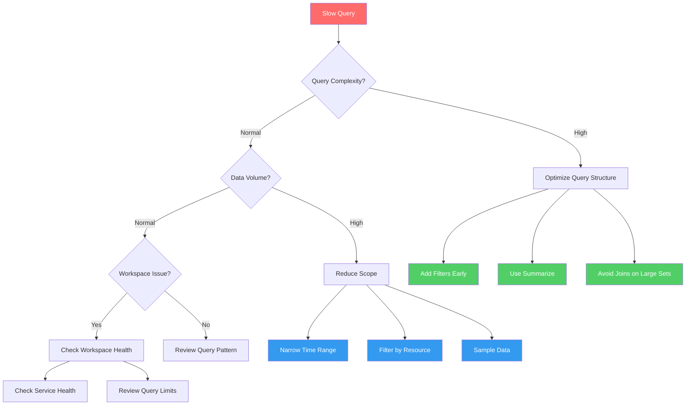
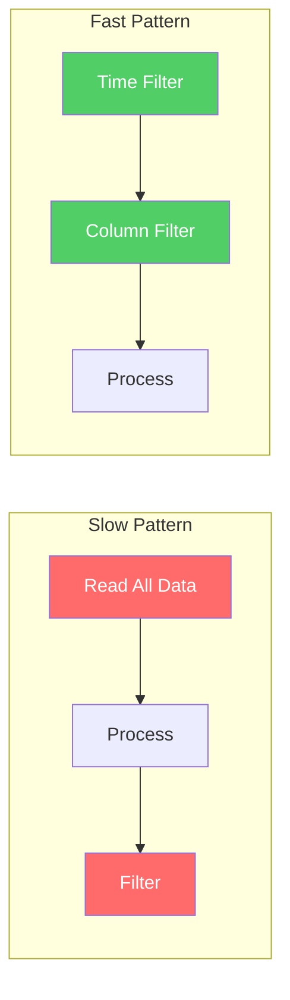

# Slow Query Performance

Systematic troubleshooting for KQL queries that execute slowly or timeout in Log Analytics.

## Symptoms

- Queries taking minutes to complete
- Query timeout errors (> 10 minutes default)
- Portal dashboard loading slowly
- Workbook visualizations hanging
- Alert rules delayed in evaluation

## Diagnostic Flowchart



## Investigation Steps

### Step 1: Analyze Query Execution Stats

```kusto
// Check query execution statistics (run your query with this prefix)
set truncationmaxrecords=10;
set truncationmaxsize=1048576;
YourQueryHere
| take 10
```

Check query stats panel:
- **CPU time**: Total processing time
- **Data scanned**: Amount of data processed
- **Memory peak**: Maximum memory used
- **Result rows**: Output size

### Step 2: Identify Expensive Operations

Common expensive patterns:

| Pattern | Issue | Fix |
|---------|-------|-----|
| `| where` after `| join` | Filters data late | Move `where` before `join` |
| `| extend` with `parse` | Regex on all rows | Filter first, then parse |
| `| summarize` without time bin | Aggregates everything | Add `bin(TimeGenerated, 1h)` |
| Cross-workspace joins | Network overhead | Reduce scope |
| `| mv-expand` on large arrays | Explodes row count | Filter before expand |

### Step 3: Check Data Volume

```kusto
// Check table size for time range
Usage
| where TimeGenerated > ago(24h)
| where DataType == "ContainerLog"  // Replace with your table
| summarize TotalGB = sum(Quantity) / 1024
```

```kusto
// Row count for time range
ContainerLog
| where TimeGenerated > ago(24h)
| summarize RowCount = count()
```

### Step 4: Verify Workspace Health

```bash
# Check workspace status
az monitor log-analytics workspace show \
    --resource-group "rg-monitoring" \
    --workspace-name "law-production" \
    --query "{name:name, sku:sku.name, retentionDays:retentionInDays, dailyQuotaGb:workspaceCapping.dailyQuotaGb}"
```

Check Azure Service Health for Log Analytics outages.

## Query Optimization Techniques

### Technique 1: Filter Early

```kusto
// BAD: Filter after aggregation
ContainerLog
| summarize Count = count() by ContainerID
| where Count > 100

// GOOD: Filter early, then aggregate
ContainerLog
| where TimeGenerated > ago(1h)
| where LogEntry contains "error"
| summarize Count = count() by ContainerID
| where Count > 100
```

### Technique 2: Use Time Filters First

```kusto
// BAD: Time filter not first
ContainerLog
| where ContainerID == "abc123"
| where TimeGenerated > ago(1d)

// GOOD: Time filter first (uses index)
ContainerLog
| where TimeGenerated > ago(1d)
| where ContainerID == "abc123"
```

### Technique 3: Limit Join Cardinality

```kusto
// BAD: Join without limiting
Table1
| join Table2 on Key

// GOOD: Reduce both sides first
let leftSide = Table1
| where TimeGenerated > ago(1h)
| summarize by Key;
let rightSide = Table2
| where TimeGenerated > ago(1h)
| summarize by Key, Value;
leftSide
| join kind=inner rightSide on Key
```

### Technique 4: Use Hints for Large Operations

```kusto
// Use broadcast hint for small lookup tables
let smallLookup = datatable(code:string, name:string) [
    "E001", "Error 1",
    "E002", "Error 2"
];
LargeTable
| where TimeGenerated > ago(1d)
| lookup kind=leftouter hint.broadcast=smallLookup on code
```

### Technique 5: Optimize Summarize

```kusto
// BAD: Many columns in summarize
| summarize count() by Column1, Column2, Column3, Column4, Column5

// GOOD: Aggregate in stages
| summarize count() by Column1, Column2
| summarize sum(count_) by Column1
```

### Technique 6: Sample Large Datasets

```kusto
// Sample for exploratory queries
ContainerLog
| where TimeGenerated > ago(7d)
| sample 10000
| where LogEntry contains "exception"
```

## Query Patterns Comparison



## Resolution Actions

### Fix 1: Add Explicit Time Bounds

```kusto
// Always include explicit time range
let startTime = ago(24h);
let endTime = now();
ContainerLog
| where TimeGenerated between (startTime .. endTime)
| where LogEntry contains "error"
```

### Fix 2: Project Early

```kusto
// Reduce columns early
ContainerLog
| where TimeGenerated > ago(1h)
| project TimeGenerated, ContainerID, LogEntry  // Only needed columns
| where LogEntry contains "error"
```

### Fix 3: Use Materialized Views

For frequently-run queries, create materialized views:

```kusto
// Create summarized view (conceptual - done via Azure Portal)
.create materialized-view ErrorSummary on table ContainerLog
{
    ContainerLog
    | where LogEntry contains "error"
    | summarize ErrorCount = count() by bin(TimeGenerated, 1h), ContainerID
}
```

### Fix 4: Partition Queries for Parallelism

```kusto
// Use partitioning hint
ContainerLog
| where TimeGenerated > ago(7d)
| partition hint.strategy=shuffle by ContainerID
(
    summarize Count = count() by LogEntry
)
```

### Fix 5: Increase Query Timeout (Programmatic)

```bash
# When using Azure CLI or REST API
# Set timeout to 5 minutes (300000 ms)
az monitor log-analytics query \
    --workspace "workspace-id" \
    --analytics-query "ContainerLog | take 10" \
    --timespan "P1D" \
    --timeout 300000
```

## Performance Benchmarks

| Data Volume | Expected Performance |
|-------------|---------------------|
| < 1 GB | < 5 seconds |
| 1-10 GB | 5-30 seconds |
| 10-100 GB | 30 seconds - 3 minutes |
| > 100 GB | Needs optimization |

## Verification

After optimization, compare execution stats:

```kusto
// Before optimization
// CPU: 45s, Data scanned: 12 GB, Duration: 2 min

// After optimization
// CPU: 3s, Data scanned: 500 MB, Duration: 5 sec
```

## Prevention

- Design queries with time filters first
- Test queries on small time ranges before scaling
- Use parameterized queries for reusability
- Monitor query performance in audit logs
- Set appropriate timeouts for dashboards

## Related Playbooks

- [High Ingestion Cost](high-ingestion-cost.md)
- [No Data in Workspace](no-data-in-workspace.md)

## Sources

- [Query best practices in Azure Monitor](https://learn.microsoft.com/en-us/azure/azure-monitor/logs/query-optimization)
- [Log Analytics query language reference](https://learn.microsoft.com/en-us/azure/azure-monitor/logs/log-query-overview)
- [KQL quick reference](https://learn.microsoft.com/en-us/azure/data-explorer/kusto/query/kql-quick-reference)
