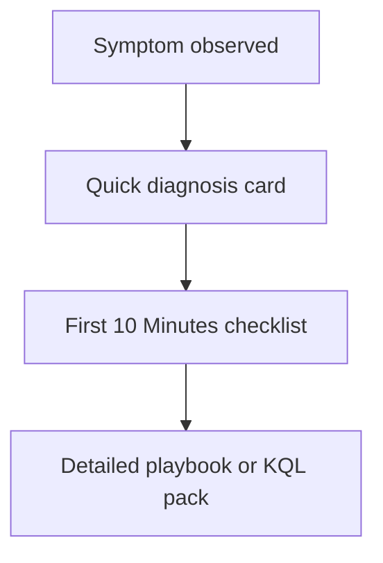

---
content_sources:
  diagrams:
    - id: quick-diagnosis-cards
      type: flowchart
      source: mslearn-adapted
      based_on:
        - https://learn.microsoft.com/en-us/azure/azure-monitor/troubleshoot
        - https://learn.microsoft.com/en-us/azure/azure-monitor/alerts/alerts-troubleshoot
        - https://learn.microsoft.com/en-us/azure/azure-monitor/logs/cost-logs
        - https://learn.microsoft.com/en-us/azure/azure-monitor/logs/query-optimization
---

# Quick Diagnosis Cards

Use these cards when you need a fast symptom-to-first-check mapping before opening a deeper checklist or playbook.

<!-- diagram-id: quick-diagnosis-cards -->

## Card 1: No Data in Workspace

| Field | Guidance |
|---|---|
| Primary symptom | Workspace tables are empty or stale |
| First question | Is every table stale, or only one source/table? |
| Check first | `Heartbeat`, `AzureActivity`, workspace cap, diagnostic settings, DCR association |
| High-probability causes | Daily cap, missing diagnostic settings, missing DCR, agent path break, ingestion delay |
| Open next | [First 10 Minutes: No Data](first-10-minutes/no-data.md) |

## Card 2: Alert Not Firing

| Field | Guidance |
|---|---|
| Primary symptom | Expected alert or notification never arrived |
| First question | Did the signal actually meet the rule logic? |
| Check first | Rule enabled state, scope, window, action group, alert processing rules, ingestion delay |
| High-probability causes | Threshold mismatch, wrong scope, disabled rule, suppression, delivery failure |
| Open next | [First 10 Minutes: Alert Not Firing](first-10-minutes/alert-not-firing.md) |

## Card 3: High Cost

| Field | Guidance |
|---|---|
| Primary symptom | Daily GB or ingestion bill increased sharply |
| First question | Which table and resource grew first? |
| Check first | `Usage`, `_Usage`, DCR list, diagnostic settings, Application Insights sampling |
| High-probability causes | Noisy diagnostic category, DCR rollout, verbose traces, retry storm, solution scope expansion |
| Open next | [First 10 Minutes: High Cost](first-10-minutes/high-cost.md) |

## Card 4: Query Timeout

| Field | Guidance |
|---|---|
| Primary symptom | Logs, workbook, or alert query is too slow or times out |
| First question | Are narrow control queries also slow? |
| Check first | Control query, top table volume, time range, selective predicates, service health |
| High-probability causes | Large scan scope, weak predicates, heavy join/summarize, hot table volume, workbook scope expansion |
| Open next | [First 10 Minutes: Query Timeout](first-10-minutes/query-timeout.md) |

## Card 5: Missing Application Telemetry

| Field | Guidance |
|---|---|
| Primary symptom | App requests, dependencies, traces, or exceptions are empty or stale |
| First question | Is every telemetry type missing, or only one type or one app role? |
| Check first | Application Insights connection string, workspace linkage, `AppRequests`, `AppDependencies`, `AppTraces`, recent deployment timing |
| High-probability causes | Wrong connection string, SDK initialization gap, disabled collection module, endpoint reachability issue, ingestion delay |
| Open next | [Missing Application Telemetry](playbooks/missing-application-telemetry.md) |

## Card 6: Alert Storm

| Field | Guidance |
|---|---|
| Primary symptom | Too many alerts or duplicate notifications arrive for one incident |
| First question | Is one rule flapping, or are several overlapping rules firing together? |
| Check first | Alert rule inventory, action groups, alert processing rules, signal replay, dimension count |
| High-probability causes | Flapping threshold, overlapping scope, high-cardinality dimensions, aggressive evaluation frequency, notification fan-out |
| Open next | [Alert Storm](playbooks/alert-storm.md) |

## Card 7: Agent Not Reporting

| Field | Guidance |
|---|---|
| Primary symptom | VM or Arc machine stops sending `Heartbeat`, `Perf`, or guest logs |
| First question | Is the failure isolated to one machine, one subnet, or one DCR rollout? |
| Check first | `Heartbeat`, AMA extension state, DCR association, managed identity, endpoint access |
| High-probability causes | Missing DCR association, unhealthy AMA runtime, identity drift, blocked IMDS or Azure Monitor endpoints, wrong data flows |
| Open next | [Agent Not Reporting](playbooks/agent-not-reporting.md) |

## Card 8: AKS Container Insights Issues

| Field | Guidance |
|---|---|
| Primary symptom | Container Insights is blank, partial, or stale for AKS nodes, pods, or namespaces |
| First question | Is monitoring disabled, or is the failure only in one table path such as `ContainerLogV2` or `KubePodInventory`? |
| Check first | AKS monitoring enablement, Azure Monitor extension state, `ama-logs` pod health, DCR association, `KubeNodeInventory` and `ContainerLogV2` freshness |
| High-probability causes | Monitoring never enabled, AMA pod failure, DCR or DCE mismatch, namespace filtering, blocked ingestion endpoints |
| Open next | [AKS Container Insights Issues](playbooks/aks-container-insights-issues.md) |

## Card 9: Application Insights Gaps

| Field | Guidance |
|---|---|
| Primary symptom | Application Insights still has data, but there are gaps, partial tables, or unexpected low volume |
| First question | Are the gaps explained by sampling, one missing telemetry type, or a recent deployment/change window? |
| Check first | `AppRequests` `ItemCount`, `ingestion_time()`, table-by-type comparison, app settings, deployment history |
| High-probability causes | Adaptive or fixed sampling, module-specific collection gap, recent config drift, private-link or network issue, short analytics delay |
| Open next | [Application Insights Gaps](playbooks/application-insights-gaps.md) |

## Coverage Map

| Symptom family | Card to start with | Typical escalation |
|---|---|---|
| Workspace ingestion loss | Card 1 | No Data in Workspace playbook, then Evidence Map |
| Missing alert | Card 2 | Alert Not Firing checklist, then alert rule validation |
| Cost spike | Card 3 | Usage analysis, DCR review, Application Insights sampling review |
| Query slowness | Card 4 | Query optimization and table-volume checks |
| App telemetry outage | Card 5 | Connection string and SDK path validation |
| Excessive notifications | Card 6 | Rule overlap and suppression review |
| Guest agent outage | Card 7 | AMA runtime and DCR association validation |
| AKS monitoring gap | Card 8 | Container Insights enablement and agent pod validation |
| Partial App Insights visibility | Card 9 | Sampling, deployment, and ingestion-delay correlation |

## How to Use the Cards

1. Match the incident to one primary symptom.
2. Run one quick KQL check and one CLI or control-plane check.
3. Escalate into the linked first-response checklist.
4. Open the detailed playbook only after narrowing to a small hypothesis set.

## See Also

- [First 10 Minutes](first-10-minutes/index.md)
- [Decision Tree](decision-tree.md)
- [Evidence Map](evidence-map.md)
- [Playbooks](playbooks/index.md)

## Sources

- [Troubleshoot Azure Monitor](https://learn.microsoft.com/en-us/azure/azure-monitor/troubleshoot)
- [Troubleshoot Azure Monitor alerts](https://learn.microsoft.com/en-us/azure/azure-monitor/alerts/alerts-troubleshoot)
- [Manage usage and costs with Azure Monitor Logs](https://learn.microsoft.com/en-us/azure/azure-monitor/logs/cost-logs)
- [Optimize log queries in Azure Monitor Logs](https://learn.microsoft.com/en-us/azure/azure-monitor/logs/query-optimization)
