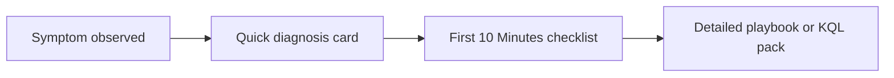

# Quick Diagnosis Cards

Use these cards when you need a fast symptom-to-first-check mapping before opening a deeper checklist or playbook.

## Card 1: No Data in Workspace

| Field | Guidance |
|---|---|
| Primary symptom | Workspace tables are empty or stale |
| First question | Is every table stale, or only one source/table? |
| Check first | `Heartbeat`, `AzureActivity`, workspace cap, diagnostic settings, DCR association |
| High-probability causes | Daily cap, missing diagnostic settings, missing DCR, agent path break, ingestion delay |
| Open next | [First 10 Minutes: No Data](first-10-minutes/no-data.md) |

## Card 2: Alert Not Firing

| Field | Guidance |
|---|---|
| Primary symptom | Expected alert or notification never arrived |
| First question | Did the signal actually meet the rule logic? |
| Check first | Rule enabled state, scope, window, action group, alert processing rules, ingestion delay |
| High-probability causes | Threshold mismatch, wrong scope, disabled rule, suppression, delivery failure |
| Open next | [First 10 Minutes: Alert Not Firing](first-10-minutes/alert-not-firing.md) |

## Card 3: High Cost

| Field | Guidance |
|---|---|
| Primary symptom | Daily GB or ingestion bill increased sharply |
| First question | Which table and resource grew first? |
| Check first | `Usage`, `_Usage`, DCR list, diagnostic settings, Application Insights sampling |
| High-probability causes | Noisy diagnostic category, DCR rollout, verbose traces, retry storm, solution scope expansion |
| Open next | [First 10 Minutes: High Cost](first-10-minutes/high-cost.md) |

## Card 4: Query Timeout

| Field | Guidance |
|---|---|
| Primary symptom | Logs, workbook, or alert query is too slow or times out |
| First question | Are narrow control queries also slow? |
| Check first | Control query, top table volume, time range, selective predicates, service health |
| High-probability causes | Large scan scope, weak predicates, heavy join/summarize, hot table volume, workbook scope expansion |
| Open next | [First 10 Minutes: Query Timeout](first-10-minutes/query-timeout.md) |

## How to Use the Cards

1. Match the incident to one primary symptom.
2. Run one quick KQL check and one CLI or control-plane check.
3. Escalate into the linked first-response checklist.
4. Open the detailed playbook only after narrowing to a small hypothesis set.

## See Also

- [First 10 Minutes](first-10-minutes/index.md)
- [Decision Tree](decision-tree.md)
- [Evidence Map](evidence-map.md)
- [Playbooks](playbooks/index.md)

## Sources

- [Troubleshoot Azure Monitor](https://learn.microsoft.com/en-us/azure/azure-monitor/troubleshoot)
- [Troubleshoot Azure Monitor alerts](https://learn.microsoft.com/en-us/azure/azure-monitor/alerts/alerts-troubleshoot)
- [Manage usage and costs with Azure Monitor Logs](https://learn.microsoft.com/en-us/azure/azure-monitor/logs/cost-logs)
- [Optimize log queries in Azure Monitor Logs](https://learn.microsoft.com/en-us/azure/azure-monitor/logs/query-optimization)
