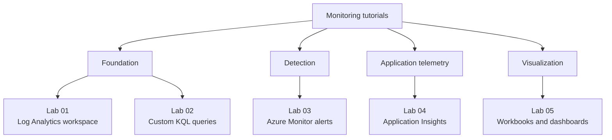

---
content_sources:
  diagrams:
    - id: tutorials
      type: flowchart
      source: mslearn-adapted
      based_on:
        - https://learn.microsoft.com/en-us/azure/azure-monitor/
        - https://learn.microsoft.com/en-us/azure/azure-monitor/logs/log-analytics-workspace-overview
        - https://learn.microsoft.com/en-us/azure/azure-monitor/app/app-insights-overview
        - https://learn.microsoft.com/en-us/azure/azure-monitor/visualize/workbooks-overview
---

# Tutorials

Hands-on tutorials turn the platform and operations guidance in this repository into repeatable Azure Monitor exercises. Use these labs to build a Log Analytics workspace, write KQL, configure alerts, instrument applications, and publish operational views.

<!-- diagram-id: tutorials -->


## What You Will Practice

- Provision and configure core Azure Monitor resources with Azure CLI.
- Route telemetry from Azure resources into a shared Log Analytics workspace.
- Write KQL queries that can be reused for troubleshooting and alerting.
- Build metric and log alerts with action groups and alert processing rules.
- Instrument an application with Application Insights and validate telemetry flow.
- Present monitoring data in workbooks and Azure dashboards.

## Tutorial Sequence

| Lab | Focus | Outcome |
|---|---|---|
| [Lab 01: Log Analytics Workspace Setup](lab-guides/lab-01-log-analytics-workspace-setup.md) | Foundation | Create a workspace, retention policy, and diagnostic connections |
| [Lab 02: Custom KQL Queries](lab-guides/lab-02-custom-kql-queries.md) | Investigation | Query data, build functions, and use parameters |
| [Lab 03: Azure Monitor Alerts](lab-guides/lab-03-azure-monitor-alerts.md) | Detection | Create metric alerts, log alerts, action groups, and noise controls |
| [Lab 04: Application Insights Setup](lab-guides/lab-04-application-insights-setup.md) | APM | Enable app telemetry, custom events, and availability checks |
| [Lab 05: Workbooks and Dashboards](lab-guides/lab-05-workbooks-and-dashboards.md) | Visualization | Build reusable workbooks and shared dashboards |

## Recommended Lab Environment

Use a dedicated resource group so that all labs can share the same workspace and be deleted together when you finish.

```bash
export LOCATION="koreacentral"
export RG="rg-monitoring-labs"
export WORKSPACE_NAME="lawmonlabs001"
export APP_INSIGHTS_NAME="appimonlabs001"

az group create \
    --name "$RG" \
    --location "$LOCATION" \
    --output json
```

Expected outcome:

- A clean sandbox resource group exists.
- You can reuse the same variables across all five labs.
- Cleanup is straightforward with a single resource group delete operation.

## How to Use These Labs

1. Start with Lab 01 unless you already have a test workspace.
2. Reuse the same resource group and naming convention throughout the sequence.
3. Copy commands exactly as shown; all commands use long flags only.
4. Perform the validation section at the end of each lab before moving on.
5. Complete cleanup if you do not need the environment for the next exercise.

!!! tip "Build confidence incrementally"
    The labs are designed to stack together. Lab 01 creates the shared workspace foundation, Lab 02 produces reusable KQL, Lab 03 turns those signals into alerts, Lab 04 adds application telemetry, and Lab 05 visualizes the final data set.

## Lab Design Principles

- **Hands-on first**: every guide uses Azure CLI and concrete validation steps.
- **Operational realism**: the labs mirror real monitoring tasks used in production.
- **Source-backed**: each guide includes Microsoft Learn references for deeper reading.
- **Portable output**: examples use placeholders instead of real subscription identifiers.

## See Also

- [Operations](../operations/index.md)
- [Troubleshooting KQL Queries](../troubleshooting/kql/index.md)
- [Reference: Azure Monitor CLI Cheatsheet](../reference/cli-cheatsheet.md)
- [Lab Guides](lab-guides/index.md)

## Sources

- [Azure Monitor documentation](https://learn.microsoft.com/en-us/azure/azure-monitor/)
- [Log Analytics workspace in Azure Monitor](https://learn.microsoft.com/en-us/azure/azure-monitor/logs/log-analytics-workspace-overview)
- [Application Insights overview](https://learn.microsoft.com/en-us/azure/azure-monitor/app/app-insights-overview)
- [Azure Monitor workbooks](https://learn.microsoft.com/en-us/azure/azure-monitor/visualize/workbooks-overview)
