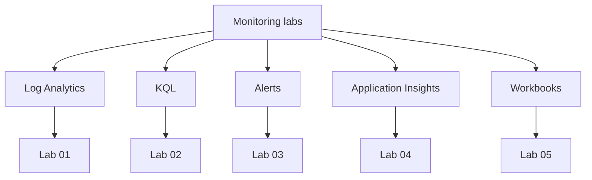

---
content_sources:
  diagrams:
    - id: monitoring-lab-guides
      type: flowchart
      source: mslearn-adapted
      based_on:
        - https://learn.microsoft.com/en-us/azure/azure-monitor/
        - https://learn.microsoft.com/en-us/azure/data-explorer/kusto/query/
        - https://learn.microsoft.com/en-us/azure/azure-monitor/alerts/alerts-overview
---

# Monitoring Lab Guides

These hands-on labs provide a structured path through the most important Azure Monitor workflows. Each guide follows the same pattern: prepare a sandbox, execute Azure CLI steps, validate the result, and clean up safely.

<!-- diagram-id: monitoring-lab-guides -->


## Lab Catalog

| Lab | Difficulty | Estimated Duration | Focus |
|---|---|---|---|
| [Lab 01: Log Analytics Workspace Setup](lab-01-log-analytics-workspace-setup.md) | Beginner | 35-45 minutes | Create a workspace, set retention, and connect resources |
| [Lab 02: Custom KQL Queries](lab-02-custom-kql-queries.md) | Intermediate | 40-50 minutes | Write queries, build functions, and use parameters |
| [Lab 03: Azure Monitor Alerts](lab-03-azure-monitor-alerts.md) | Intermediate | 45-60 minutes | Build alerts, action groups, and alert suppression rules |
| [Lab 04: Application Insights Setup](lab-04-application-insights-setup.md) | Intermediate | 45-60 minutes | Instrument an app and validate telemetry |
| [Lab 05: Workbooks and Dashboards](lab-05-workbooks-and-dashboards.md) | Intermediate | 35-50 minutes | Build workbook visuals and team dashboards |

## Shared Prerequisites

All labs assume:

- Azure CLI authenticated with `az login`.
- Contributor access to a non-production Azure subscription.
- A dedicated sandbox resource group.
- Permission to create monitoring resources such as workspaces, alerts, and dashboards.
- Basic familiarity with Azure Monitor, KQL, and resource IDs.

## Suggested Execution Order

1. **Lab 01** creates the central workspace and routes data.
2. **Lab 02** teaches you how to read that data with reusable KQL.
3. **Lab 03** converts those signals into notifications and automation hooks.
4. **Lab 04** adds application telemetry to the monitoring estate.
5. **Lab 05** turns queries and metrics into visual operational artifacts.

## Reusable Variables

```bash
export LOCATION="koreacentral"
export RG="rg-monitoring-labs"
export WORKSPACE_NAME="lawmonlabs001"
export APP_INSIGHTS_NAME="appimonlabs001"
export ACTION_GROUP_NAME="ag-monitoring-labs"
export DASHBOARD_NAME="dashboard-monitoring-labs"
```

## Validation Expectations

You should be able to confirm the following by the end of the sequence:

- A Log Analytics workspace exists and receives telemetry.
- KQL queries return meaningful results and can be saved as functions.
- Metric and log alerts are enabled and point to an action group.
- Application Insights receives requests, dependencies, traces, and custom events.
- A workbook and dashboard display the same monitoring data from the lab environment.

## Cleanup Strategy

If you want to remove everything at once after Lab 05, delete the shared resource group:

```bash
az group delete \
    --name "$RG" \
    --yes \
    --no-wait
```

!!! warning "Cost management"
    Metric alerts, web tests, dashboards, and retained logs can continue to incur charges. Delete unused resources promptly if you are not actively using the sandbox.

## See Also

- [Tutorials](../index.md)
- [Operations: Workspace Management](../../operations/workspace-management.md)
- [Operations: Alert Rule Management](../../operations/alert-rule-management.md)
- [Operations: Workbooks and Dashboards](../../operations/workbooks-and-dashboards.md)

## Sources

- [Azure Monitor documentation](https://learn.microsoft.com/en-us/azure/azure-monitor/)
- [Kusto Query Language overview](https://learn.microsoft.com/en-us/azure/data-explorer/kusto/query/)
- [Create and manage alerts](https://learn.microsoft.com/en-us/azure/azure-monitor/alerts/alerts-overview)
