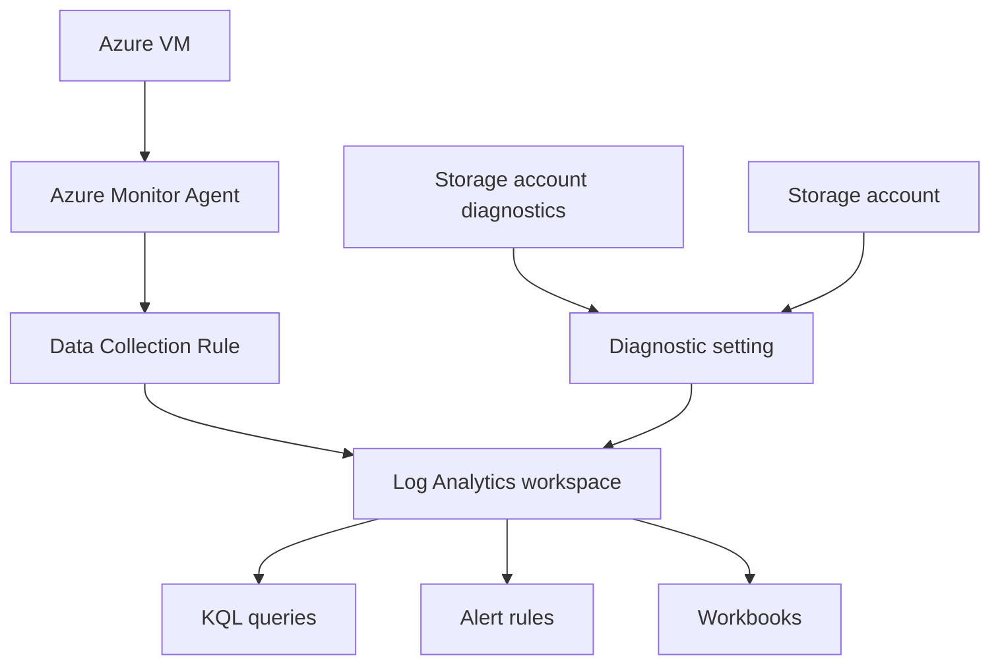

---
content_sources:
  diagrams:
    - id: architecture-diagram
      type: flowchart
      source: mslearn-adapted
      based_on:
        - https://learn.microsoft.com/en-us/azure/azure-monitor/logs/log-analytics-workspace-overview
        - https://learn.microsoft.com/en-us/azure/azure-monitor/logs/manage-access
        - https://learn.microsoft.com/en-us/azure/azure-monitor/platform/create-diagnostic-settings
        - https://learn.microsoft.com/en-us/azure/azure-monitor/agents/azure-monitor-agent-overview
        - https://learn.microsoft.com/en-us/azure/azure-monitor/data-collection/data-collection-rule-overview
---

# Lab 01: Log Analytics Workspace Setup

This lab builds the shared data platform for the rest of the tutorial sequence. You will create a Log Analytics workspace, configure retention and daily cap settings, and connect Azure resources so telemetry lands in one searchable location.

## Lab Metadata

| Attribute | Value |
|---|---|
| Difficulty | Beginner |
| Estimated Duration | 35-45 minutes |
| Azure Monitor Tier | Foundational |
| Primary Services | Log Analytics workspace, diagnostic settings, Azure Monitor Agent |
| Skills Practiced | Workspace creation, retention design, resource connection, validation |

## Prerequisites

- Azure CLI installed and authenticated with `az login`.
- Contributor access to a sandbox subscription.
- Permission to create resource groups, workspaces, virtual machines, storage accounts, and diagnostic settings.
- Familiarity with Azure resource IDs and the Azure portal.
- Bash-compatible shell for environment variables.

Define reusable variables:

```bash
export LOCATION="koreacentral"
export RG="rg-monitoring-lab01"
export WORKSPACE_NAME="lawmonlab01"
export STORAGE_NAME="stmonlab01001"
export VM_NAME="vmmonlab01"
export DCR_NAME="dcr-monlab01"
```

## Architecture Diagram

<!-- diagram-id: architecture-diagram -->


## Lab Objectives

By the end of the lab, you will have:

1. A dedicated resource group for monitoring experiments.
2. A Log Analytics workspace with retention and daily cap configured.
3. A storage account streaming logs and metrics into the workspace.
4. A VM connected through Azure Monitor Agent and a data collection rule.
5. A validation query proving that data is arriving.

## Step-by-Step Instructions

### Step 1: Create the resource group

```bash
az group create \
    --name "$RG" \
    --location "$LOCATION" \
    --output json
```

Expected result:

```json
{
  "location": "koreacentral",
  "name": "rg-monitoring-lab01",
  "properties": {
    "provisioningState": "Succeeded"
  }
}
```

### Step 2: Create the Log Analytics workspace

```bash
az monitor log-analytics workspace create \
    --resource-group "$RG" \
    --workspace-name "$WORKSPACE_NAME" \
    --location "$LOCATION" \
    --sku "PerGB2018" \
    --retention-time 30 \
    --output json
```

Review the workspace properties:

```bash
az monitor log-analytics workspace show \
    --resource-group "$RG" \
    --workspace-name "$WORKSPACE_NAME" \
    --query "{name:name,location:location,retentionInDays:retentionInDays,workspaceId:customerId}" \
    --output json
```

### Step 3: Set a daily cap for predictable spend

```bash
az monitor log-analytics workspace update \
    --resource-group "$RG" \
    --workspace-name "$WORKSPACE_NAME" \
    --set workspaceCapping.dailyQuotaGb=2 \
    --output json
```

Why this matters:

- Retention protects investigation depth.
- Daily cap protects your sandbox budget.
- Both settings should be explicit rather than relying on defaults.

### Step 4: Create a storage account that can emit platform logs

```bash
az storage account create \
    --name "$STORAGE_NAME" \
    --resource-group "$RG" \
    --location "$LOCATION" \
    --sku "Standard_LRS" \
    --kind "StorageV2" \
    --output json
```

Capture IDs for later steps:

```bash
export WORKSPACE_ID=$(az monitor log-analytics workspace show \
    --resource-group "$RG" \
    --workspace-name "$WORKSPACE_NAME" \
    --query "id" \
    --output tsv)

export STORAGE_ID=$(az storage account show \
    --name "$STORAGE_NAME" \
    --resource-group "$RG" \
    --query "id" \
    --output tsv)
```

### Step 5: Connect storage logs and metrics to the workspace

```bash
az monitor diagnostic-settings create \
    --name "send-to-law" \
    --resource "$STORAGE_ID" \
    --workspace "$WORKSPACE_ID" \
    --logs '[{"categoryGroup":"audit","enabled":true}]' \
    --metrics '[{"category":"Transaction","enabled":true}]' \
    --output json
```

List the diagnostic settings to confirm the attachment:

```bash
az monitor diagnostic-settings list \
    --resource "$STORAGE_ID" \
    --output json
```

### Step 6: Create a VM to generate heartbeat telemetry

```bash
az vm create \
    --resource-group "$RG" \
    --name "$VM_NAME" \
    --image "Ubuntu2204" \
    --admin-username "azureuser" \
    --generate-ssh-keys \
    --size "Standard_B2s" \
    --public-ip-sku "Standard" \
    --output json
```

Capture the VM resource ID:

```bash
export VM_ID=$(az vm show \
    --resource-group "$RG" \
    --name "$VM_NAME" \
    --query "id" \
    --output tsv)
```

### Step 7: Create a data collection rule for performance counters

```bash
az monitor data-collection rule create \
    --name "$DCR_NAME" \
    --resource-group "$RG" \
    --location "$LOCATION" \
    --data-flows streams="[\"Microsoft-Perf\"]" destinations="[\"la-workspace\"]" \
    --destinations log-analytics name="la-workspace" workspace-resource-id="$WORKSPACE_ID" \
    --data-sources performance-counters name="perfCounters" streams="[\"Microsoft-Perf\"]" sampling-frequency="PT1M" counter-specifiers="[\"\\Processor(_Total)\\% Processor Time\",\"\\Memory\\Available MBytes\"]" \
    --output json
```

### Step 8: Install Azure Monitor Agent on the VM

```bash
az vm extension set \
    --resource-group "$RG" \
    --vm-name "$VM_NAME" \
    --name "AzureMonitorLinuxAgent" \
    --publisher "Microsoft.Azure.Monitor" \
    --enable-auto-upgrade true \
    --output json
```

Associate the VM with the data collection rule:

```bash
export DCR_ID=$(az monitor data-collection rule show \
    --name "$DCR_NAME" \
    --resource-group "$RG" \
    --query "id" \
    --output tsv)

az monitor data-collection rule association create \
    --name "vm-law-association" \
    --resource "$VM_ID" \
    --rule-id "$DCR_ID" \
    --output json
```

### Step 9: Wait for telemetry ingestion and run validation queries

It may take several minutes before the first records appear.

```bash
az monitor log-analytics query \
    --workspace "$WORKSPACE_ID" \
    --analytics-query "Heartbeat | where TimeGenerated > ago(30m) | summarize Computers=dcount(Computer)" \
    --output table
```

Run a second query for metrics and logs from the storage account:

```bash
az monitor log-analytics query \
    --workspace "$WORKSPACE_ID" \
    --analytics-query "AzureMetrics | where TimeGenerated > ago(30m) | summarize Records=count() by ResourceProvider" \
    --output table
```

## Validation Steps

Use these checks to verify success:

1. Confirm workspace configuration.

```bash
az monitor log-analytics workspace show \
    --resource-group "$RG" \
    --workspace-name "$WORKSPACE_NAME" \
    --query "{retentionInDays:retentionInDays,dailyQuotaGb:workspaceCapping.dailyQuotaGb,publicNetworkAccessForIngestion:publicNetworkAccessForIngestion}" \
    --output json
```

2. Confirm the VM association exists.

```bash
az monitor data-collection rule association list \
    --resource "$VM_ID" \
    --output table
```

3. Confirm diagnostic settings are attached to the storage account.

```bash
az monitor diagnostic-settings list \
    --resource "$STORAGE_ID" \
    --query "[].{name:name,workspaceId:workspaceId}" \
    --output table
```

4. Confirm the workspace receives telemetry.

```bash
az monitor log-analytics query \
    --workspace "$WORKSPACE_ID" \
    --analytics-query "union isfuzzy=true Heartbeat, Perf, AzureMetrics | where TimeGenerated > ago(30m) | summarize Records=count() by Type" \
    --output table
```

Validation is successful when the workspace exists, retention and quota settings are visible, the DCR association is present, and at least one telemetry table returns recent rows.

## Cleanup Instructions

If you are continuing with later labs, keep the workspace and resource group. Otherwise delete the sandbox:

```bash
az group delete \
    --name "$RG" \
    --yes \
    --no-wait
```

Optional partial cleanup if you want to keep the workspace but remove the VM:

```bash
az vm delete \
    --resource-group "$RG" \
    --name "$VM_NAME" \
    --yes
```

## See Also

- [Platform: Log Analytics Workspace](../../platform/log-analytics-workspace.md)
- [Operations: Workspace Management](../../operations/workspace-management.md)
- [Lab 02: Custom KQL Queries](lab-02-custom-kql-queries.md)

## Sources

- [Log Analytics workspace in Azure Monitor](https://learn.microsoft.com/en-us/azure/azure-monitor/logs/log-analytics-workspace-overview)
- [Manage access to Log Analytics workspaces](https://learn.microsoft.com/en-us/azure/azure-monitor/logs/manage-access)
- [Create diagnostic settings in Azure Monitor](https://learn.microsoft.com/en-us/azure/azure-monitor/platform/create-diagnostic-settings)
- [Azure Monitor Agent overview](https://learn.microsoft.com/en-us/azure/azure-monitor/agents/azure-monitor-agent-overview)
- [Data collection rules in Azure Monitor](https://learn.microsoft.com/en-us/azure/azure-monitor/data-collection/data-collection-rule-overview)
