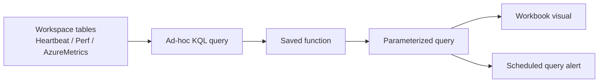

---
content_sources:
  diagrams:
    - id: architecture-diagram
      type: flowchart
      source: mslearn-adapted
      based_on:
        - https://learn.microsoft.com/en-us/azure/data-explorer/kusto/query/
        - https://learn.microsoft.com/en-us/azure/azure-monitor/logs/log-query-overview
        - https://learn.microsoft.com/en-us/azure/azure-monitor/logs/functions
        - https://learn.microsoft.com/en-us/azure/azure-monitor/logs/query-optimization
---

# Lab 02: Custom KQL Queries

This lab teaches you how to turn raw monitoring data into reusable investigation logic. You will write ad-hoc KQL queries, save a reusable function in the Log Analytics workspace, and practice parameterized query patterns that can later power alerts and workbooks.

## Lab Metadata

| Attribute | Value |
|---|---|
| Difficulty | Intermediate |
| Estimated Duration | 40-50 minutes |
| Azure Monitor Tier | Investigation |
| Primary Services | Log Analytics, KQL, saved searches |
| Skills Practiced | Filtering, summarization, functions, parameters, validation |

## Prerequisites

- Complete [Lab 01: Log Analytics Workspace Setup](lab-01-log-analytics-workspace-setup.md) or provide an existing workspace with recent telemetry.
- Azure CLI authenticated with `az login`.
- Permission to read and update the Log Analytics workspace.
- Basic familiarity with KQL operators such as `where`, `summarize`, `project`, and `join`.

Set or confirm variables:

```bash
export RG="rg-monitoring-lab01"
export WORKSPACE_NAME="lawmonlab01"
export SAVED_SEARCH_NAME="RecentPerformanceSignals"
export FUNCTION_ALIAS="RecentPerfSignals"

export WORKSPACE_ID=$(az monitor log-analytics workspace show \
    --resource-group "$RG" \
    --workspace-name "$WORKSPACE_NAME" \
    --query "id" \
    --output tsv)
```

## Architecture Diagram

<!-- diagram-id: architecture-diagram -->


## Lab Objectives

- Query heartbeat and performance data from multiple tables.
- Normalize output with `project`, `extend`, and `summarize`.
- Save a reusable KQL function in the workspace.
- Execute parameterized queries with `declare query_parameters`.
- Validate that query output is stable enough for automation.

## Step-by-Step Instructions

### Step 1: Inspect available tables

Start by verifying which tables are populated.

```bash
az monitor log-analytics query \
    --workspace "$WORKSPACE_ID" \
    --analytics-query "search * | where TimeGenerated > ago(1h) | summarize Records=count() by Type | top 20 by Records desc" \
    --output table
```

What to look for:

- `Heartbeat` confirms agent connectivity.
- `Perf` confirms data collection rule performance counters.
- `AzureMetrics` confirms platform metric routing.

### Step 2: Write a baseline performance query

```bash
az monitor log-analytics query \
    --workspace "$WORKSPACE_ID" \
    --analytics-query "Perf | where TimeGenerated > ago(1h) | where ObjectName == 'Processor' and CounterName == '% Processor Time' | summarize AvgCpu=avg(CounterValue), MaxCpu=max(CounterValue) by Computer, bin(TimeGenerated, 5m) | order by TimeGenerated desc" \
    --output table
```

Why this query matters:

1. It narrows the scope to one counter family.
2. It bins data into alert-friendly intervals.
3. It produces averages and peaks for troubleshooting.

### Step 3: Correlate heartbeat freshness with performance data

```bash
az monitor log-analytics query \
    --workspace "$WORKSPACE_ID" \
    --analytics-query "let LastHeartbeat = Heartbeat | summarize LastSeen=max(TimeGenerated) by Computer; let RecentCpu = Perf | where TimeGenerated > ago(1h) | where ObjectName == 'Processor' and CounterName == '% Processor Time' | summarize AvgCpu=avg(CounterValue) by Computer; LastHeartbeat | join kind=leftouter RecentCpu on Computer | project Computer, LastSeen, AvgCpu | order by LastSeen desc" \
    --output table
```

This pattern is useful for distinguishing a silent VM from a healthy but busy VM.

### Step 4: Create a saved KQL function

Azure Monitor stores workspace functions as saved searches. Use `az resource create` so the function is versionable and reproducible.

```bash
az resource create \
    --resource-group "$RG" \
    --resource-type "Microsoft.OperationalInsights/workspaces/savedSearches" \
    --name "$WORKSPACE_NAME/$SAVED_SEARCH_NAME" \
    --api-version "2022-10-01" \
    --properties '{
        "category": "tutorial-functions",
        "displayName": "Recent performance signals",
        "functionAlias": "RecentPerfSignals",
        "query": "Perf | where TimeGenerated > ago(30m) | where ObjectName == \"Processor\" and CounterName == \"% Processor Time\" | summarize AvgCpu=avg(CounterValue), MaxCpu=max(CounterValue) by Computer, bin(TimeGenerated, 5m)"
    }' \
    --output json
```

Read the function back:

```bash
az resource show \
    --resource-group "$RG" \
    --resource-type "Microsoft.OperationalInsights/workspaces/savedSearches" \
    --name "$WORKSPACE_NAME/$SAVED_SEARCH_NAME" \
    --api-version "2022-10-01" \
    --query "properties.{category:category,displayName:displayName,functionAlias:functionAlias}" \
    --output json
```

### Step 5: Run the saved function from a query

```bash
az monitor log-analytics query \
    --workspace "$WORKSPACE_ID" \
    --analytics-query "RecentPerfSignals | summarize PeakCpu=max(MaxCpu), AverageCpu=avg(AvgCpu) by Computer" \
    --output table
```

This proves the alias can be reused in later workbooks and scheduled query rules.

### Step 6: Practice parameterized queries

Use query parameters instead of hard-coding thresholds or host names.

```bash
az monitor log-analytics query \
    --workspace "$WORKSPACE_ID" \
    --analytics-query "declare query_parameters(TargetComputer:string='vmmonlab01', CpuThreshold:real=60); Perf | where TimeGenerated > ago(1h) | where Computer == TargetComputer | where ObjectName == 'Processor' and CounterName == '% Processor Time' | summarize AvgCpu=avg(CounterValue), MaxCpu=max(CounterValue) by Computer | extend ThresholdBreached = MaxCpu > CpuThreshold" \
    --output table
```

Try the same pattern with a time window parameter:

```kusto
declare query_parameters(TimeWindow:timespan=30m);
Heartbeat
| where TimeGenerated > ago(TimeWindow)
| summarize LastSeen=max(TimeGenerated) by Computer
```

### Step 7: Build a parameterized troubleshooting query

```bash
az monitor log-analytics query \
    --workspace "$WORKSPACE_ID" \
    --analytics-query "declare query_parameters(Window:timespan=30m); let RecentHeartbeat = Heartbeat | where TimeGenerated > ago(Window) | summarize LastSeen=max(TimeGenerated) by Computer; let RecentPerf = Perf | where TimeGenerated > ago(Window) | where ObjectName == 'Memory' and CounterName == 'Available MBytes' | summarize MinAvailableMb=min(CounterValue) by Computer; RecentHeartbeat | join kind=leftouter RecentPerf on Computer | project Computer, LastSeen, MinAvailableMb | order by LastSeen desc" \
    --output table
```

Use this design pattern when you want one query to serve multiple environments without editing the body each time.

### Step 8: Export query logic for source control

```bash
az resource show \
    --resource-group "$RG" \
    --resource-type "Microsoft.OperationalInsights/workspaces/savedSearches" \
    --name "$WORKSPACE_NAME/$SAVED_SEARCH_NAME" \
    --api-version "2022-10-01" \
    --output json
```

Store the JSON output in source control so function changes are reviewed like code.

## Validation Steps

Run the following checks:

1. Validate that the function object exists.

```bash
az resource list \
    --resource-group "$RG" \
    --resource-type "Microsoft.OperationalInsights/workspaces/savedSearches" \
    --query "[].{name:name,resourceGroup:resourceGroup}" \
    --output table
```

2. Validate that the function alias executes without errors.

```bash
az monitor log-analytics query \
    --workspace "$WORKSPACE_ID" \
    --analytics-query "RecentPerfSignals | take 5" \
    --output table
```

3. Validate that the parameterized query returns rows and a Boolean threshold result.

```bash
az monitor log-analytics query \
    --workspace "$WORKSPACE_ID" \
    --analytics-query "declare query_parameters(TargetComputer:string='vmmonlab01', CpuThreshold:real=10); Perf | where TimeGenerated > ago(1h) | where Computer == TargetComputer | where ObjectName == 'Processor' and CounterName == '% Processor Time' | summarize MaxCpu=max(CounterValue) by Computer | extend ThresholdBreached = MaxCpu > CpuThreshold" \
    --output table
```

4. Validate that the workspace still contains recent source data.

```bash
az monitor log-analytics query \
    --workspace "$WORKSPACE_ID" \
    --analytics-query "union Heartbeat, Perf | where TimeGenerated > ago(30m) | summarize Records=count() by Type" \
    --output table
```

Validation is complete when the saved search exists, the alias runs successfully, parameterized queries execute cleanly, and the base tables still contain recent telemetry.

## Cleanup Instructions

If you want to remove only the saved function and keep the workspace for later labs:

```bash
az resource delete \
    --resource-group "$RG" \
    --resource-type "Microsoft.OperationalInsights/workspaces/savedSearches" \
    --name "$WORKSPACE_NAME/$SAVED_SEARCH_NAME" \
    --api-version "2022-10-01"
```

If you want to preserve the function for Lab 05 workbook reuse, skip this step.

## See Also

- [Troubleshooting: KQL Queries](../../troubleshooting/kql/index.md)
- [Reference: KQL Quick Reference](../../reference/kql-quick-reference.md)
- [Lab 03: Azure Monitor Alerts](lab-03-azure-monitor-alerts.md)

## Sources

- [Kusto Query Language overview](https://learn.microsoft.com/en-us/azure/data-explorer/kusto/query/)
- [Azure Monitor log queries](https://learn.microsoft.com/en-us/azure/azure-monitor/logs/log-query-overview)
- [Functions in Azure Monitor log queries](https://learn.microsoft.com/en-us/azure/azure-monitor/logs/functions)
- [Query optimization in Azure Monitor Logs](https://learn.microsoft.com/en-us/azure/azure-monitor/logs/query-optimization)
